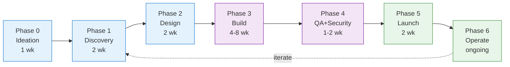

# 🏗️ AI Multi-Agent Workflow Blueprint
## จากไอเดียสู่โปรดักส์จริง — สำหรับ Software House 15-20 คน

> พิมพ์เขียวเต็มระบบที่ map "มนุษย์ 15-20 คน" × "Claude skills/personas/agents ทั้งระบบ" → end-to-end product delivery engine

**Version:** 1.0 · **Target org size:** 15-20 people · **Delivery cycle:** 8-14 weeks per product

---

## 📑 Table of Contents

- [[#🎯 Executive Summary|🎯 Executive Summary]]
- [[#🧭 ปรัชญาการใช้ AI|🧭 ปรัชญาการใช้ AI]]
- [[#👥 แผนผังองค์กร × AI|👥 แผนผังองค์กร × AI]]
- [[#🔄 The 7-Phase Workflow|🔄 The 7-Phase Workflow]]
- [[#🎭 Role Playbooks|🎭 Role Playbooks]]
- [[#🧩 Multi-Agent Orchestration|🧩 Multi-Agent Orchestration]]
- [[#📅 Meeting Rhythm|📅 Meeting Rhythm]]
- [[#🤖 Automation Stack|🤖 Automation Stack]]
- [[#📊 Success Metrics|📊 Success Metrics]]
- [[#🛣️ Implementation Roadmap|🛣️ Implementation Roadmap]]

---

## 🎯 Executive Summary

### ปัญหาที่แก้
Software house 15-20 คนมีภาระ cross-role งานเยอะ แต่ละคนต้องสวมหลายหมวก (BA ก็เขียน SOW เองสำหรับ proposal, CTO review code เองทุก PR) → เสียเวลา slow-down delivery

### คำตอบ
ติดตั้ง **AI counterpart ทุก role** → มนุษย์เป็น decision-maker, AI เป็น execution leverage → throughput เพิ่ม 2-3× โดยไม่ต้องเพิ่มหัว

### ผลลัพธ์ที่คาดหวัง
- **Delivery cycle** 8-14 สัปดาห์ต่อโปรดักส์ MVP
- **Defect rate** ลดลง ≥ 30% (จาก AI pre-review)
- **On-call load** ลดลง ≥ 40% (จาก auto-runbook + observability)
- **Proposal turnaround** < 48 ชม. (จาก 1 สัปดาห์)
- **Marketing output** 3× เพิ่มจำนวน content โดย headcount เท่าเดิม

---

## 🧭 ปรัชญาการใช้ AI

> [!tip] 5 หลักคิด
> 1. **AI ช่วย "ขยาย" ไม่ใช่ "แทนที่"** — มนุษย์ตัดสินใจ AI ทำ grunt work
> 2. **Specialist > Generalist** — เรียก skill เฉพาะทางดีกว่า chat ทั่วไป
> 3. **Multi-agent review** — งานสำคัญให้ 2+ personas review ไขว้กัน
> 4. **Logs คือ memory** — ทุก AI call บันทึกลง Obsidian → กลายเป็น knowledge base
> 5. **Automate boring, decide hard** — ทุก recurring task → scheduled agent; ทุก judgment call → human

### The Decision Hierarchy

```
Human owns:           AI owns:
─────────────────     ─────────────────────
✓ Strategy            ✓ Research synthesis
✓ Trade-offs          ✓ Draft writing
✓ Hiring              ✓ Code review pass-1
✓ Culture             ✓ Documentation
✓ Customer promises   ✓ Data analysis
✓ Ethics              ✓ Monitoring alerts
```

---

## 👥 แผนผังองค์กร × AI

### Map มนุษย์ 15-20 คน → AI counterpart

| # | Role (มนุษย์) | จำนวน | Primary Persona | Core Skills | Secondary Skills |
|---|---|---:|---|---|---|
| 1 | **CEO** | 1 | `startup-cto` / custom | `ceo-advisor`, `strategic-alignment`, `scenario-war-room`, `board-deck-builder` | `founder-coach`, `company-os`, `ma-playbook` |
| 2 | **CTO** | 1 | `startup-cto` | `cto-advisor`, `senior-architect`, `tech-stack-evaluator` | `skill-security-auditor`, `tech-debt-tracker`, `ci-cd-pipeline-builder` |
| 3 | **Senior Backend** | 2-3 | — | `senior-backend`, `senior-fullstack`, `api-design-reviewer`, `database-designer` | `api-test-suite-builder`, `sql-database-assistant`, `stripe-integration-expert` |
| 4 | **Senior Frontend** | 2 | — | `senior-frontend`, `ui-design-system`, `performance-profiler` | `playwright-pro`, `a11y-audit`, `landing-page-generator` |
| 5 | **BA (Business Analyst)** | 1-2 | — | `product-discovery`, `competitive-teardown`, `research-summarizer` | `code-to-prd`, `competitive-intel`, `marketing-psychology` |
| 6 | **SA (System Analyst)** | 1-2 | — | `senior-architect`, `database-schema-designer`, `spec-driven-workflow` | `api-design-reviewer`, `migration-architect`, `spec-to-repo` |
| 7 | **UX/UI** | 1-2 | — | `ux-researcher-designer`, `ui-design-system`, `apple-hig-expert` | `a11y-audit`, `landing-page-generator`, `design:design-critique` |
| 8 | **DE (Data Engineer)** | 1 | — | `senior-data-engineer`, `snowflake-development`, `data-quality-auditor` | `sql-database-assistant`, `rag-architect`, `observability-designer` |
| 9 | **DS (Data Scientist)** | 1 | — | `senior-data-scientist`, `senior-ml-engineer`, `statistical-analyst` | `experiment-designer`, `product-analytics`, `senior-computer-vision` |
| 10 | **Marketing** | 1-2 | `growth-marketer` | `cmo-advisor`, `marketing-strategy-pmm`, `content-creator`, `launch-strategy` | `copywriting`, `email-sequence`, `paid-ads`, `social-media-manager` |
| 11 | **SEO** | 1 | — | `seo-audit`, `ai-seo`, `programmatic-seo`, `schema-markup` | `site-architecture`, `content-strategy`, `competitor-alternatives` |
| 12 | **บัญชี** | 1 | — | `cfo-advisor`, `financial-analyst`, `saas-metrics-coach` | `revenue-operations`, `business-investment-advisor` |
| 13 | **ธุรการ (Admin)** | 1 | — | `chief-of-staff`, `team-communications`, `meeting-analyzer` | `atlassian-admin`, `ms365-tenant-manager`, `google-workspace-cli` |

### Cross-cutting AI-only roles (ไม่มีคน แต่มี agent)

| Virtual Role | Skills | หน้าที่ |
|---|---|---|
| **🔒 Security Guardian** | `senior-security`, `senior-secops`, `ciso-advisor`, `ai-security`, `red-team`, `threat-detection`, `skill-security-auditor` | audit ทุก PR, sign-off release |
| **📊 Observability** | `observability-designer`, `performance-profiler`, `incident-commander`, `incident-response` | SLO + alert + PIR |
| **🧪 QA Bot** | `senior-qa`, `tdd-guide`, `playwright-pro`, `api-test-suite-builder` | auto-generate test, flaky fix |
| **🧠 Knowledge Curator** | `self-improving-agent`, `llm-wiki`, `find-connections`, `process-inbox` | จัดการ Obsidian vault, promote evergreen |
| **💼 Deal Desk** | `contract-and-proposal-writer`, `sales-engineer`, `pricing-strategy` | draft proposal, pricing model |

---

## 🔄 The 7-Phase Workflow



---

### Phase 0 — Ideation (1 สัปดาห์)

> **Goal:** เลือก 1 ไอเดียที่คุ้มลงทุน · **Humans:** CEO, CTO, BA · **Output:** Opportunity Brief

**Skill Chain:**
```
1. BA: `competitive-teardown`  → คู่แข่งทำอะไร
2. BA: `competitive-intel`     → market signal
3. Marketing: `marketing-psychology` → why customers care
4. CEO + CTO: `scenario-war-room` → เล่น scenario 3 แบบ
5. CEO: `strategic-alignment` → fit กับ company OKR ไหม
6. CEO: `board-deck-builder` → สื่อสารต่อ stakeholder
```

**Meeting:** Idea Triage 90 นาที
**Deliverable:** `01 - Projects/<Product>/Opportunity Brief.md` (ใช้ template `Product Discovery`)

---

### Phase 1 — Discovery (2 สัปดาห์)

> **Goal:** PRD v1 + validated problem · **Humans:** BA, SA, UX, DS, Marketing · **Output:** PRD + Research

**Skill Chain:**
```
Week 1 — Research
  BA:  `product-discovery` → problem framing
  UX:  `ux-researcher-designer` + `user-research` → interviews
  DS:  `product-analytics` → behavioral signal
  SEO: `seo-audit` + keyword research → demand signal
  Mktg: `marketing-strategy-pmm` → positioning

Week 2 — Synthesis
  BA:  `research-summarizer` → synthesize findings
  BA:  `code-to-prd` → ร่าง PRD
  SA:  review technical feasibility
  CTO: `tech-stack-evaluator` → pre-check stack
```

**Meeting:** Discovery Kickoff → Weekly Research Standup → Discovery Review
**Deliverable:** PRD, User Research Report, Market Brief

---

### Phase 2 — Design (2 สัปดาห์)

> **Goal:** Tech spec + Design system · **Humans:** SA, CTO, UX/UI, Sr BE, Sr FE · **Output:** Spec + Wireframes

**Skill Chain:**
```
Architecture Track (SA + CTO)
  `senior-architect`           → high-level design
  `database-schema-designer`   → data model
  `api-design-reviewer`        → API contract
  `tech-stack-evaluator`       → final stack
  `migration-architect`        → ถ้ามี legacy
  `ci-cd-pipeline-builder`     → ops pipeline

UX Track (UX/UI)
  `ui-design-system`           → component library
  `apple-hig-expert`           → platform convention
  `a11y-audit`                 → baseline a11y
  `design:design-critique`     → review loop

Frontend Track (Sr FE)
  `senior-frontend`            → framework decision
  `performance-profiler`       → perf budget

Security pre-check
  `skill-security-auditor` on proposed stack
  `ai-security` (if LLM features)
```

**Multi-Agent Handoff:** SA ส่ง spec → CTO review → Sr BE review feasibility → back to SA
**Deliverable:** Tech Spec, API Spec, Figma + Design System, Security Plan

---

### Phase 3 — Build (4-8 สัปดาห์)

> **Goal:** Feature-complete MVP · **Humans:** Sr BE, Sr FE, DE, DS, UX · **Output:** Working MVP

**Skill Chain per Sprint (2 weeks):**

```
Backend Track
  `senior-backend`            → implement
  `database-designer`         → migrations
  `api-design-reviewer`       → review own API
  `api-test-suite-builder`    → tests
  `sql-database-assistant`    → complex queries

Frontend Track
  `senior-frontend`           → implement
  `ui-design-system`          → follow DS
  `playwright-pro`            → e2e tests
  `performance-profiler`      → budget check
  `a11y-audit`                → a11y check

Data Track
  `senior-data-engineer`      → pipelines
  `data-quality-auditor`      → data contracts
  `rag-architect`             → if LLM feature
  `senior-ml-engineer`        → if ML feature

Cross-cutting (every PR)
  `code-reviewer`             → first pass
  `pr-review-expert`          → blast radius
  `senior-security`           → security scan
  `dependency-auditor`        → supply chain
  `tdd-guide`                 → test coverage
```

**Daily rhythm:**
- **09:00** Morning standup (`meeting-analyzer` สรุปให้)
- **Code commits** → auto-trigger `pr-review-expert`
- **17:00** EOD summary (automated → Slack + Obsidian)

**Deliverable:** MVP + test suite + docs

---

### Phase 4 — QA + Security (1-2 สัปดาห์)

> **Goal:** Production-ready · **Humans:** All · **Output:** Signed-off release

**Skill Chain:**
```
QA Deep Pass
  `senior-qa`                 → test strategy
  `playwright-pro`            → e2e coverage
  `api-test-suite-builder`    → API contract tests
  `tc-tracker`                → test case coverage

Security Gate (MUST PASS)
  `skill-security-auditor`    → audit whole repo
  `red-team`                  → attack simulation
  `security-pen-testing`      → pentest
  `dependency-auditor`        → vulns
  `ai-security`               → if LLM in scope

Operations Prep
  `observability-designer`    → SLO + alerts
  `runbook-generator`         → ops runbook
  `incident-commander`        → IR playbook
  `release-manager`           → release readiness
```

**Sign-off Required From:** CTO, QA Lead, Security Guardian, CEO
**Deliverable:** Signed release checklist, runbook, SLO dashboard

---

### Phase 5 — Launch (2 สัปดาห์)

> **Goal:** Customers acquired · **Humans:** Marketing, SEO, CEO, CS · **Output:** Launched + first 100 users

**Skill Chain:**
```
Pre-Launch (Week 1)
  Mktg: `launch-strategy`       → full plan
  Mktg: `marketing-strategy-pmm` → positioning
  SEO:  `site-architecture`     → IA
  SEO:  `schema-markup`         → structured data
  SEO:  `programmatic-seo`      → landing pages
  Mktg: `content-creator`       → launch content
  Mktg: `copywriting`           → landing copy
  Mktg: `email-sequence`        → drip campaign

Launch Week (Week 2)
  Mktg: `paid-ads`              → ad creative
  Mktg: `social-media-manager`  → social push
  Mktg: `x-twitter-growth`      → X strategy
  CEO:  `board-deck-builder`    → stakeholder update
  CS:   `customer-success-manager` → onboarding
  
Post-Launch (Day +1 to +7)
  Mktg: `campaign-analytics`    → measure
  Mktg: `ab-test-setup`         → optimize
  CRO:  `page-cro`, `form-cro`  → conversion tune
```

**Deliverable:** Launched product + first cohort + analytics dashboard

---

### Phase 6 — Operate (ongoing)

> **Goal:** Scale + retain · **Humans:** All · **Output:** Steady-state ops

**Daily:**
```
Admin: `chief-of-staff` → exec assistant tasks
CS:    `customer-success-manager` → tickets
Ops:   `incident-commander` (on-call)
Data:  `product-analytics` daily report
```

**Weekly:**
```
CEO+CFO: `saas-metrics-coach` → ARR/MRR/churn/LTV/CAC
Mktg:    `campaign-analytics`
Product: `experiment-designer` → new tests
Eng:     `tech-debt-tracker`
```

**Monthly:**
```
CEO:     `scenario-war-room` → strategic review
CFO:     `financial-analyst` → P&L
CTO:     `self-eval` + `tech-debt-tracker`
HR:      `chro-advisor` + `culture-architect`
Sec:     `ciso-advisor` + `isms-audit-expert`
```

**Quarterly:**
```
Board:   `board-meeting` + `board-deck-builder`
Compliance: `soc2-compliance`, `gdpr-dsgvo-expert`
Strategy: `strategic-alignment` + `org-health-diagnostic`
```

---

## 🎭 Role Playbooks

### 👔 CEO Playbook

**Daily (15 min):**
- Read `/daily-review` skill output (morning brief)
- Scan KPI dashboard (from `saas-metrics-coach`)

**Weekly:**
- `scenario-war-room` — 1 ชั่วโมงคิด what-if
- `strategic-alignment` check กับ quarterly OKR

**Monthly:**
- `board-deck-builder` → update investors
- `company-os` review — process ที่ติด

**When stuck:**
```
/skill founder-coach
/skill executive-mentor
/skill scenario-war-room
```

---

### 🔧 CTO Playbook

**Daily:**
- Review `pr-review-expert` digest ของ PR ทั้งหมด
- Check `observability-designer` alerts

**Weekly:**
- `tech-debt-tracker` → prioritize
- `dependency-auditor` → patch queue
- `self-eval` สำหรับ team

**Per Project:**
- Phase 0: `scenario-war-room` กับ CEO
- Phase 2: `senior-architect` + `tech-stack-evaluator`
- Phase 4: Sign-off security + release

**Automation owned:**
- `ci-cd-pipeline-builder` pipelines
- `skill-security-auditor` gates
- `release-manager` workflows

---

### 💻 Senior Backend Playbook

**Per Feature:**
```
1. Read spec → `senior-backend` implement plan
2. Schema → `database-designer` + `database-schema-designer`
3. API → `api-design-reviewer` (self-review)
4. Tests → `api-test-suite-builder` + `tdd-guide`
5. Integration → `stripe-integration-expert` / other 3rd-party
6. Pre-PR → `code-reviewer` + `pr-review-expert`
```

**Daily:**
- Morning: review own open PRs via `pr-review-expert`
- Work: pair with `senior-backend` skill live
- EOD: `changelog-generator` update

---

### 🎨 Senior Frontend Playbook

**Per Feature:**
```
1. Design handoff → review in `ui-design-system`
2. `apple-hig-expert` (if iOS) / platform-specific
3. Implement with `senior-frontend`
4. `a11y-audit` inline check
5. `playwright-pro` e2e
6. `performance-profiler` Lighthouse/bundle
```

**Owns:** `landing-page-generator` for marketing collaboration

---

### 📊 BA Playbook

**Discovery:**
```
`product-discovery` → problem tree
`competitive-teardown` → top 3 competitors
`competitive-intel` → market motion
`research-summarizer` → synthesize
`code-to-prd` → draft PRD
```

**Per Feature:**
- `experiment-designer` (กับ DS) สำหรับ validation
- `marketing-psychology` cross-check กับ customer insight

---

### 🏛️ SA Playbook

**Per Project:**
```
`senior-architect`           → high-level
`database-schema-designer`   → data model
`api-design-reviewer`        → API contract
`spec-driven-workflow`       → spec discipline
`migration-architect`        → if migrating
`spec-to-repo`               → scaffold repo
```

**Cross-check with:** CTO (feasibility), Sr BE (implementation)

---

### 🎨 UX/UI Playbook

**Research Phase:**
- `ux-researcher-designer` + `user-research`

**Design Phase:**
- `ui-design-system` (maintain DS)
- `apple-hig-expert` / platform guideline
- `design:design-critique` (self-review)
- `a11y-audit` (baseline)

**Handoff:**
- `design:design-handoff` → dev spec
- Work with `landing-page-generator`

---

### 🗄️ Data Engineer Playbook

**Per Project:**
```
`senior-data-engineer`       → pipeline design
`snowflake-development`      → warehouse
`data-quality-auditor`       → contracts
`sql-database-assistant`     → complex queries
`rag-architect`              → if LLM retrieval
```

**Weekly:**
- `data-quality-auditor` full scan
- `observability-designer` data SLOs

---

### 🔬 Data Scientist Playbook

**Weekly:**
- `product-analytics` review
- `statistical-analyst` test results
- `experiment-designer` ออกแบบ test ใหม่

**Per ML Feature:**
```
`senior-data-scientist`   → problem framing
`senior-ml-engineer`      → implementation
`senior-computer-vision`  → if CV
`statistical-analyst`     → validation
```

**Cross-check:** `ai-security` (ก่อน deploy)

---

### 📣 Marketing Playbook

**Monthly Planning:**
```
`cmo-advisor`                 → strategic direction
`marketing-strategy-pmm`      → positioning
`launch-strategy`             → upcoming launches
```

**Weekly Content:**
```
`content-strategy`            → editorial calendar
`content-creator`             → draft posts
`content-humanizer`           → polish AI tone
`copywriting`                 → CTAs + landing copy
`social-content`              → platforms
`video-content-strategist`    → video plan
```

**Campaign Runs:**
```
`email-sequence`              → drips
`paid-ads`                    → media plan
`x-twitter-growth`            → X strategy
`campaign-analytics`          → measure
`ab-test-setup`               → optimize
```

**CRO Sprints (quarterly):**
```
`page-cro`, `form-cro`, `popup-cro`, `signup-flow-cro`,
`onboarding-cro`, `paywall-upgrade-cro`
```

---

### 🔍 SEO Playbook

**Monthly:**
```
`seo-audit`                 → technical audit
`ai-seo`                    → LLM-optimized pages
`site-architecture`         → IA review
`schema-markup`             → structured data
```

**Continuous:**
```
`programmatic-seo`          → scalable pages
`competitor-alternatives`   → "alternatives to X"
`content-strategy` (w/ Mktg) → topical authority
```

---

### 💰 บัญชี / Finance Playbook

**Weekly:**
- `saas-metrics-coach` — ARR, MRR, churn, LTV, CAC
- `financial-analyst` — budget variance

**Monthly:**
- `financial-analyst` — P&L, cash flow
- `revenue-operations` — pipeline health
- `cfo-advisor` — strategic recommendations

**Quarterly:**
- `business-investment-advisor` — investment allocation

---

### 📋 ธุรการ / Admin Playbook

**Daily:**
```
`chief-of-staff`          → exec prep
`meeting-analyzer`        → summarize meetings
`team-communications`     → draft announcements
```

**Weekly:**
```
`atlassian-admin`         → Jira/Confluence housekeeping
`ms365-tenant-manager` / `google-workspace-cli` → tenant mgmt
```

---

## 🧩 Multi-Agent Orchestration

### Pattern 1 — Skill Chain (Sequential)
**ใช้เมื่อ:** Repeatable pipeline, ไม่ต้อง judgment

```
Example: Content pipeline (ทุกบทความ)
content-strategy → content-creator → copy-editing 
  → content-humanizer → seo-audit → schema-markup 
  → email-sequence → social-content
```

### Pattern 2 — Domain Deep-Dive
**ใช้เมื่อ:** ต้อง specialist review ลึก domain เดียว

```
Example: Security audit
senior-security + skill-security-auditor + ai-security 
  + dependency-auditor + red-team → unified report
```

### Pattern 3 — Multi-Agent Handoff (Review)
**ใช้เมื่อ:** High-stakes decision, ต้อง cross-check

```
Example: New feature PR
Author: senior-backend (implement)
Pass 1: code-reviewer (style + bugs)
Pass 2: pr-review-expert (blast radius)
Pass 3: senior-security (vulns)
Pass 4: senior-architect (design fit)
→ Human CTO final approve
```

### Pattern 4 — Solo Sprint (Persona Switch)
**ใช้เมื่อ:** Solo founder / one-person project

```
Example: 1-person MVP
Week 1-2: persona=startup-cto (build)
Week 3-4: persona=growth-marketer (launch)
Week 5+:  persona=solo-founder (operate)
```

### Pattern 5 — Adversarial Review
**ใช้เมื่อ:** ต้องการ devil's advocate

```
Proposer: `senior-architect` draft design
Attacker: `adversarial-reviewer` ชี้จุดอ่อน
Attacker: `red-team` simulate attack
Judge:    `challenge` skill (cross-examine)
→ Human CTO final decision
```

---

## 📅 Meeting Rhythm

### Daily (async-first)

| Time | Event | AI-in-loop |
|---|---|---|
| 09:00 | Morning brief (Slack) | `chief-of-staff` generate + post |
| 09:15 | Standup (15 min) | `meeting-analyzer` summary post-call |
| 17:00 | EOD summary | automated → Obsidian daily note |

### Weekly

| Day | Event | Skills |
|---|---|---|
| Mon | Sprint planning (1 hr) | `senior-pm`, `scrum-master`, `experiment-designer` |
| Tue | Product review (30 min) | `product-analytics`, `saas-metrics-coach` |
| Wed | Tech review (30 min) | `tech-debt-tracker`, `senior-architect` |
| Thu | Marketing sync (30 min) | `campaign-analytics`, `content-strategy` |
| Fri | Retro (30 min) + Show-and-tell (30 min) | `meeting-analyzer`, `self-eval` |

### Monthly

- **Board meeting** — `board-meeting` + `board-deck-builder`
- **All-hands** — `internal-narrative` + `culture-architect`
- **Security review** — `ciso-advisor` + audit report

### Quarterly

- **OKR planning** — `strategic-alignment` + `scenario-war-room`
- **Compliance review** — `soc2-compliance` / `gdpr-dsgvo-expert`
- **Org health** — `org-health-diagnostic`

---

## 🤖 Automation Stack

### ต่อยอดจากระบบที่มีอยู่แล้ว

ปัจจุบัน vault นี้มี automation 8 งาน (IT news, Finance, Company News, Extended News, Portfolio, Economic Calendar, Weekly Digest, Vault Maintenance)

**เพิ่มตามพิมพ์เขียว:**

| Task | Cron | Skill | Output |
|---|---|---|---|
| `morning-exec-brief` | 07:00 daily | `chief-of-staff` | Slack + Obsidian |
| `pr-review-digest` | ทุก PR | `pr-review-expert` | PR comment |
| `security-nightly` | 02:00 daily | `skill-security-auditor` + `dependency-auditor` | Telegram alert |
| `saas-metrics-weekly` | Mon 08:00 | `saas-metrics-coach` | Obsidian + Slack |
| `content-pipeline` | Mon 09:00 | content-* chain | Draft in Notion |
| `incident-postmortem` | on incident | `incident-commander` | Runbook update |
| `customer-health-score` | Mon 10:00 | `customer-success-manager` | Dashboard |
| `competitive-scan` | Mon 11:00 | `competitive-intel` | Obsidian note |

### Integration Stack

```
┌─────────────────────────────────────────────────┐
│  Obsidian Vault (Source of Truth)               │
│  ├─ PARA folders                                │
│  ├─ MOCs (hub notes)                            │
│  └─ 08 - Automation/ scripts                    │
└─────────────────────────────────────────────────┘
           ↕                      ↕
┌──────────────────┐    ┌──────────────────────┐
│ Claude Code      │    │ Scheduled Tasks      │
│ - skills         │    │ - cron jobs          │
│ - agents         │    │ - Telegram bots      │
│ - slash cmds     │    │ - git auto-push      │
└──────────────────┘    └──────────────────────┘
           ↕                      ↕
┌─────────────────────────────────────────────────┐
│  External: Slack · Jira · GitHub · Notion       │
│  (via MCP when ready)                           │
└─────────────────────────────────────────────────┘
```

---

## 📊 Success Metrics

### Engineering
- **PR cycle time** < 24 ชม. (median)
- **Defect escape rate** < 3% (critical to prod)
- **Test coverage** > 75%
- **Security scan pass rate** 100% before merge

### Product
- **Discovery → Launch** 8-14 สัปดาห์
- **PRD acceptance rate** > 80% (คือไม่ต้อง rework major)
- **Experiment velocity** > 2 tests/month per surface

### Marketing
- **Content output** 3× baseline (หลัง 3 เดือน)
- **CAC payback** < 12 เดือน
- **Organic traffic growth** > 20% QoQ

### Financial
- **Gross margin** > 70% (SaaS)
- **Net revenue retention** > 110%
- **Rule of 40** ≥ 40

### AI-specific
- **Skill invocations per engineer per day** > 10
- **AI-drafted PR %** > 40% (first pass)
- **AI-drafted content %** > 60% (ก่อน human polish)

---

## 🛣️ Implementation Roadmap

### Month 1 — Foundation (4 สัปดาห์)

| Week | Focus | Actions |
|---|---|---|
| 1 | Install + Train | ติดตั้ง skills ครบ (✅ ทำแล้ว) · ฝึกทีมใช้ top-10 skills |
| 2 | Role playbooks | แต่ละ role เขียน playbook ตัวเอง + test กับงานจริง 1 ชิ้น |
| 3 | Automation basics | Morning brief, PR digest, security nightly |
| 4 | Meeting rhythm | ใช้ `meeting-analyzer` ทุก meeting, เริ่ม EOD summary |

### Month 2 — Integration (4 สัปดาห์)

| Week | Focus | Actions |
|---|---|---|
| 5 | Pilot 1 product | ใช้ full 7-phase workflow กับ 1 feature จริง |
| 6 | Multi-agent review | Security + PR review + architecture review chains live |
| 7 | Content engine | Content pipeline full auto (content-* chain) |
| 8 | Metrics dashboard | `saas-metrics-coach` + weekly brief automated |

### Month 3 — Scale (4 สัปดาห์)

| Week | Focus | Actions |
|---|---|---|
| 9 | Customer-facing AI | CS + proposal draft automation |
| 10 | Ops maturity | Runbooks, incident response, observability |
| 11 | Compliance | SOC2 / ISO / GDPR baseline |
| 12 | Review + Retro | Measure KPI, adjust, plan quarter 2 |

### Month 4+ — Advanced

- **Custom skills** — เขียน skill เฉพาะบริษัท (domain knowledge)
- **MCP integrations** — เชื่อม Jira, GitHub, Slack, Notion, Figma
- **Fine-tuned personas** — สร้าง persona ตาม founder voice
- **Self-improving loop** — `self-improving-agent` + `llm-wiki` run ทุกคืน

---

## 🔗 Related Notes

- [[01 - Projects/AI Multi-Agent Workflow/01 - Role Playbook Template]] (next)
- [[01 - Projects/AI Multi-Agent Workflow/02 - Phase Gate Checklists]] (next)
- [[07 - Prompt Library/Community Skills Catalog — alirezarezvani]]
- [[07 - Prompt Library/Claude Skills Catalog]]
- [[MOCs/Automation MOC]]

---

## 📝 Change Log

- **2026-04-19 v1.0** — Initial blueprint
- Next: add templates per phase, MCP integration guide, custom skill creation guide
