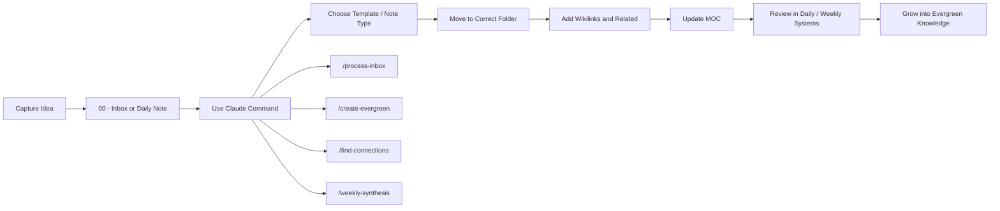

# Obsidian Claude Ecosystem Usage Guide

## Overview
This guide shows how to use the project structure in practice, starting from capture, moving through processing, and ending in connected knowledge.

## Structure Map

```mermaid
flowchart TD
    A["🏠 Home"] --> B["MOCs/Obsidian Claude Ecosystem MOC"]

    B --> C["Vault Foundation"]
    B --> D["Claude Integration"]
    B --> E["Core Plugins"]
    B --> F["Prompt Library"]
    B --> G["Knowledge Workflows"]
    B --> H["Automation"]
    B --> I["Daily Systems"]
    B --> J["Visualization"]
    B --> K["Maintenance & Optimization"]
    B --> L["Community & Growth"]

    C --> C1["Folder Structure"]
    C --> C2["Templates System"]
    C --> C3["Metadata & Dataview"]

    D --> D1["CLAUDE.md"]
    D --> D2["Commands Folder"]
    D --> D3["Session Memory"]

    F --> F1["Thinking Tools"]
    F --> F2["Note Processing"]
    F --> F3["Idea Generation"]
    F --> F4["Reflection & Synthesis"]

    G --> G1["Capture -> Process -> Connect"]
    G --> G2["Literature Notes"]
    G --> G3["Evergreen Notes"]
    G --> G4["Research & Synthesis"]

    I --> I1["Daily Notes"]
    I --> I2["Weekly & Monthly Reviews"]
    I --> I3["Task Management"]

    H --> H1["Custom Skills"]
    H --> H2["Auto-Tagging & Linking"]
    H --> H3["Summary Generation"]
```

## Daily Usage Flow

## How to Use
1. Start from [[🏠 Home]] or [[MOCs/Obsidian Claude Ecosystem MOC]].
2. If you are setting up the system, read Foundation, Claude Integration, and Core Plugins first.
3. If you are doing daily work, live mostly in Daily Systems, Prompt Library, and Knowledge Workflows.
4. Send raw material to `00 - Inbox/` first when unsure.
5. Use slash commands to process, connect, summarize, and review notes.
6. Keep important notes linked back into a MOC so the system stays navigable.

## Recommended Entry Points
- For setup: [[03 - Resources/Vault Foundation/Vault Foundation]]
- For Claude workflows: [[03 - Resources/Claude Integration/Claude Integration]]
- For note creation: [[03 - Resources/Knowledge Workflows/Knowledge Workflows]]
- For daily operation: [[05 - Daily Systems/Daily Systems]]
- For reviews and cleanup: [[10 - Meta/Maintenance & Optimization]]

## Related
- [[01 - Projects/Obsidian Claude Ecosystem]]
- [[MOCs/Obsidian Claude Ecosystem MOC]]
- [[01 - Projects/คู่มือการใช้งาน Obsidian Claude Ecosystem (TH)]]
