# 📖 คู่มือการใช้งาน Obsidian Claude Ecosystem

> คู่มือฉบับสมบูรณ์สำหรับระบบ PKM + AI ที่ขับเคลื่อนด้วย Obsidian และ Claude Code

---

## 🗺️ ภาพรวมระบบ

### สถาปัตยกรรมทั้งหมด

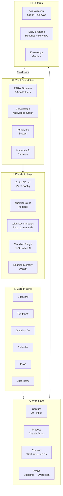

---

## 📂 โครงสร้างโฟลเดอร์ (PARA + Zettelkasten)

### PARA — จัดการตามความเร่งด่วน/เกี่ยวข้อง

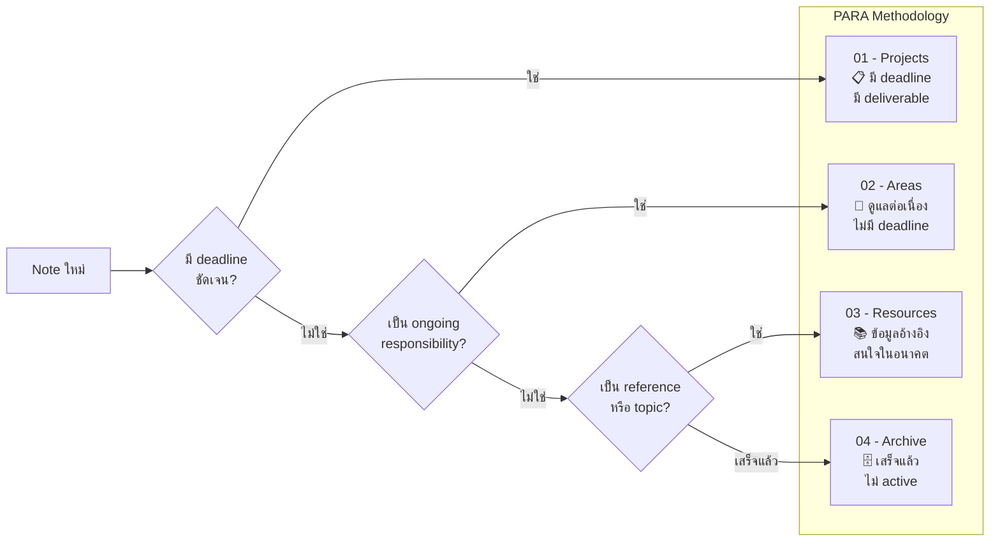

### Zettelkasten — สร้าง knowledge graph

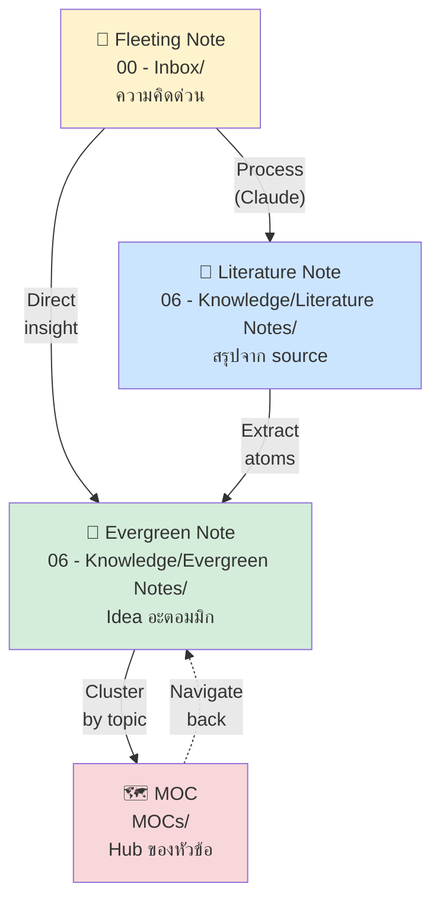

---

## 🤖 Claude Integration — วิธีใช้ AI

### สถาปัตยกรรมการทำงานของ Claude

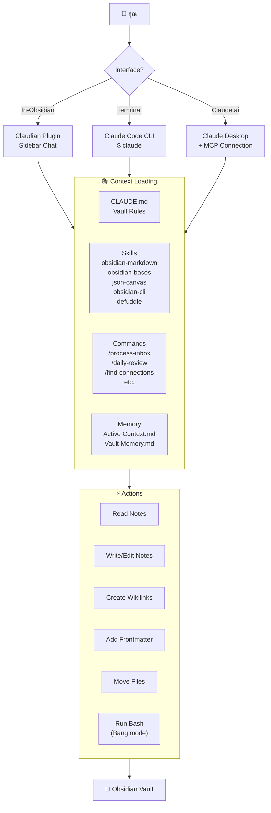

### Permission Modes ของ Claudian

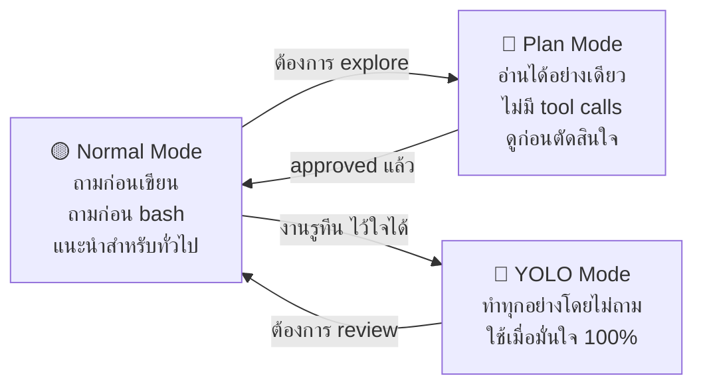

---

## ⚡ Slash Commands — คำสั่งทั้งหมด

### คำสั่งหลัก

| Command | ทำอะไร | ใช้เมื่อไหร่ |
|---------|---------|-------------|
| `/process-inbox` | จัดการ note ทุกอย่างใน Inbox | ทุกเช้า หรือเมื่อ inbox เต็ม |
| `/daily-review` | สร้าง reflection สำหรับวันนี้ | ทุกเย็น |
| `/weekly-synthesis` | สร้าง weekly review | ทุกวันอาทิตย์ |
| `/find-connections` | ค้นหา connections ใน notes ล่าสุด | เมื่อ note เยอะ ต้องการ link |
| `/create-evergreen` | แปลง note เป็น evergreen format | เมื่อ idea สุกพอ |
| `/vault-health` | ตรวจสุขภาพ vault | รายสัปดาห์ |
| `/update-memory` | อัปเดต session context | หลังทำงานสำคัญ |

### Thinking Tool Commands

| Command | เทคนิค | ใช้เมื่อ |
|---------|--------|---------|
| `/trace` | วิเคราะห์ step-by-step | ปัญหาซับซ้อน |
| `/challenge` | หา flaw และ assumption | ก่อนตัดสินใจสำคัญ |
| `/reframe` | มองจาก perspective ใหม่ | ติดขัด หรือ tunnel vision |
| `/synthesize` | รวม ideas หลายชิ้น | มี notes หลายตัวที่เกี่ยวกัน |
| `/brainstorm` | generate ideas จำนวนมาก | ต้องการ options |

### Workflow: การใช้ Commands ในชีวิตจริง

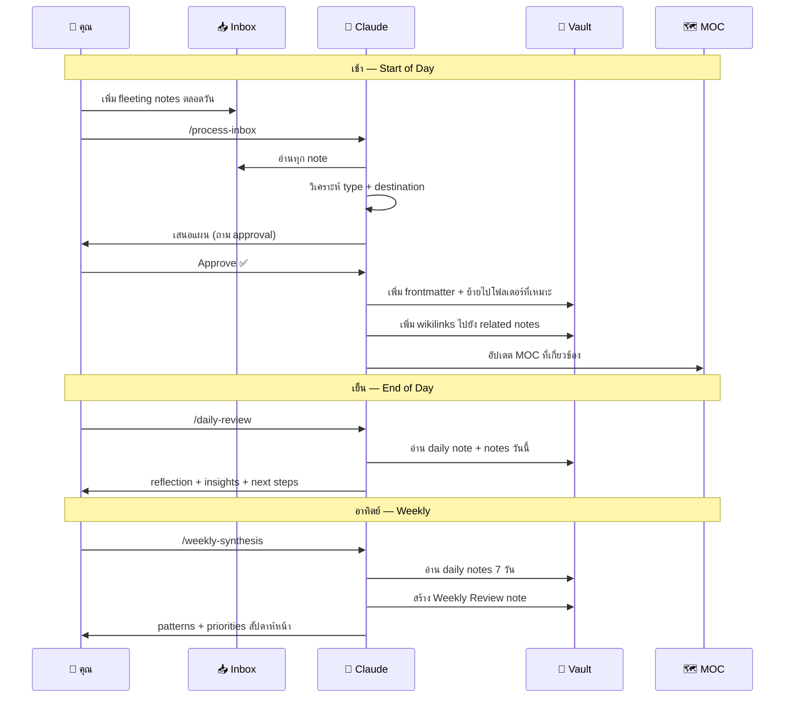

---

## 📝 Template System — เทมเพลตทั้งหมด

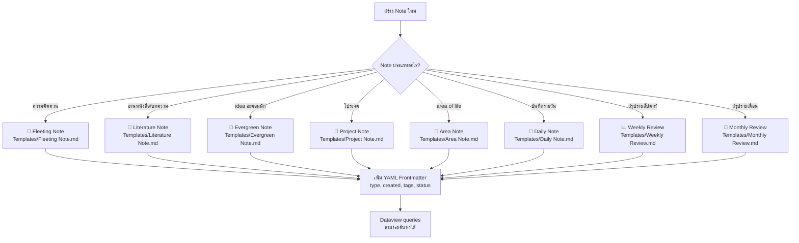

### Frontmatter ที่ควรใส่ทุก note

```yaml
---
type: fleeting | literature | evergreen | project | area | moc | daily
created: "YYYY-MM-DD"      # วันที่สร้าง (required)
status: seedling | growing | evergreen | active | done
tags:
  - type/[note-type]        # required
  - status/[status]         # required
  - area/[domain]           # optional
  - topic/[subject]         # optional
related: []                 # wikilinks ไปยัง notes ที่เกี่ยวข้อง
---
```

---

## 🌱 Knowledge Garden — วงจรชีวิตของ Note

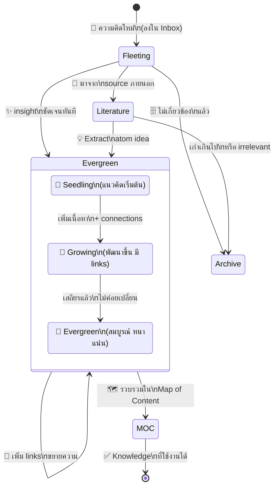

### กฎ Evergreen Note ที่ดี

> [!tip] 4 หลักการของ Evergreen Note
> 1. **Atomic** — หนึ่ง note = หนึ่งความคิด
> 2. **Concept-oriented** — ชื่อเป็น statement ไม่ใช่ topic
>    - ❌ "Machine Learning"
>    - ✅ "ML models overfit when training data lacks diversity"
> 3. **Own words** — เขียนด้วยคำพูดตัวเอง ไม่ copy-paste
> 4. **Densely linked** — มีลิงก์ไปยัง notes อื่น ≥ 3 ลิงก์

---

## 📅 Daily Systems — ระบบประจำวัน

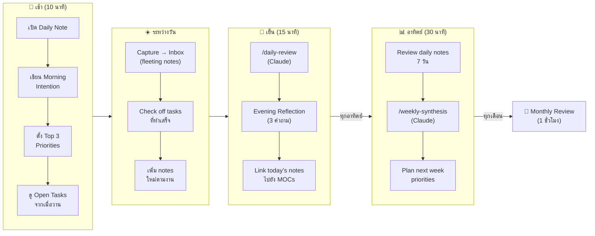

---

## 🔌 Core Plugins — ปลั๊กอินที่ติดตั้งแล้ว

| Plugin | สถานะ | ใช้ทำอะไร |
|--------|-------|----------|
| **Claudian** | ✅ ติดตั้งแล้ว | Claude AI in-Obsidian |
| **Dataview** | ✅ ติดตั้งแล้ว | Query notes เหมือน database |
| **Templater** | ✅ ติดตั้งแล้ว | Dynamic templates |
| **Calendar** | ✅ ติดตั้งแล้ว | Visual daily note navigation |
| **Obsidian Tasks** | ✅ ติดตั้งแล้ว | Advanced task management |
| **Obsidian Git** | ✅ ติดตั้งแล้ว | Auto git backup |
| **Excalidraw** | ✅ ติดตั้งแล้ว | Hand-drawn diagrams |
| **Icon Folder** | ✅ ติดตั้งแล้ว | Folder icons |
| **Table Editor** | ✅ ติดตั้งแล้ว | Better table editing |

---

## 🕸️ Visualization — ดู knowledge graph

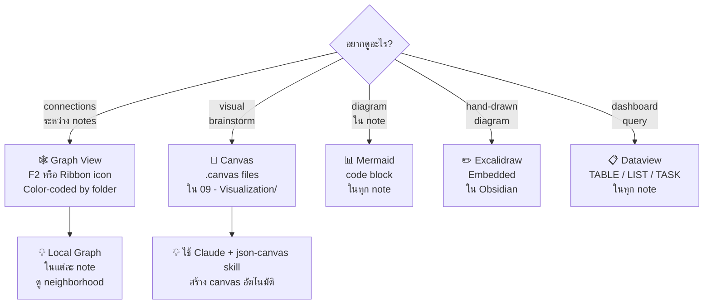

---

## 🔧 การ Maintenance — ดูแลรักษา Vault

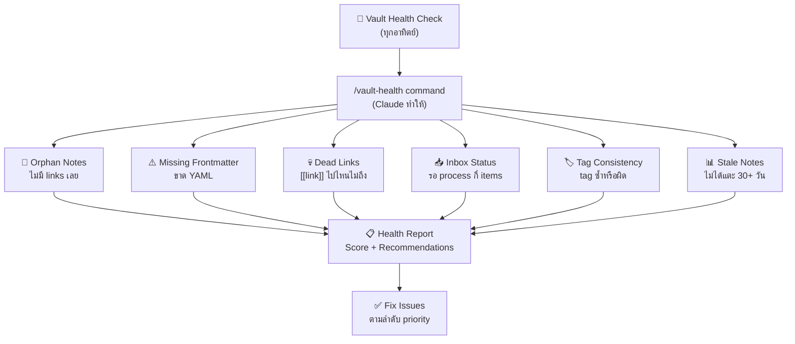

---

## 🚀 Getting Started — เริ่มต้นใช้งาน

### Checklist เริ่มต้น

- [ ] เปิด Obsidian และ enable Claudian plugin
- [ ] ตั้ง `ANTHROPIC_API_KEY` ใน environment
- [ ] ทดสอบ `/process-inbox` กับ note แรกใน Inbox
- [ ] สร้าง Daily Note วันนี้ด้วย template
- [ ] ลอง `/trace` กับ idea ที่กำลังคิดอยู่
- [ ] เปิด Graph View และดู vault structure
- [ ] อ่าน [[CLAUDE.md]] เพื่อเข้าใจ conventions

---

## 🔗 Quick Links

| หมวด | ลิงก์ |
|------|-------|
| Home Dashboard | [[🏠 Home]] |
| Ecosystem Map | [[MOCs/Obsidian Claude Ecosystem MOC]] |
| Knowledge | [[MOCs/Knowledge MOC]] |
| Projects | [[MOCs/Projects MOC]] |
| Daily Systems | [[MOCs/Daily Systems MOC]] |
| Prompts | [[MOCs/Prompt Library MOC]] |
| Automation | [[MOCs/Automation MOC]] |
| Visualization | [[MOCs/Visualization MOC]] |
