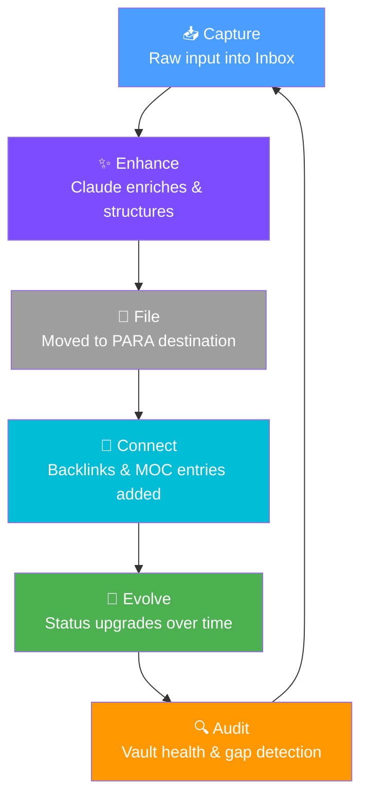

# Agentic Note-Taking

> [!abstract] Overview
> Agentic note-taking transforms Claude from a passive responder into an **active thinking partner** — one that proactively suggests connections, enriches raw captures, and continuously evolves your knowledge base over time.

## What Is Agentic Note-Taking?

Traditional note-taking is passive: you write, you store, you retrieve. Even AI-assisted note-taking is often reactive — you ask, Claude answers.

**Agentic note-taking** flips this model. Claude becomes a proactive participant in your knowledge work:

- **Suggests** connections you haven't noticed yet
- **Enriches** raw captures with context, definitions, and implications
- **Evolves** notes from seedlings to evergreens over time
- **Audits** your vault for gaps, contradictions, and orphaned ideas
- **Initiates** synthesis when patterns become meaningful enough

This is distinct from simple AI-assisted writing. The agent is not just completing your sentences — it is actively managing the health and growth of your knowledge graph.

> [!info] Key Distinction
> **Reactive AI**: "Summarize this note for me."
> **Agentic AI**: "I noticed this note connects to three other concepts you captured last week — here's what that synthesis reveals."

---

## Core Workflows

### 1. Live Capture with Claude

The fastest capture mode. You speak or type raw thoughts; Claude structures them in real time.

**How it works:**
1. Open a new note in `00 - Inbox/`
2. Dump raw thoughts, voice transcripts, or web clippings without formatting
3. Invoke Claude with `/process-inbox` or a custom prompt
4. Claude applies the correct template, adds frontmatter, extracts tags, and identifies wikilink candidates

**Example prompt for live capture:**
```
I just had a conversation about [topic]. Here are my raw notes:
[paste notes]

Structure this as a fleeting note with proper frontmatter, extract 3–5 key claims, and suggest 3 notes in my vault this might connect to.
```

> [!tip] Speed Tip
> Keep a hotkey bound to "New note in Inbox" so capture is frictionless. Let Claude do all the formatting work afterward.

### 2. Post-Capture Processing

After accumulating captures, run a processing session to move notes into your PARA structure.

**Workflow:**
1. Use `/process-inbox` to review all `00 - Inbox/` files
2. Claude reads each note, classifies it (project, area, resource, archive), and suggests a destination
3. Claude enhances the note: adds frontmatter, links related notes, suggests status tags
4. You approve moves or override — Claude executes

**What Claude does during processing:**
- Reads note content and determines note type (`fleeting`, `literature`, `evergreen`)
- Assigns initial `#status/seedling`
- Finds 2–4 candidate backlinks from existing vault notes
- Suggests MOC entries (e.g., "Add this to `[[MOCs/Knowledge MOC]]`")

### 3. Knowledge Evolution

The most powerful workflow — periodic review sessions where Claude upgrades notes from seedlings to evergreens.

**Triggered by:**
- A note sitting at `#status/seedling` for more than 2 weeks
- A cluster of related notes that haven't been synthesized
- A `/find-connections` run that surfaces unexpected links

**What evolution looks like:**

| Stage | Claude's Action | Result |
|---|---|---|
| `#status/seedling` | Adds 3 supporting references, a synthesis section, linked notes | `#status/growing` |
| `#status/growing` | Writes a "In Context" section, resolves ambiguities, establishes permanent claims | `#status/evergreen` |

---

## Real-Time Note Enhancement

When Claude reads your raw notes, it can enrich them along several dimensions:

| Enhancement Type | What Claude Does |
|---|---|
| **Contextualization** | Adds background knowledge, definitions, historical context |
| **Implication extraction** | Identifies "if this is true, then…" reasoning chains |
| **Question generation** | Surfaces open questions implied by the content |
| **Contradiction flagging** | Notes where this conflicts with other vault content |
| **Link suggestion** | Proposes `[[wikilinks]]` to existing notes |
| **Tag inference** | Suggests appropriate hierarchical tags |
| **Template matching** | Applies the right template from `Templates/` |

**Example enhancement prompt:**
```
Read this raw note and enhance it:
1. Add YAML frontmatter (type, created, tags, related)
2. Extract 3 key claims as bullet points
3. Identify 2–3 open questions this raises
4. Suggest 3 wikilinks to likely existing notes
5. Flag any claims that might contradict common knowledge
```

> [!warning] Anti-Pattern: Over-Enhancement
> Don't let Claude rewrite your voice. Enhancement should ADD to what you wrote, not replace it. Preserve original phrasing in a `## Raw Notes` section if needed.

---

## Autonomous Knowledge Gardening

At a higher level of autonomy, Claude can periodically review your vault and suggest improvements without being explicitly asked.

**Gardening tasks Claude can perform:**
- Identify notes with no outgoing links (isolated islands)
- Flag notes tagged `#status/seedling` older than 14 days
- Detect near-duplicate notes that should be merged
- Suggest new MOC entries when a topic cluster grows large enough
- Generate a "vault health report" summarizing gaps and opportunities

**Using `/vault-health` for gardening:**
This command runs a comprehensive scan and returns:
- Orphaned notes count
- Stale seedlings list
- Suggested merges
- Missing MOC connections
- Template compliance check

> [!example] Weekly Gardening Session
> Every Sunday, run `/vault-health` then review Claude's suggestions. Accept 3–5 improvements and defer the rest. This keeps the vault growing without overwhelming maintenance overhead.

---

## The Agentic Note-Taking Cycle



**Cycle explanation:**
1. **Capture** — Raw input flows into `00 - Inbox/` with zero friction
2. **Enhance** — Claude structures, enriches, and applies frontmatter
3. **File** — Note moves to correct PARA folder
4. **Connect** — Backlinks and MOC references are established
5. **Evolve** — Notes mature through seedling → growing → evergreen
6. **Audit** — Periodic review finds gaps and seeds new captures

---

## Best Practices

> [!success] Do These
> - **Keep captures atomic**: One idea per note makes Claude's connections more precise
> - **Use consistent vocabulary**: Consistent terms help Claude recognize when two notes are about the same thing
> - **Review Claude's suggestions critically**: Accept enrichments that resonate, reject those that feel off
> - **Set status tags deliberately**: `#status/seedling` is a contract with your future self to return
> - **Run `/find-connections` weekly**: Fresh connections surface as your vault grows

> [!danger] Anti-Patterns to Avoid
> - **Letting Claude rewrite your voice**: Enhancement is not replacement
> - **Accepting all suggestions uncritically**: Claude may hallucinate vault notes that don't exist — verify wikilinks
> - **Over-structuring raw captures**: The inbox is for raw thought; don't pre-format
> - **Never reviewing evolved notes**: Evergreen notes need human validation, not just AI polish
> - **Ignoring contradictions Claude flags**: These are often the most intellectually valuable moments

---

## Integration Points

- [[MOCs/Automation MOC]] — Track automation workflows built on this system
- [[03 - Resources/Advanced Techniques/Vault-as-Context Engineering]] — How note structure enables better Claude outputs
- [[03 - Resources/Advanced Techniques/Cross-Note Analysis]] — Vault-wide pattern detection
- [[03 - Resources/Claude Integration/Context Loading Strategies]] — Feeding the right vault context to Claude
- [[03 - Resources/Claude Integration/Session Memory System]] — Persisting context across Claude sessions
- [[03 - Resources/Advanced Techniques/Custom AI Agents]] — Building specialized agents for note-taking tasks
