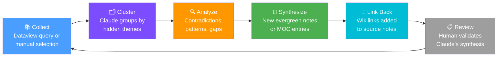

# Cross-Note Analysis

> [!abstract] Overview
> Cross-note analysis uses Claude to find **themes, contradictions, hidden connections, and synthesis opportunities** that span multiple notes — revealing the emergent intelligence of your vault as a whole, not just its individual parts.

## What Is Cross-Note Analysis?

Individual notes are atoms of knowledge. Cross-note analysis is the chemistry that happens when atoms combine.

You might capture ten separate observations about your productivity patterns over three months. No single note tells the full story. But Claude, reading all ten together, can surface:

- A recurring theme you didn't consciously notice
- A contradiction between what you believe and what you actually do
- A pattern that only becomes visible at the scale of weeks or months
- An insight that belongs in a new evergreen note

> [!info] What Makes This Different from Search
> Search finds notes that contain specific terms. Cross-note analysis finds **meaning** — patterns, tensions, and implications that aren't written in any single note.

---

## Using the /find-connections Command

The `/find-connections` command is the primary tool for cross-note analysis. It analyzes recent notes (typically the last 7 days) and surfaces hidden relationships.

**What it looks for:**
- Semantic overlap — notes about the same concept using different words
- Temporal co-occurrence — ideas captured close together in time
- Structural similarity — notes with parallel argument structures
- Thematic clustering — notes that belong to the same implicit category
- Contradiction pairs — notes whose claims are in tension

**Running it:**
```
/find-connections
```

Claude will return:
1. A list of connection pairs or clusters with explanation
2. Suggested wikilinks to add
3. Candidate synthesis notes (new notes that should be created to capture emergent ideas)
4. MOC entries to update

> [!tip] Weekly Practice
> Run `/find-connections` every Sunday as part of your weekly review. The connections Claude finds from 7 days of captures are often more revealing than any single note you wrote.

---

## Temporal Analysis: Patterns Over Time

Daily notes are a goldmine for temporal pattern detection. Over weeks and months, they reveal how your thinking, energy, and habits actually evolve — not how you think they evolve.

**What to analyze:**
- Mood or energy patterns across daily notes
- Recurring concerns or anxieties that surface repeatedly
- Topics you keep returning to (signals of deep interest)
- Habits that are claimed but never logged
- Projects mentioned often but never acted on

**Prompt for temporal analysis:**
```
Read these daily notes from the past 4 weeks:
[paste or reference notes]

Identify:
1. Recurring topics or concerns (mentioned 3+ times)
2. Topics that appear and then disappear
3. Claims I make repeatedly that I might want to examine
4. Any trend in mood, energy, or focus
5. Patterns in what I defer vs. act on
```

> [!example] What Temporal Analysis Revealed
> A user's daily notes showed they mentioned "need to work on deep work blocks" 11 times in 30 days but never logged a completed deep work session. That contradiction prompted a full system review.

---

## Thematic Analysis: Clustering Notes by Hidden Themes

Your vault may contain notes under different topics that are secretly about the same underlying theme. Thematic analysis reveals these hidden clusters.

**Common hidden themes to look for:**
- Notes about different tools that are all really about the same underlying need
- Multiple projects with the same root bottleneck
- Knowledge from different domains that converges on the same principle
- Personal observations that point toward a core value or belief

**Prompt for thematic clustering:**
```
Here are 10 notes from different folders in my vault:
[paste note titles and brief summaries]

Cluster these notes by hidden theme — not by their explicit topic, but by what underlying concern or principle they all relate to. For each cluster:
1. Name the hidden theme
2. List the notes that belong to it
3. Write one sentence capturing what the cluster reveals
4. Suggest a title for a synthesis note that captures the insight
```

---

## Contradiction Detection

One of the most valuable things Claude can do across your notes is find where you contradict yourself — and those contradictions are often where the most interesting thinking lives.

**Types of contradictions:**
- **Value contradictions**: You claim to value X but your notes show you consistently doing Y
- **Belief contradictions**: Two notes make incompatible factual or empirical claims
- **Strategy contradictions**: Two notes recommend opposite approaches to the same problem
- **Temporal contradictions**: A belief you held 6 months ago conflicts with what you think now

**Prompt for contradiction detection:**
```
Read these notes and identify any contradictions or tensions:
[paste notes]

For each contradiction you find:
1. State what Note A claims
2. State what Note B claims
3. Explain why they're in tension
4. Suggest how to resolve it (or whether the tension is generative)
```

> [!warning] Contradictions Are Features, Not Bugs
> Many contradictions in a knowledge vault are productive tensions — two true things that are in creative opposition. Don't rush to resolve them. Often the right move is to create a note that holds both in tension and explores what they reveal together.

---

## Using Dataview + Claude Together

Dataview queries surface structured subsets of your vault. Claude then analyzes that subset for meaning. Together they form a powerful analysis pipeline.

**Step 1 — Use Dataview to collect relevant notes:**
```dataview
LIST
FROM #area/health OR #area/habits
WHERE status = "seedling"
SORT file.ctime DESC
LIMIT 20
```

**Step 2 — Feed Claude the collected notes for analysis:**
```
Here are 20 notes from my health and habits area, all at seedling status.
[paste or reference them]

Analyze this set:
1. What themes recur most frequently?
2. Which notes are conceptually redundant and could be merged?
3. Which notes, if evolved to evergreen, would have the most downstream value?
4. What important topic is conspicuously missing from this cluster?
```

**Useful Dataview queries for analysis prep:**

Notes modified in the last 14 days:
```dataview
TABLE file.mtime AS "Modified", tags
FROM "06 - Knowledge"
SORT file.mtime DESC
LIMIT 30
```

Orphaned notes (no outgoing links):
```dataview
LIST
FROM "06 - Knowledge"
WHERE length(file.outlinks) = 0
```

---

## The Cross-Note Analysis Pipeline



**Pipeline stages:**
1. **Collect** — Define the scope: which notes, which time range, which tags
2. **Cluster** — Claude groups notes by hidden theme, not surface topic
3. **Analyze** — Contradictions, patterns, temporal trends, and gaps are identified
4. **Synthesize** — New evergreen notes or MOC entries are created to capture emergent insights
5. **Link Back** — Source notes receive wikilinks to the synthesis
6. **Review** — Human validates, adjusts, and approves before committing

---

## Practical Cross-Note Analysis Workflows

### Monthly Knowledge Audit
```
Once per month, run this on your 06 - Knowledge folder:
1. Collect all notes modified in the past 30 days
2. Run /find-connections to surface new links
3. Ask Claude to identify the 3 most important synthesis opportunities
4. Create one new evergreen note from the top synthesis
5. Update MOC entries
```

### Project Retrospective Analysis
```
At project close:
1. Collect all notes tagged #project/[name]
2. Ask Claude: "What did I learn across these notes that isn't captured in any single note?"
3. Create a retrospective synthesis note in 04 - Archive/
4. Extract transferable insights to 06 - Knowledge/
```

### Belief Evolution Tracking
```
Quarterly:
1. Find all notes tagged #belief or containing "I think" / "I believe"
2. Ask Claude: "How has my thinking on [topic] evolved across these notes?"
3. Write a "belief evolution" note summarizing the shift
```

---

## Integration Points

- [[MOCs/Automation MOC]] — Automate collection and analysis workflows
- [[03 - Resources/Advanced Techniques/Multi-Step Reasoning]] — Deep reasoning on individual clusters
- [[03 - Resources/Advanced Techniques/Agentic Note-Taking]] — Agentic workflows that trigger analysis automatically
- [[03 - Resources/Claude Integration/Context Loading Strategies]] — How to feed note clusters to Claude effectively
- [[03 - Resources/Claude Integration/Session Memory System]] — Maintaining context across multi-session analyses
- [[07 - Prompt Library/Note Processing/Note Processing Prompts]] — Prompt templates for processing and analysis
