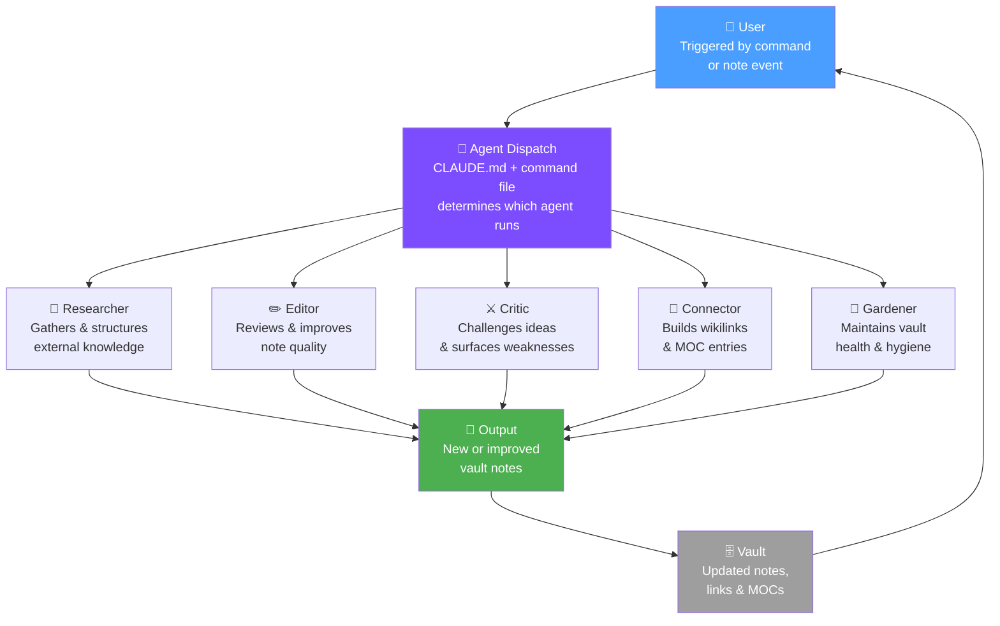

# Custom AI Agents

> [!abstract] Overview
> Custom AI agents are **specialized Claude configurations** designed for a specific, recurring job in your knowledge workflow. Rather than giving Claude general instructions every time, you encode a role, a set of behaviors, and a decision logic that Claude inhabits consistently.

## What Are Custom Agents?

A custom agent is not a separate AI system. It is Claude operating within a tightly defined context:

- A **role definition** (what this agent is and what it cares about)
- A **behavioral ruleset** (how it approaches its task)
- A **tool configuration** (which commands and skills it can use)
- A **memory strategy** (what context it loads at the start of each session)

The result is Claude that behaves like a dedicated specialist — a research assistant, an editorial critic, a knowledge connector — rather than a generalist.

> [!info] The Power of Specialization
> A generalist Claude asked "review my note" will give a general response. A "Editor Agent" Claude with defined editorial criteria, your personal writing voice guidelines, and your style rules will give targeted, consistent, high-value feedback every time.

---

## Agent Types

### The Researcher Agent

**Role:** Finds, synthesizes, and structures information from external sources.

**What it does:**
- Takes a research question from your inbox or project notes
- Searches for relevant information and frameworks
- Returns a structured literature note with sources, key claims, and open questions
- Tags the note for follow-up with `#status/seedling`

**Key behaviors:**
- Always cites sources with URLs
- Distinguishes between strong evidence and speculation
- Flags where consensus is lacking
- Suggests 3 follow-up questions for deeper investigation

**Invocation pattern:**
```
You are a research agent for my Obsidian knowledge vault.
Your job: given a research question, return a structured literature note.
Format: YAML frontmatter, ## Summary, ## Key Claims (with evidence levels), ## Open Questions, ## Sources
Research question: [question]
```

---

### The Editor Agent

**Role:** Reviews and improves notes for clarity, structure, and accuracy.

**What it does:**
- Reads a draft note and evaluates it against defined criteria
- Identifies structural problems (missing context, unclear claims, weak evidence)
- Suggests specific improvements without rewriting the note wholesale
- Checks for consistency with other vault notes on the same topic

**Key behaviors:**
- Preserves the author's voice — suggests improvements, doesn't impose new style
- Rates the note on: clarity (1–5), evidence quality (1–5), structure (1–5)
- Only recommends changes that serve the note's stated purpose
- Distinguishes "must fix" from "nice to improve"

**Invocation pattern:**
```
You are an editor agent for my Obsidian knowledge vault.
My writing voice: [brief description]
Editorial criteria: clarity, evidence quality, note structure, wikilink density
Review this note and give: (1) ratings on each criterion, (2) top 3 specific improvements, (3) any factual flags
Note: [paste note]
```

---

### The Critic Agent

**Role:** Challenges ideas and surfaces weaknesses before they become embedded beliefs.

**What it does:**
- Steel-mans the idea, then attacks it
- Identifies hidden assumptions
- Finds counterexamples or disconfirming evidence
- Rates the idea's robustness after critique

**Key behaviors:**
- Charitable but rigorous — not dismissive, genuinely adversarial
- Focuses on the weakest link in the argument, not the strongest
- Always suggests what evidence would change the assessment
- Ends with a revised, post-critique summary of what still holds

**Invocation pattern:**
```
You are a critic agent. Your job is to challenge ideas charitably but rigorously.
Process:
1. Restate the idea in its strongest form
2. Identify the 3 key assumptions it rests on
3. Challenge each assumption — what would falsify it?
4. Name one strong counterargument
5. After the critique: what still holds? what needs more evidence?
Idea to critique: [paste idea or note]
```

---

### The Connector Agent

**Role:** Finds links between notes and builds the web of knowledge.

**What it does:**
- Takes a new note and scans for connection candidates in the vault
- Suggests specific `[[wikilinks]]` with explanation of why each link matters
- Identifies which MOCs the note should be added to
- Detects if the note is a duplicate or extension of an existing note

**Key behaviors:**
- Explains the *type* of connection (supports, contradicts, extends, instantiates, generalizes)
- Prioritizes quality links over quantity — suggests 3–5 strong links, not 20 weak ones
- Flags near-duplicates explicitly with a merge recommendation
- Always suggests at least one MOC entry

**Invocation pattern:**
```
You are a connector agent for my Obsidian vault.
Your job: given a new note, find its best connections to existing knowledge.
For each suggested link: name the target note, describe the connection type, write the one sentence that would appear next to the wikilink.
New note: [paste note]
Existing note titles for context: [paste list or use Dataview output]
```

---

### The Gardener Agent

**Role:** Maintains vault health by identifying what needs attention.

**What it does:**
- Scans for orphaned notes, stale seedlings, and missing MOC connections
- Identifies notes that are ready to evolve to the next status level
- Detects topic clusters that warrant a new MOC or synthesis note
- Produces a prioritized "gardening task list"

**Key behaviors:**
- Works from explicit criteria, not vague quality judgments
- Produces an actionable task list, not just observations
- Distinguishes urgent (broken links, missing frontmatter) from optional (style improvements)
- Reports on vault health trends over time if memory notes are available

**Invocation pattern:**
```
You are a gardener agent for my Obsidian vault.
Run a vault health check and return:
1. Notes with no outgoing links (orphans)
2. Notes tagged #status/seedling modified more than 14 days ago
3. Topic clusters (3+ notes on the same topic) without a MOC entry
4. Notes with missing required frontmatter fields (type, created, tags)
5. Top 5 prioritized gardening tasks for this week
Vault summary: [paste Dataview output or file list]
```

---

## How to Create Agent-Like Behavior

Claude Code enables agent-like behavior through three layers:

### Layer 1: CLAUDE.md as System Prompt

`CLAUDE.md` is loaded at the start of every Claude Code session and defines global behavior. Use it to encode:
- Vault structure and conventions
- Your preferred writing voice and style
- Default behaviors (always use wikilinks, always add frontmatter, etc.)
- Which agents are available and how to invoke them

### Layer 2: `.claude/commands/` for Repeatable Tasks

Slash commands in `.claude/commands/` are invocable procedures. Each command file encodes a specific agent workflow:

```
.claude/commands/
├── process-inbox.md     → Inbox Processor Agent
├── find-connections.md  → Connector Agent
├── vault-health.md      → Gardener Agent
├── trace.md             → Reasoning Agent
└── synthesize.md        → Synthesis Agent
```

Each command file contains:
1. Role definition for that invocation
2. Step-by-step procedure
3. Output format specification
4. Edge case handling

### Layer 3: `.claude/skills/` for Domain Behavior

Skills provide richer, more complex behavior patterns — like the `obsidian-markdown` skill that encodes all Obsidian formatting conventions. Custom skills can encode:
- Your specific vault's conventions
- Domain-specific knowledge (e.g., a "literature review" skill for academic work)
- Multi-step workflows too complex for a simple command

---

## Agent Architecture Diagram



---

## Best Practices for Agent Design

> [!success] Design Principles
> - **Single responsibility**: Each agent does one thing well. Avoid "do everything" agents.
> - **Explicit output format**: Define exactly what the agent should return — structure, length, sections.
> - **Recoverable by default**: Agents should suggest, not auto-execute destructive changes.
> - **Idempotent**: Running the same agent twice on the same note should produce consistent results.
> - **Version your agents**: When you update a command file, note what changed and why.

> [!danger] Anti-Patterns
> - **Over-generalizing**: A "do everything" agent loses the specialization that makes agents valuable
> - **Implicit instructions**: If the agent's behavior isn't written down, it's not consistent
> - **No human review step**: Even good agents make mistakes — always include a review gate for important outputs
> - **Context overload**: Feeding an agent too many notes dilutes focus; scope inputs carefully
> - **Forgetting memory**: Agents without access to session memory will repeat work across sessions

---

## Integration Points

- [[MOCs/Automation MOC]] — All automation workflows including agent configurations
- [[08 - Automation/Custom Skills/Custom Claude Skills]] — Implementation of custom skills
- [[03 - Resources/Advanced Techniques/Vault-as-Context Engineering]] — How vault structure enables agent effectiveness
- [[03 - Resources/Advanced Techniques/Agentic Note-Taking]] — Agentic workflows these agents support
- [[03 - Resources/Claude Integration/Context Loading Strategies]] — How agents load the right context
- [[03 - Resources/Claude Integration/Session Memory System]] — Memory strategies for agent continuity
