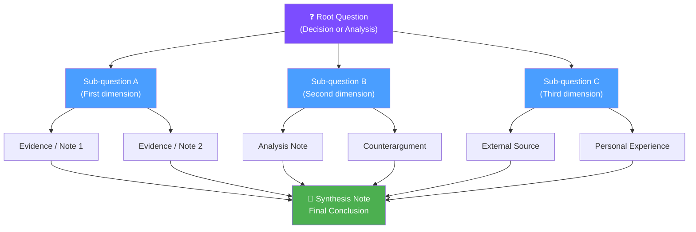

# Multi-Step Reasoning

> [!abstract] Overview
> Multi-step reasoning is the practice of breaking a complex intellectual problem into an explicit **chain of smaller reasoning steps** — and using Claude to work through each step systematically before synthesizing a conclusion.

## What Is Multi-Step Reasoning?

Complex decisions and analyses rarely yield to a single question. When you ask "Should I pursue this project?" or "What are the implications of this research finding?", a one-shot answer is often superficial or brittle.

**Multi-step reasoning** structures the cognitive process itself:

1. Clarify what you're actually asking
2. Gather and inspect the relevant evidence
3. Decompose the problem into sub-questions
4. Analyze each sub-question independently
5. Identify tensions and tradeoffs
6. Synthesize a final, well-grounded answer

By making each step explicit, you get reasoning that is **transparent**, **revisable**, and **traceable back to evidence** — not just a black-box conclusion.

> [!info] Why It Matters for Knowledge Work
> In note-taking, the conclusions you reach are only as good as the reasoning behind them. Multi-step reasoning leaves an audit trail in your notes, so future-you (or Claude) can revisit and challenge the logic.

---

## Chain-of-Thought Prompting Patterns

Chain-of-thought (CoT) prompting asks Claude to show its reasoning before giving a conclusion. Several patterns are useful depending on context.

### Pattern 1: Sequential Decomposition

Best for: Linear problems with clear sub-questions.

```
Problem: [state the question]

Work through this step by step:
Step 1: What do I already know about this?
Step 2: What are the key sub-questions I need to answer?
Step 3: What does the evidence suggest for each sub-question?
Step 4: Are there tensions or contradictions between the answers?
Step 5: What is the most defensible conclusion given all of the above?
```

### Pattern 2: Lens Analysis

Best for: Strategic decisions or concept exploration from multiple angles.

```
Analyze [topic] through each of the following lenses:
- Technical lens: What are the implementation realities?
- Economic lens: What are the costs, benefits, incentives?
- Human lens: How does this affect people's behavior or wellbeing?
- Temporal lens: How does this play out over time?
- Risk lens: What could go wrong?

Then synthesize: What does the full picture reveal that any single lens would miss?
```

### Pattern 3: Steel-Man + Critique

Best for: Evaluating ideas you're tempted to accept too quickly.

```
Idea: [state the idea]

Step 1: Steel-man this idea — make the strongest possible case for it.
Step 2: Identify the 3 most important assumptions it rests on.
Step 3: For each assumption, what would falsify it?
Step 4: Critique the idea from the perspective of someone who disagrees.
Step 5: Revised assessment: what remains true after the critique?
```

### Pattern 4: Decision Tree Expansion

Best for: Choices with conditional branches.

```
Decision: [state the choice]

Map this as a decision tree:
- Option A: What happens if I choose this?
  - Best case: ...
  - Likely case: ...
  - Worst case: ...
- Option B: What happens if I choose this?
  - Best case: ...
  - Likely case: ...
  - Worst case: ...

Which option has the best expected outcome? Which has the best worst-case?
```

---

## Using the /trace Command

The `/trace` command is purpose-built for systematic, step-by-step analysis of a note or idea.

**How it works:**
1. Open the note or idea you want to analyze
2. Run `/trace` with the target
3. Claude traces through: what the idea claims, what it assumes, what it implies, what challenges it, and what it connects to

**What `/trace` produces:**
- The core claim, stated precisely
- Hidden assumptions surfaced explicitly
- Logical implications (what must also be true if this is true)
- Potential counterarguments
- Connection candidates in your vault
- Suggested next steps (further reading, experiments, questions to answer)

> [!example] Using /trace on a Research Finding
> If you capture "studies show intermittent fasting improves cognitive function," `/trace` would surface: what studies? what populations? what mechanisms are proposed? what confounds exist? what would this imply for your own practice? what contradicts this in your vault?

---

## Building Reasoning Trees Across Multiple Notes

Complex problems don't fit in one note. Reasoning trees let you spread an analysis across your vault and link it together.

**Structure:**
```
Decision or Question (root note)
├── Sub-question A (linked note)
│   ├── Evidence 1 [[source note]]
│   └── Evidence 2 [[source note]]
├── Sub-question B (linked note)
│   ├── Analysis note
│   └── Counterargument note
└── Synthesis (linked note)
    └── Final conclusion + action items
```

**Implementation in Obsidian:**
- Create a "reasoning root" note with a clear question as the title
- Use `[[wikilinks]]` to link to sub-question notes
- Tag all related notes with a shared project tag (e.g., `#project/decision-2026`)
- Use Dataview to pull all tagged notes into the root note for a live overview

**Example Dataview query for a reasoning tree:**
```dataview
LIST
FROM #project/decision-2026
SORT file.ctime ASC
```

---

## Example: Analyzing a Complex Decision Through Multiple Lenses

> [!example] Should I switch from a weekly to a daily review system?

**Step 1 — Clarify the question:**
The real question is: "What review cadence best serves my goals, given my current constraints and work style?"

**Step 2 — Gather evidence from vault:**
- `[[05 - Daily Systems/Weekly Review Template]]` — current system
- `[[03 - Resources/Vault Foundation/Daily Note System]]` — daily note design
- Recent daily notes showing whether reviews are happening

**Step 3 — Lens analysis:**
- *Friction lens*: Daily reviews take ~10 min; weekly take ~45 min. Daily feels lighter but adds up.
- *Completeness lens*: Weekly gives full-week perspective; daily misses the forest for the trees.
- *Consistency lens*: Daily habit is more likely to stick; weekly tends to slip during busy weeks.
- *Outcome lens*: What am I actually trying to achieve — habit tracking, reflection, or project oversight?

**Step 4 — Tensions:**
Daily is better for habits and reflection; weekly is better for project oversight. These are different goals.

**Step 5 — Synthesis:**
Hybrid: 10-minute daily check-in + 30-minute weekly synthesis. Daily note captures; weekly note synthesizes.

---

## The Reasoning Tree Structure



---

## When to Use Multi-Step vs. Single-Step Prompts

| Situation | Best Approach |
|---|---|
| Simple factual question | Single-step prompt |
| Summarizing a note | Single-step prompt |
| Creating a new note from a template | Single-step prompt |
| Analyzing a major decision | Multi-step reasoning |
| Evaluating a complex idea | Multi-step + steel-man |
| Comparing two competing frameworks | Lens analysis |
| Planning a project with many unknowns | Decision tree expansion |
| Finding implications of a research finding | `/trace` command |
| Resolving a contradiction between two notes | Sequential decomposition |

> [!tip] Rule of Thumb
> If your question has sub-questions embedded in it, use multi-step. If you can answer it in one sentence, use single-step.

---

## Integration Points

- [[MOCs/Automation MOC]] — Automation workflows that use reasoning chains
- [[03 - Resources/Advanced Techniques/Cross-Note Analysis]] — Applying reasoning across many notes at once
- [[03 - Resources/Advanced Techniques/Agentic Note-Taking]] — Agentic workflows that trigger reasoning automatically
- [[07 - Prompt Library/Thinking Tools/Thinking Tools]] — Full prompt library for thinking tools
- [[03 - Resources/Claude Integration/Context Loading Strategies]] — How to give Claude the right context for deep reasoning
