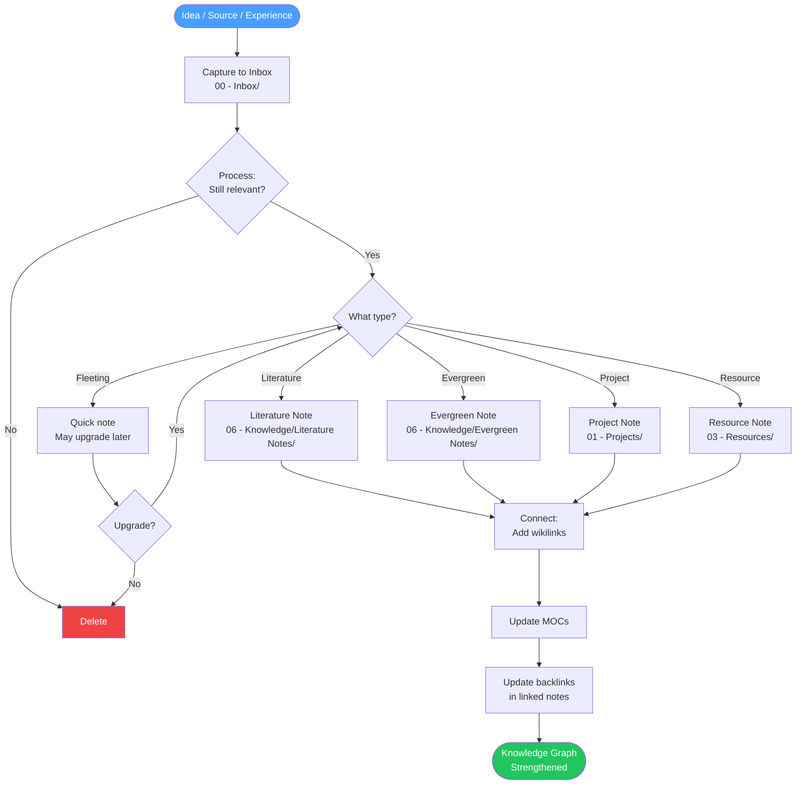

# Capture → Process → Connect: The Complete Knowledge Workflow

The foundation of this vault is a three-phase cycle that transforms raw ideas into lasting knowledge. Every piece of information you encounter flows through the same pipeline: **Capture** it quickly, **Process** it thoughtfully, **Connect** it meaningfully.

> [!abstract] Core Principle
> The goal is not to store information — it is to build a *thinking system*. Each phase serves a different cognitive function: capture removes the burden of remembering, processing adds judgment, and connecting creates insight.

---

## Phase 1: Capture

The capture phase is about **speed and completeness**. The rule is simple: if something catches your attention, capture it now and decide later. Friction is the enemy of capture.

### What to Capture

Capture anything that:
- Surprises you or contradicts your existing understanding
- Answers a question you've been holding
- Could be useful to a future project
- Sparks a creative idea or new angle
- Represents something you want to remember or return to

> [!tip] The "Interesting" Test
> If you find yourself thinking "that's interesting" — capture it. Your future self will thank you. If it turns out to be unimportant, it costs nothing to discard it during processing.

### Where to Capture

Everything goes to `[[00 - Inbox/]]` first. No exceptions. The inbox is a staging area, not a filing cabinet. It should feel slightly messy — that's the point.

**Capture Tools & Shortcuts**

| Tool | Use Case | Destination |
|------|----------|-------------|
| Obsidian Quick Capture | Desktop capture of ideas | `00 - Inbox/` |
| Mobile Obsidian | On-the-go capture | `00 - Inbox/` |
| Obsidian Web Clipper | Web articles, references | `00 - Inbox/` |
| Daily Note | Thoughts during daily review | `05 - Daily Systems/` |
| Voice memo → transcribe | Verbal ideas while moving | `00 - Inbox/` |

### Capture Templates

Use fleeting note format for speed — a title and a few lines is enough:

```markdown
---
type: fleeting
created: "{{date}}"
tags:
  - status/seedling
---

# [One-line title that captures the idea]

[2-3 sentences describing the core idea. What was the context? Why did it feel important?]

Source: [URL, book, conversation, etc.]
```

> [!warning] Don't Over-Capture
> Capturing too much creates noise. Focus on ideas that have some personal resonance or relevance to your current projects and interests. You are curating, not archiving.

---

## Phase 2: Process

Processing is the act of transforming raw captures into structured knowledge. This is where you bring judgment. Aim to process your inbox every 1-3 days — never let it exceed 20-30 items.

### The Processing Protocol

For each item in your inbox, ask these questions in order:

1. **Is this still relevant?** If not, delete it immediately. No guilt.
2. **What type of note is this?** (See decision tree below)
3. **What is the core idea?** Rewrite it in your own words.
4. **What folder does it belong in?**
5. **What frontmatter does it need?**

### Note Classification Decision Tree

```
Is this a raw, unprocessed thought or observation?
├── YES → Fleeting Note (may be discarded or upgraded later)
└── NO → Does it document your understanding of someone else's work?
          ├── YES → Literature Note → goes to 06 - Knowledge/Literature Notes/
          └── NO → Does it express a single, stable, reusable idea in your own words?
                    ├── YES → Evergreen Note → goes to 06 - Knowledge/Evergreen Notes/
                    └── NO → Is it tied to a specific active project?
                              ├── YES → Project Note → goes to 01 - Projects/[project]/
                              └── NO → Is it reference material you'll look up later?
                                        ├── YES → Resource → goes to 03 - Resources/
                                        └── NO → Archive or Daily Note
```

### Choosing the Right Destination

| Note Type | Folder | Key Characteristic |
|-----------|--------|--------------------|
| Fleeting | `00 - Inbox/` or delete | Raw, unprocessed |
| Literature | `06 - Knowledge/Literature Notes/` | About a source |
| Evergreen | `06 - Knowledge/Evergreen Notes/` | Atomic, reusable idea |
| Project | `01 - Projects/[name]/` | Tied to a deliverable |
| Resource | `03 - Resources/[topic]/` | Reference material |
| Daily | `05 - Daily Systems/Daily/` | Date-stamped reflection |

### Adding Frontmatter During Processing

Every processed note needs complete frontmatter. Use the appropriate template:

- Literature notes: `[[Templates/Literature Note]]`
- Evergreen notes: `[[Templates/Evergreen Note]]`
- Project notes: `[[Templates/Project Note]]`

Minimum required fields:
```yaml
---
type: [fleeting|literature|evergreen|project|resource]
created: "YYYY-MM-DD"
tags:
  - status/seedling
  - type/[notetype]
  - area/[relevant-area]
---
```

> [!example] Processing in Practice
> You captured: *"Article about spaced repetition showing 80% retention improvement"*
>
> Processing steps:
> 1. Still relevant? Yes.
> 2. Type? Literature note — it's about someone else's research.
> 3. Core idea in my words? "Spacing out review sessions dramatically outperforms massed practice for long-term retention."
> 4. Destination? `06 - Knowledge/Literature Notes/`
> 5. Frontmatter? Add source, tags `#topic/learning #type/literature`

---

## Phase 3: Connect

Connecting is where the magic happens. An isolated note is just storage. A connected note becomes thinking. The goal is to make every new note point to and from existing notes, building a web of mutually reinforcing ideas.

### The Connection Protocol

After placing a note in its destination folder, spend 5 minutes on connections:

1. **Search for related notes** — Use Obsidian's search and graph view to find thematically related notes
2. **Add wikilinks** — Link to at least 2-3 existing notes from the new note's body
3. **Update existing notes** — Go to those linked notes and add a backlink reference
4. **Update the relevant MOC** — Add the new note to its topic's Map of Content
5. **Check for clusters** — Are you building enough notes on a topic to merit a new MOC?

### Finding Related Notes

Use these strategies to find connection candidates:

- **Obsidian Search** (`Cmd+Shift+F`): search for key terms in the new note
- **Graph View**: open the local graph of a related note to discover neighbors
- **Backlinks panel**: check what already links to notes you're linking to
- **MOC scanning**: browse the relevant MOC for conceptually adjacent notes
- **Tag browsing**: filter by shared tags to find thematic neighbors

### Creating Meaningful Links

Not all links are equal. Prefer links that express a **relationship**, not just a topic overlap:

```markdown
- "This builds on the idea in [[Spaced Repetition Principles]]"
- "This contradicts the assumption in [[Massed Practice Is Efficient]]"
- "This is an application of [[Interleaving Effect]]"
- "See also [[Active Recall vs Passive Review]] for comparison"
```

> [!tip] Link with Context
> When you add a wikilink, surround it with a phrase that explains *why* it's linked. "See [[Note Name]]" is weak. "This principle explains *why* [[Note Name]] works" is strong.

### Updating MOCs

Every note should be registered in at least one [[MOCs/Knowledge MOC|Map of Content]]. MOCs serve as curated entry points — they are not auto-generated indexes but hand-maintained collections.

**Key MOCs to update:**
- `[[MOCs/Knowledge MOC]]` — for all knowledge notes
- `[[MOCs/Prompt Library MOC]]` — for new prompts and commands
- `[[MOCs/Automation MOC]]` — for scripts and workflows
- `[[MOCs/Daily Systems MOC]]` — for daily/weekly/monthly system notes
- Topic-specific MOCs under `MOCs/`

### Building Knowledge Clusters

When you have 5+ notes on the same topic, consider creating a dedicated MOC or cluster note. Signs that a cluster is forming:

- Multiple notes frequently link to each other
- You find yourself searching the same topic repeatedly
- A topic appears in many different contexts in your graph

---

## Full Pipeline Flowchart



---

## Using Claude to Accelerate the Workflow

Claude can assist at every phase:

| Phase | Claude Command | What it does |
|-------|---------------|--------------|
| Capture | N/A | Capture is always manual |
| Process | `[[07 - Prompt Library/Note Processing/Note Processing Prompts]]` | Classifies and rewrites notes |
| Connect | `/find-connections` | Surfaces hidden connections in recent notes |
| Connect | `/create-evergreen` | Converts literature/fleeting to evergreen |
| Review | `/synthesize` | Combines multiple notes into a synthesis |

> [!info] Claude Integration Principle
> Use Claude to **accelerate** the workflow, not to replace your judgment. Claude can suggest connections and reformulate ideas, but the decision to keep, discard, or promote a note is always yours.

---

## Weekly Maintenance Checklist

- [ ] Process all items in `00 - Inbox/` (target: 0 unprocessed)
- [ ] Review recent evergreen notes for new connections
- [ ] Update MOCs with newly added notes
- [ ] Run `/vault-health` to check for orphaned notes
- [ ] Review and close completed project notes

---

## Related Guides

- `[[03 - Resources/Knowledge Workflows/Literature Notes Guide]]` — Deep dive on literature notes
- `[[03 - Resources/Knowledge Workflows/Evergreen Notes Guide]]` — Deep dive on evergreen notes
- `[[03 - Resources/Knowledge Workflows/Project Management Guide]]` — Managing projects in PARA
- `[[03 - Resources/Knowledge Workflows/Research & Synthesis Guide]]` — Research workflows
