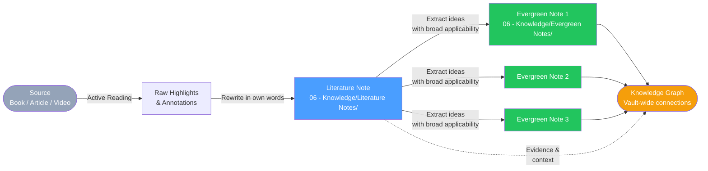

# Literature Notes Guide

A literature note is a record of **your understanding** of a source — not a copy of the source itself. It answers the question: *what does this mean to me, and why does it matter?*

> [!abstract] The Core Distinction
> A highlight is passive. A literature note is active. The act of writing in your own words forces comprehension — it reveals whether you actually understood something or just recognized it.

---

## What Is a Literature Note?

A literature note documents your engagement with a specific source: a book, article, paper, video, podcast, or conversation. It is:

- **Your synthesis**, not the author's words
- **Selective**, capturing only what struck you as significant
- **Contextualized**, noting why an idea matters to your thinking
- **Connected**, pointing toward related notes in your vault

A literature note is **not**:
- A summary of every chapter or section
- A collection of quotes (though a few key quotes are fine)
- A book report intended for someone else to read
- A copy-paste of highlights from a reading app

> [!warning] The Copy-Paste Trap
> Pasting highlights into a note feels like learning but isn't. Your brain recognizes the words, producing a false sense of comprehension. The test of understanding is whether you can explain the idea in completely different words.

---

## Active Reading: How to Take Notes While Reading

The quality of your literature notes is determined before you open Obsidian. Active reading means engaging with the text as a dialogue, not a download.

### The SQ3R Method (Adapted)

1. **Survey** — Skim headings, introduction, conclusion. What is the author trying to argue?
2. **Question** — Before reading each section, ask: *what do I want to know here?*
3. **Read** — Read with your question in mind. Don't highlight everything — highlight what surprises you.
4. **Recite** — After each section, close the book and write the main idea in your own words.
5. **Review** — After finishing, write your literature note while the ideas are fresh.

### Marginalia and Inline Annotations

Use a consistent annotation system while reading:

| Symbol | Meaning |
|--------|---------|
| `*` | This is important |
| `?` | I don't understand this |
| `!` | This surprises me or contradicts my beliefs |
| `→` | This connects to something I already know |
| `✓` | I agree with this |
| `✗` | I disagree with this |

### Reading for Literature Notes vs. Reading for Projects

**For literature notes:** Read slowly, engage deeply, capture ideas that resonate with your broader thinking. These become permanent assets in your vault.

**For project research:** Read strategically for specific answers. Capture what's relevant to the project; discard the rest.

---

## The Literature Note Template Walkthrough

Open `[[Templates/Literature Note]]` when creating a new literature note. Here is what each section means:

### Frontmatter

```yaml
---
type: literature
created: "2026-04-16"
source: "[Book/Article/Video Title]"
author: "[Author Name]"
source-url: "[URL if applicable]"
tags:
  - type/literature
  - status/seedling
  - area/[relevant-area]
  - topic/[main-topic]
related: []
---
```

- `source` and `author` are required — they trace the idea back to its origin
- `source-url` for anything digital
- `status/seedling` — all new literature notes start as seedlings

### The One-Line Summary

After the title, write a single declarative sentence summarizing the source's core argument:

```markdown
> [!abstract] Core Argument
> The author argues that [main thesis in one sentence].
```

This discipline forces you to identify the central claim before diving into details.

### Key Ideas Section

Limit to 5-7 key ideas from the source. Each idea should be:
- Written in your own words (no direct quotes without attribution)
- A complete thought, not a phrase
- Accompanied by a brief note on why it matters to you

```markdown
## Key Ideas

### 1. [Idea Title]
[2-4 sentences in your own words explaining the idea.]
*Why this matters to me: [personal relevance or connection to existing knowledge]*

### 2. [Idea Title]
...
```

### My Reaction

This is the most important section and the most skipped. Write:
- What do you agree with, and why?
- What do you disagree with or find questionable?
- What questions does this raise?
- What does this change about how you think?

> [!example] Example My Reaction Section
> "I was skeptical of the claim that willpower is a depletable resource — it feels too convenient as an excuse. But the evidence on glucose depletion is harder to dismiss. This does change how I think about scheduling difficult cognitive work: front-load it. See [[Deep Work Scheduling Principles]] for how this might apply."

### Connections

List wikilinks to related notes. This is where literature notes gain their power — not in isolation but in relation to the rest of your vault.

```markdown
## Connections
- Builds on: [[Note A]] — [why]
- Challenges: [[Note B]] — [how]
- Applied in: [[Project X]] — [where]
- See also: [[Note C]]
```

---

## Extracting Key Ideas and Creating Connections

The process of building connections is not optional — it is the core of the literature note workflow.

### Step 1: Identify the "Surprising" Ideas

After writing your key ideas, ask: which of these would I tell a knowledgeable friend about? Those are the ones most worth turning into evergreen notes.

### Step 2: Search for Resonance

For each key idea, search your vault:
- What already exists on this topic?
- Does this confirm, extend, or contradict existing notes?
- Is there a project where this is directly applicable?

### Step 3: Create the Links

Add wikilinks in both directions:
- In the **literature note**: link to existing related notes
- In the **existing related notes**: add a line referencing the new literature note

### Step 4: Tag for Future Retrieval

Use topic tags liberally. A literature note about a psychology study might get:
```
#topic/psychology #topic/learning #topic/memory #area/research
```

These tags make the note discoverable in future searches even if you don't remember the source.

---

## When to Convert Literature Notes into Evergreen Notes

Not every key idea from a literature note deserves its own evergreen note. Convert when:

- The idea appears in **multiple sources** (it's not just one person's opinion)
- The idea is **general enough** to apply in many contexts
- You've **genuinely internalized** it and can express it entirely in your own words
- The idea is **stable** — not likely to become outdated quickly

> [!tip] The Conversion Trigger
> When you find yourself linking to the same literature note from three or more other notes, that's a signal the idea it contains deserves to become a standalone evergreen note. Use `/create-evergreen` or `[[07 - Prompt Library/Note Processing/Note Processing Prompts]]` to assist.

The evergreen note then **replaces** the literature note as the canonical location of the idea. The literature note becomes supporting evidence.

---

## Good vs. Bad Literature Notes

### Bad Literature Note

```markdown
## Key Ideas
- "The key to success is deliberate practice"
- "10,000 hours is required for mastery"
- "Feedback is essential"
- [Three more bullet points that are just phrases from the book]
```

Problems: phrases only, not ideas; no personal engagement; no connections; could have been written by anyone who read the table of contents.

### Good Literature Note

```markdown
## Key Ideas

### 1. Deliberate practice requires discomfort by design
Practice only produces expertise when it operates at the edge of current ability —
comfortable repetition doesn't build new skills, it just entrenches existing ones.
*Why this matters: This reframes my approach to coding practice. I've been drilling
things I already know. I need to design challenges that force failure.*

### 2. Expert performance is built on chunked mental representations
Experts don't think faster — they perceive differently. Chess masters don't calculate
more moves; they recognize meaningful patterns instantly. Expertise is a library of
compressed patterns, not raw computational power.
*This connects to [[Pattern Recognition in Expert Decision-Making]] and challenges
the idea that intelligence is general.*
```

What makes it good: complete thoughts, personal angle, specific connections, reveals thinking rather than just restating the source.

---

## Source-to-Knowledge Diagram



---

## Literature Note Checklist

Before moving a literature note out of the inbox, verify:

- [ ] Written in your own words (not copy-pasted)
- [ ] Has a one-line summary of the core argument
- [ ] Has 3-7 key ideas, each with a "why this matters" reflection
- [ ] Has a "My Reaction" section with genuine engagement
- [ ] Has at least 2-3 wikilinks to related notes
- [ ] Is tagged with relevant topic and area tags
- [ ] Has been added to the relevant section of `[[MOCs/Knowledge MOC]]`
- [ ] Source information is complete in frontmatter

---

## Claude Assistance for Literature Notes

Use these prompts when processing literature notes with Claude:

- **Rewrite in own words**: "Rewrite these highlights in my own words, focusing on what's surprising or non-obvious"
- **Find connections**: "What notes in my vault connect to these ideas?" (Use `/find-connections`)
- **Identify evergreen candidates**: "Which of these ideas is general enough to become a standalone evergreen note?"
- **Generate questions**: "What questions does this source raise that I haven't yet answered?"

See `[[07 - Prompt Library/Note Processing/Note Processing Prompts]]` for full prompt templates.

---

## Related Guides

- `[[03 - Resources/Knowledge Workflows/Capture Process Connect]]` — The full workflow pipeline
- `[[03 - Resources/Knowledge Workflows/Evergreen Notes Guide]]` — What to do after the literature note
- `[[Templates/Literature Note]]` — The note template to use
- `[[MOCs/Knowledge MOC]]` — Where to register new literature notes
