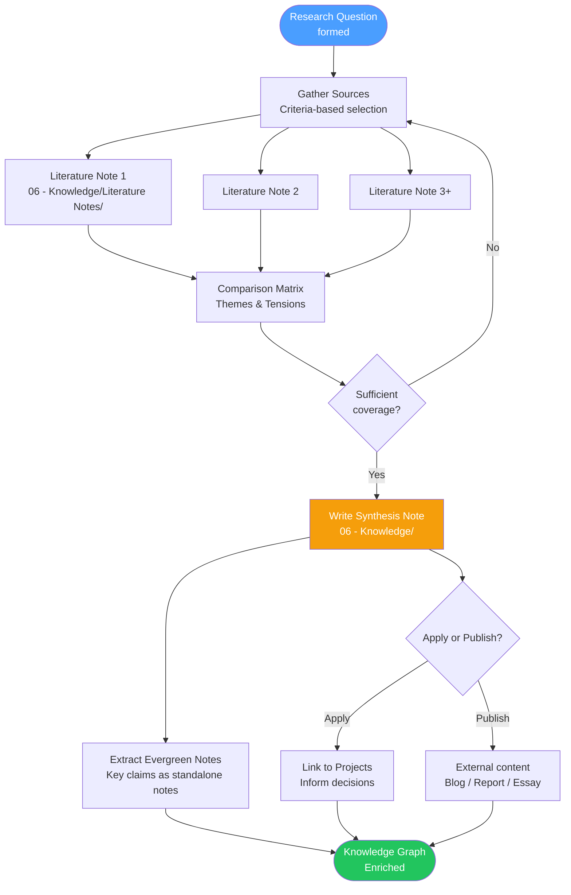

# Research & Synthesis Guide

Research without synthesis is just accumulation. Synthesis without research is just opinion. This guide covers the complete workflow: from asking the right question, through gathering and analyzing sources, to producing a synthesis that is genuinely greater than the sum of its parts.

> [!abstract] What is Synthesis?
> Synthesis is not summarization. Summarization compresses a single source. Synthesis integrates *multiple* sources into a new, unified understanding that no single source contains. A good synthesis surfaces tensions between sources, identifies what's agreed upon, and advances the question.

---

## The Research Workflow

Research in this vault follows a five-stage process:

```
Question → Gather → Analyze → Synthesize → Publish/Apply
```

Each stage has distinct activities and outputs. Skipping stages produces shallow work. Rushing synthesis before adequate analysis produces confident-sounding nonsense.

---

## Stage 1: Question

All good research begins with a question worth answering. Not a topic — a question. The quality of the question determines the quality of the research.

### Forming a Good Research Question

A research question is:
- **Specific enough** to be answerable (not "what is creativity?")
- **Open enough** to require investigation (not "what year was X published?")
- **Personally motivated** — you should genuinely want to know the answer
- **Falsifiable** — there should be ways you could be wrong

| Weak Question | Strong Question |
|---|---|
| What is motivation? | Under what conditions does external reward undermine intrinsic motivation? |
| How does memory work? | Why does spaced repetition produce better long-term retention than massed practice? |
| Is remote work good? | What does the evidence say about remote work's effect on deep focus work vs. collaborative work? |

### Question Types

**Descriptive:** What is X? What does X look like? (Useful for understanding a new domain)
**Causal:** Why does X happen? What causes Y? (Useful for building mental models)
**Comparative:** How does X compare to Y? (Useful for making decisions)
**Evaluative:** Is X good/effective? (Useful for guiding action)
**Generative:** How might X work? (Useful for design and invention)

> [!tip] The Question Incubation Note
> Before starting research, create a note in `00 - Inbox/` with just the question and your current hypotheses. Writing down what you *already think* before researching prevents you from unconsciously confirming your priors.

---

## Stage 2: Gather

Gathering is systematic collection of relevant sources. The goal is **coverage**, not comprehensiveness — you want sources that represent the range of perspectives on your question.

### Source Selection Criteria

Prioritize sources that are:
- **Primary** over secondary (original studies over summaries of studies)
- **Recent** for fast-moving fields; **foundational** for established knowledge
- **Diverse** in perspective, methodology, and origin
- **High-signal** — you don't need to read everything, you need to read the right things

### Organizing Sources During Gathering

Create a research hub note for each research project:

```markdown
# Research: [Your Question]

## Sources to Process
- [ ] [[Source 1]] — [why included]
- [ ] [[Source 2]] — [why included]

## Sources Processed
- [x] [[Literature Note: Source 3]]

## Initial Hypotheses
[What you think before starting]

## Open Questions
[Questions that emerge as you gather]
```

### Using Claude for Source Discovery

Claude can accelerate the gathering stage without replacing your judgment:

- "What are the most cited papers on [topic]?"
- "What are the major competing frameworks for understanding [phenomenon]?"
- "What critiques exist of [theory/approach]?"
- "What disciplines other than [my primary field] study this question?"

The last question is particularly powerful — cross-disciplinary search surfaces non-obvious sources.

---

## Stage 3: Analyze

Analysis is the engagement with each source individually, before combining them. Each source becomes a `[[Templates/Literature Note]]` — your understanding, in your words.

### Active Analysis Questions

For each source, ask:
1. What is the core claim or finding?
2. What evidence supports it?
3. What are the limitations or weaknesses of this evidence?
4. How does this compare to what I've read previously?
5. What would have to be true for this to be wrong?

> [!warning] Don't Rush to Synthesis
> The temptation is to start synthesizing while still gathering. Resist. Premature synthesis anchors you to early sources and makes it harder to genuinely integrate later, contradictory material. Complete your literature notes first.

### Building the Comparison Matrix

Once you have 3+ literature notes on a question, create a comparison matrix:

| Source | Core Claim | Evidence Type | Strengths | Weaknesses | Agrees With | Disagrees With |
|--------|-----------|---------------|-----------|------------|-------------|----------------|
| [[Lit Note A]] | ... | Randomized trial | ... | ... | [[Lit Note B]] | [[Lit Note C]] |
| [[Lit Note B]] | ... | Meta-analysis | ... | ... | [[Lit Note A]] | — |
| [[Lit Note C]] | ... | Case study | ... | ... | — | [[Lit Note A]] |

This matrix makes tensions visible and becomes the scaffold for your synthesis.

---

## Stage 4: Synthesize

Synthesis is where you construct your own position, informed by but not determined by the sources. It answers your original research question with nuance.

### The Synthesis Structure

A synthesis note is not a literature review (source-by-source summary). It is organized around **themes and tensions**, not sources.

**Anatomy of a synthesis note:**

1. **The Question** — Restate your research question
2. **The Consensus** — What do most sources agree on?
3. **The Tensions** — Where do sources disagree, and why?
4. **The Edge Cases** — What conditions change the answer?
5. **Your Position** — What do you now believe, and why?
6. **What Remains Unknown** — What your research didn't resolve
7. **Implications** — What follows from this for your work/thinking

> [!example] Synthesis vs. Summary
>
> **Summary (wrong approach):**
> "Source A says X. Source B says Y. Source C says Z."
>
> **Synthesis (right approach):**
> "The evidence broadly supports X, with Sources A and B agreeing on the core mechanism. However, the picture is complicated by Source C's finding that X doesn't hold when [condition]. This suggests the real question is not whether X, but *under what conditions* X — a question the literature hasn't resolved."

### Multi-Source Synthesis Techniques

**The Triangulation Method**
Find the claim that 3+ independent sources agree on. That intersection is the most reliable synthesis claim.

**The Tension Method**
Identify the sharpest disagreement between sources. Synthesize by explaining *why* the disagreement exists (different definitions? different populations? different methodologies?).

**The Evolution Method**
Trace how thinking on a question has changed over time. The synthesis is the narrative of why earlier views were revised.

**The Levels Method**
Some sources disagree because they're operating at different levels of analysis (individual vs. organizational, short-term vs. long-term). A synthesis clarifies which level each source is addressing.

### Writing the Synthesis Note

Create the synthesis note in `06 - Knowledge/` with type `synthesis`:

```yaml
---
type: synthesis
created: "2026-04-16"
question: "[Your research question]"
sources:
  - "[[Literature Note: Source A]]"
  - "[[Literature Note: Source B]]"
  - "[[Literature Note: Source C]]"
tags:
  - type/synthesis
  - status/growing
  - topic/[main-topic]
---
```

---

## Stage 5: Publish / Apply

Research that stays in a vault dies. The final stage is applying your synthesis — either by publishing it externally or by using it to inform decisions, projects, or further thinking.

### Internal Application
- Extract key claims as standalone `[[Templates/Evergreen Note]]` files
- Connect the synthesis to active projects in `01 - Projects/`
- Add the synthesis note to the relevant MOC in `MOCs/`
- Use the synthesis as the basis for further research questions

### External Publication
- Blog post, essay, or article
- Thread or social post
- Report or documentation
- Presentation or talk

Before publishing, run the synthesis through `/challenge` to stress-test your position against the strongest counterarguments.

---

## Research Synthesis Workflow Diagram



---

## Using Claude for Research and Synthesis

Claude is most valuable at three specific moments in the research workflow:

### 1. Question Sharpening (Stage 1)

```
I'm trying to research the following topic: [topic]
My initial question is: [question]
Help me sharpen this into a more precise, answerable research question.
What sub-questions would fully addressing this require?
```

### 2. Gap Detection (Stage 3-4 Transition)

```
I've processed these sources on [question]: [list or paste summaries]
What perspectives or evidence types seem to be missing?
What would a skeptic of [your emerging position] want to see addressed?
```

### 3. Synthesis Drafting (Stage 4)

```
Here are my literature notes on [question]: [paste notes]
Here is my comparison matrix: [paste matrix]
Help me draft a synthesis organized around themes and tensions rather than sources.
What is the most defensible position given this evidence?
```

Also see:
- `[[07 - Prompt Library/Reflection/Reflection & Synthesis]]` — Synthesis prompts
- `[[07 - Prompt Library/Thinking Tools/Thinking Tools]]` — Analysis frameworks
- `/synthesize` skill — Automated synthesis from multiple notes

---

## Building Research Maps with Canvas

For complex research with many interconnected sources, a Canvas visualization can make structure visible that a linear note cannot.

**Research Canvas layout:**
- Center: Your research question
- Inner ring: Your synthesis claims
- Middle ring: Literature notes (grouped by perspective)
- Outer ring: Sources and evidence
- Edges: Labeled with relationship type (supports / challenges / qualifies)

Create research canvases in `09 - Visualization/Research Maps/`.

> [!tip] Canvas as a Thinking Tool, Not Just Display
> The value of a research canvas is not the final product but the process of building it. Physically arranging sources and drawing connections between them forces you to make relationships explicit that might stay implicit in a text-based synthesis.

---

## Research Quality Checklist

Before considering research complete:

- [ ] Original question is clearly stated
- [ ] Multiple independent sources consulted (minimum 3)
- [ ] Sources represent diverse perspectives, not just confirming sources
- [ ] Comparison matrix completed
- [ ] Synthesis is organized by themes/tensions, not by source
- [ ] Competing views addressed fairly, not dismissed
- [ ] Your position is stated and defended with reasoning
- [ ] What remains unknown is acknowledged
- [ ] Key claims extracted as evergreen notes
- [ ] Synthesis added to `[[MOCs/Knowledge MOC]]`

---

## Related Resources

- `[[03 - Resources/Knowledge Workflows/Literature Notes Guide]]` — The analysis stage in detail
- `[[03 - Resources/Knowledge Workflows/Evergreen Notes Guide]]` — Extracting evergreen claims from synthesis
- `[[07 - Prompt Library/Reflection/Reflection & Synthesis]]` — Synthesis prompt templates
- `[[07 - Prompt Library/Thinking Tools/Thinking Tools]]` — Analytical frameworks (Steelman, Devil's Advocate, etc.)
- `[[MOCs/Knowledge MOC]]` — Where synthesis notes are registered
