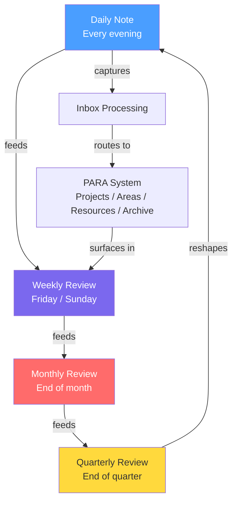
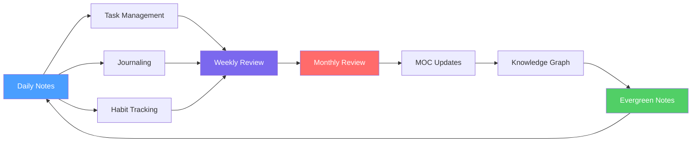

# Daily Systems — Master Overview

> [!abstract] What This Is
> This is the master guide for how all daily, weekly, and monthly systems connect in this vault. It defines the rhythm of capture, reflection, and growth that keeps the knowledge system alive and useful.

The daily systems layer is the **operational heartbeat** of this vault. Without consistent daily practice, even the best-organized knowledge base becomes a graveyard of half-finished ideas. This guide ties together every sub-system into one coherent operating rhythm.

---

## The Core Philosophy

Three principles drive every system here:

1. **Capture everything, decide nothing** — in the moment, just get it in. Decisions happen during reviews.
2. **Reflection compounds** — 10 minutes of daily review beats 2 hours of monthly catching-up.
3. **Systems serve you** — if a system creates friction, simplify it. Abandon any tool that doesn't earn its place.

---

## The Daily Rhythm

A sustainable day has three distinct phases. Each phase serves a different cognitive mode.

### Morning Routine (20–30 min)

The morning is for **orientation and intention**.

| Time | Activity | Tool |
|------|----------|------|
| 0–5 min | Open today's daily note | `[[Templates/Daily Note]]` |
| 5–10 min | Review yesterday's open tasks | Tasks plugin / Dataview |
| 10–15 min | Set 3 priorities for the day | Daily note `## Today's Focus` |
| 15–20 min | Check weekly goals alignment | `[[05 - Daily Systems/Weekly & Monthly Reviews]]` |
| 20–30 min | Morning pages / freewrite (optional) | `[[05 - Daily Systems/Journaling/Journaling with Claude]]` |

> [!tip] Morning Keystone
> The single most important habit is opening your daily note first thing. Everything else flows from that anchor.

### Work Blocks (Flexible)

The work day is structured in **90-minute deep work blocks** separated by 15-minute breaks. During each block:

- Focus on one task or project
- Capture stray thoughts in `00 - Inbox/` — do not context-switch
- Log key decisions and blockers in the daily note as they happen

> [!warning] Inbox Discipline
> The `00 - Inbox/` folder is a holding area, not a storage area. Items must be processed within 48 hours or they lose relevance. See [[process-inbox]] for the workflow.

### Evening Review (15–20 min)

The evening is for **closure and reflection**.

| Time | Activity |
|------|----------|
| 0–5 min | Complete daily task review — mark done, reschedule open |
| 5–10 min | Write 3–5 sentences of reflection in daily note |
| 10–15 min | Process inbox captures into proper folders |
| 15–20 min | Gratitude / wins log (optional) |

---

## Typical Day Timeline

```
06:30  Wake up
07:00  Morning routine — open daily note, set intentions
07:30  Deep work block #1 (90 min) — highest-priority task
09:00  Break — inbox triage, brief walk
09:15  Deep work block #2 (90 min)
10:45  Break
11:00  Meetings / collaboration / email
12:30  Lunch
13:30  Deep work block #3 (90 min) — secondary tasks
15:00  Admin block — capture processing, Obsidian maintenance
15:30  Deep work block #4 (90 min) — optional / creative work
17:00  Evening review — close the day
17:30  Personal time
```

> [!info] This Is a Template, Not a Mandate
> Adjust the timeline to fit your actual constraints. The key is maintaining the three-phase structure: intention → execution → reflection.

---

## The Review Cadence

Reviews are the engine of improvement. They close the loop between action and learning.

### Daily Review (15–20 min)
- **When:** Evening
- **Purpose:** Close the day, process captures, set up tomorrow
- **Output:** Completed daily note, empty inbox
- **Command:** `/daily-review`

### Weekly Review (30–45 min)
- **When:** Friday afternoon or Sunday evening
- **Purpose:** Assess the week, update projects, plan next week
- **Output:** Completed weekly review note
- **Command:** `/weekly-synthesis`
- **Guide:** `[[05 - Daily Systems/Weekly & Monthly Reviews]]`

### Monthly Review (60–90 min)
- **When:** Last day of the month
- **Purpose:** Reflect on progress, update areas, prune archive
- **Output:** Monthly review note, updated MOCs
- **Guide:** `[[05 - Daily Systems/Weekly & Monthly Reviews]]`

### Quarterly Review (2–3 hours)
- **When:** End of each quarter
- **Purpose:** Big-picture direction setting, goal alignment
- **Output:** Updated `[[🏠 Home]]` dashboard, revised priorities

---

## Review Cascade Diagram



---

## How All Systems Connect



Each sub-system has a specific role:

| System | Role | Guide |
|--------|------|-------|
| Daily Notes | Capture, track, reflect daily | `[[05 - Daily Systems/Daily Notes/Daily Notes]]` |
| Task Management | Prioritize and execute work | `[[05 - Daily Systems/Task Management/Task & Priority Management]]` |
| Journaling | Deepen reflection, process emotions | `[[05 - Daily Systems/Journaling/Journaling with Claude]]` |
| Habit Tracking | Build consistency, measure behavior | `[[05 - Daily Systems/Habit Tracking/Habit Tracking]]` |
| Weekly/Monthly Reviews | Close loops, improve systems | `[[05 - Daily Systems/Weekly & Monthly Reviews]]` |

---

## Getting Started Checklist

> [!todo] First-Time Setup
> - [ ] Read [[Templates/Daily Note]] and understand each section
> - [ ] Create today's daily note using the template
> - [ ] Set up the Tasks plugin (see [[08 - Automation/]])
> - [ ] Configure Dataview for task and habit queries
> - [ ] Schedule your weekly review as a recurring calendar event
> - [ ] Bookmark `[[🏠 Home]]` as your vault entry point

---

## Related Notes

- `[[MOCs/Daily Systems MOC]]` — Map of all daily systems notes
- `[[Templates/Daily Note]]` — The daily note template
- `[[Templates/Weekly Review]]` — Weekly review template
- `[[Templates/Monthly Review]]` — Monthly review template
- `[[🏠 Home]]` — Vault dashboard
