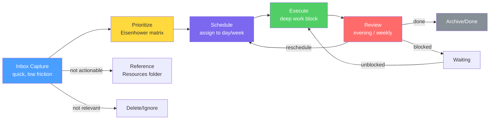

# Task & Priority Management

> [!abstract] The Goal
> Not to manage more tasks — but to do the right tasks at the right time with minimum mental overhead. A good task system gets out of your way.

This vault's task management system is built on four components working together: **frontmatter properties** for metadata, the **Obsidian Tasks plugin** for queries and tracking, **Dataview** for dashboards, and the **Eisenhower Matrix** for prioritization decisions.

---

## The Eisenhower Matrix

Before managing tasks, you need to prioritize them. The Eisenhower Matrix sorts tasks on two axes: **urgency** and **importance**.

|  | **Urgent** | **Not Urgent** |
|---|---|---|
| **Important** | Do now (Q1) | Schedule (Q2) |
| **Not Important** | Delegate (Q3) | Eliminate (Q4) |

**Q1 — Do Now:** Crises, deadlines, emergencies. These cannot be ignored but should be minimized through better planning.

**Q2 — Schedule:** Deep work, strategy, skill-building, relationships. This is where your best work happens. Protect this time fiercely.

**Q3 — Delegate:** Meetings that could be emails, requests that someone else can handle. If you can't delegate, batch and minimize.

**Q4 — Eliminate:** Busywork, time-wasting habits, low-value entertainment during work hours. Cut ruthlessly.

> [!tip] The Q2 Principle
> Most people spend their days in Q1 and Q3. The highest-leverage change you can make is shifting time from Q3 into Q2 — from reacting to building.

---

## Task Properties in Frontmatter

For project-level tasks and standalone task notes, use frontmatter properties:

```yaml
---
type: task
status: in-progress
priority: high
due: 2026-04-20
created: 2026-04-16
project: "[[01 - Projects/Project Alpha]]"
related:
  - "[[03 - Resources/Research Topic]]"
---
```

### Status Values

| Value | Meaning |
|-------|---------|
| `todo` | Not started |
| `in-progress` | Actively being worked on |
| `waiting` | Blocked, awaiting external input |
| `done` | Completed |
| `cancelled` | Abandoned — no longer relevant |

### Priority Values

| Value | Eisenhower Quadrant |
|-------|-------------------|
| `high` | Q1 — urgent + important |
| `medium` | Q2 — important, not urgent |
| `low` | Q3/Q4 — deprioritize |

---

## Obsidian Tasks Plugin Syntax

For inline tasks within notes (daily notes, project notes), use the Tasks plugin syntax:

```markdown
- [ ] Task description 📅 2026-04-20 ⏫
- [x] Completed task ✅ 2026-04-16
- [-] Cancelled task
- [/] In-progress task
```

### Emoji Metadata

| Emoji | Meaning | Example |
|-------|---------|---------|
| 📅 | Due date | `📅 2026-04-20` |
| ⏫ | High priority | |
| 🔼 | Medium priority | |
| 🔽 | Low priority | |
| ✅ | Completion date | `✅ 2026-04-16` |
| 🔁 | Recurring | `🔁 every week` |
| #task | Tag for filtering | |

### Recurring Tasks

```markdown
- [ ] Weekly review 🔁 every week on Friday 📅 2026-04-18
- [ ] Monthly review 🔁 every month on the last day
- [ ] Water plants 🔁 every 3 days
```

> [!info] Tasks Plugin Required
> The task queries below require the Obsidian Tasks community plugin. Install it from Settings → Community Plugins → Browse → search "Tasks".

---

## Task Lifecycle



---

## Task Queries with the Tasks Plugin

### Today's Tasks

```tasks
not done
due today
sort by priority
```

### Overdue Tasks

```tasks
not done
due before today
sort by due
```

### High-Priority Tasks This Week

```tasks
not done
priority is high
due before in 7 days
sort by due
```

### All Waiting/Blocked Tasks

```tasks
not done
status.name includes waiting
```

### Recently Completed (Last 7 Days)

```tasks
done
done after 7 days ago
sort by done reverse
limit 20
```

---

## Dataview Dashboards

### Task Status Overview

```dataview
TABLE status, priority, due, project
FROM ""
WHERE type = "task" AND status != "done" AND status != "cancelled"
SORT priority ASC, due ASC
```

### High-Priority Tasks by Project

```dataview
TABLE file.link as "Task", due, status
FROM "01 - Projects"
WHERE type = "task" AND priority = "high" AND status != "done"
SORT due ASC
```

### Tasks Completed This Week

```dataview
TABLE file.link as "Task", completed, project
FROM ""
WHERE type = "task" AND status = "done"
  AND date(completed) >= date(today) - dur(7 days)
SORT completed DESC
```

---

## Task Review Workflow

### Daily Task Review (Evening — 5 min)

1. Open today's daily note
2. Mark all completed tasks as done with `x`
3. For every uncompleted task, decide:
   - **Reschedule** — change the due date to a specific future day
   - **Delegate** — add a note on who is handling it
   - **Cancel** — mark as cancelled with a brief reason
4. Never leave tasks in an ambiguous state overnight

### Weekly Task Review (Part of Weekly Review — 10 min)

1. Run the "All Open Tasks" Dataview query (see above)
2. Identify any tasks that have been rescheduled 3+ times — they either need to be broken down, delegated, or cancelled
3. Check for tasks with no due date — assign one or move to a "someday" list
4. Review the "Waiting" list — any blocked items that can now move forward?

> [!warning] The Rescheduling Trap
> A task rescheduled more than three times is a signal, not a scheduling problem. Ask: Is this task actually important? Is it too large to act on directly? Do I actually want to do this?

---

## Task Capture Best Practices

> [!tip] Fast Capture Rules
> 1. Capture immediately — don't rely on memory
> 2. Use the daily note `## Tasks` section as the daily capture zone
> 3. For anything that needs more than one step, make it a project note in `[[01 - Projects/]]`
> 4. A task should be a single, concrete, actionable step — not a goal
> 5. If you can do it in under 2 minutes, just do it instead of capturing it

**Good task format:**
- "Draft the introduction section of the API docs"
- "Reply to Maria's question about the Q2 report"
- "Research 3 alternatives to the current auth library"

**Bad task format (too vague):**
- "Work on docs"
- "Handle Maria's email"
- "Research auth"

---

## Related Notes

- `[[MOCs/Daily Systems MOC]]` — All daily systems
- `[[Templates/Daily Note]]` — Where daily tasks live
- `[[05 - Daily Systems/Daily Systems]]` — Master overview
- `[[05 - Daily Systems/Weekly & Monthly Reviews]]` — Review workflow
- `[[08 - Automation/]]` — Plugin setup and automation
