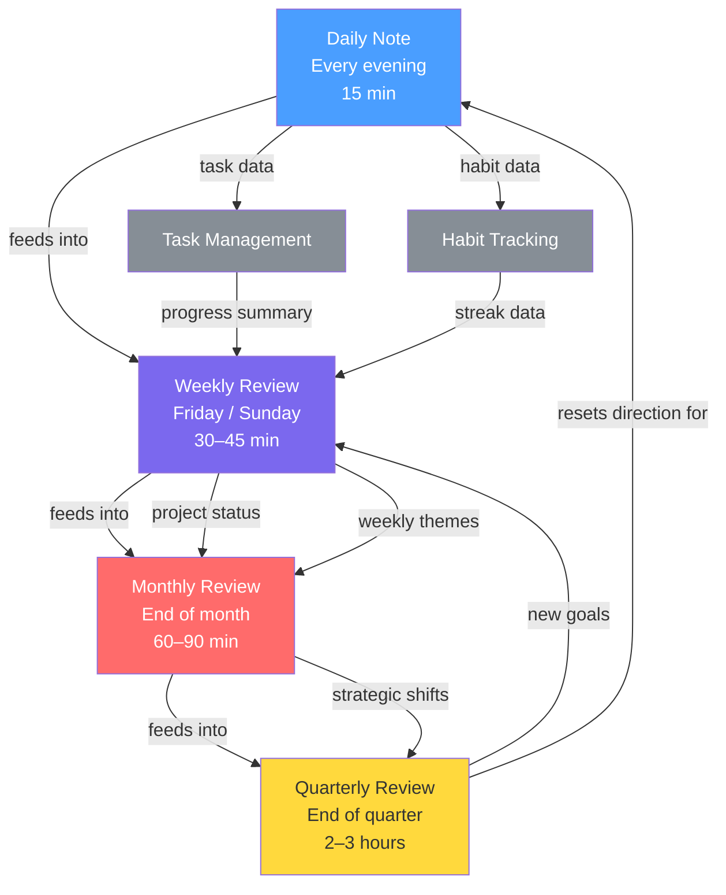

# Weekly & Monthly Reviews

> [!abstract] Why Reviews Matter
> Reviews are the mechanism that turns raw experience into lasting improvement. Without them, you repeat the same mistakes, lose track of progress, and accumulate a slow drift away from your actual goals.

The review system operates on two timescales: **weekly** (tactical) and **monthly** (strategic). Each has a distinct purpose and a different depth of reflection.

---

## The Review Philosophy

Reviews are not about guilt. They are not a performance evaluation. They are a **steering mechanism** — a regular check of "am I still going where I want to go, and is my system still serving me?"

Three questions underlie every review:

1. **What happened?** — Honest accounting of the period
2. **What does it mean?** — Pattern recognition and learning extraction
3. **What changes?** — Concrete adjustments for the next period

---

## Weekly Review

**Duration:** 30–45 minutes
**When:** Friday afternoon or Sunday evening
**Template:** `[[Templates/Weekly Review]]`
**Command:** `/weekly-synthesis`

The weekly review is **tactical**. It closes the week, resets the system, and sets clear intentions for the next 7 days.

### Step-by-Step Checklist

#### Phase 1: Collect (10 min)

- [ ] Process `00 - Inbox/` completely — nothing left uncategorized
- [ ] Review all open browser tabs — capture or close each one
- [ ] Check all temporary capture locations (phone notes, paper scraps, email drafts)
- [ ] Review this week's daily notes — pull out any lingering captures

#### Phase 2: Review (15 min)

- [ ] Open `[[01 - Projects/]]` — check status of every active project
  - Mark completed projects as done → move to `[[04 - Archive/]]`
  - Identify stuck projects → what is the next action?
  - Note projects with no activity this week
- [ ] Review this week's calendar — what commitments were made? What was learned?
- [ ] Review this week's daily notes
  - What tasks recurred multiple times without being done? (likely need scheduling)
  - What unexpected wins happened?
  - What drained energy consistently?
- [ ] Check habit tracking → any patterns worth noting?

#### Phase 3: Update (10 min)

- [ ] Update project next-action notes
- [ ] Set 1–3 **weekly goals** for next week in the new weekly note
- [ ] Identify any notes that are ready to be developed into evergreen notes
- [ ] Check `[[MOCs/]]` for any stale links or missing entries

#### Phase 4: Reflect (5–10 min)

- [ ] Write a 3–5 sentence reflection in the weekly note:
  - One thing that went well
  - One thing that was harder than expected
  - One insight or learning from the week
- [ ] Run `/weekly-synthesis` to let Claude surface patterns across your daily notes

> [!tip] Keep It Under 45 Minutes
> A weekly review that takes 2 hours will be skipped. Timebox ruthlessly. The goal is rhythm, not perfection. An 80% review done every week beats a perfect review done once a month.

---

## Monthly Review

**Duration:** 60–90 minutes
**When:** Last day of the month (or first day of the next)
**Template:** `[[Templates/Monthly Review]]`

The monthly review is **strategic**. It zooms out from the week-to-week grind and asks bigger questions about direction, priorities, and system health.

### Step-by-Step Checklist

#### Phase 1: Reflect on the Month (20 min)

- [ ] Read all weekly review notes from this month
- [ ] Write a month summary: what were the 3–5 most significant things that happened?
- [ ] Review monthly goals set last month — what was achieved? What wasn't? Why?
- [ ] Identify the month's biggest win and biggest disappointment
- [ ] Note any significant shifts in priorities, values, or interests

#### Phase 2: System Review (20 min)

- [ ] Review `[[01 - Projects/]]` — archive anything completed or abandoned
- [ ] Review `[[02 - Areas/]]` — are all areas of responsibility still relevant?
- [ ] Review `[[03 - Resources/]]` — anything that's now irrelevant or outdated?
- [ ] Vault health check:
  - [ ] Orphaned notes without backlinks
  - [ ] Notes in `00 - Inbox/` older than 2 weeks
  - [ ] Templates that need updating
  - [ ] Broken wikilinks
- [ ] Run `/vault-health` for automated diagnostics

#### Phase 3: Knowledge Review (15 min)

- [ ] Review literature notes from this month — any ready to become evergreen?
- [ ] Check `[[06 - Knowledge/]]` for notes that need synthesis
- [ ] Update relevant MOCs with new notes
- [ ] Identify 1–2 knowledge gaps worth exploring next month

#### Phase 4: Plan Next Month (15–20 min)

- [ ] Set 3–5 monthly goals for next month
- [ ] Identify the single most important project to advance
- [ ] Block time for the next monthly review in your calendar
- [ ] Write a one-paragraph intention for the month ahead

> [!example] Monthly Intention Format
> "In [Month], my primary focus is [main theme]. I want to make meaningful progress on [project]. I will invest in [area of growth]. The habit I'm building is [habit]. I will know it was a good month if [success criteria]."

---

## What to Look for in Reviews

### Patterns

> [!question] Pattern Recognition Questions
> - Which tasks keep appearing on lists without getting done? (likely need decomposition or scheduling)
> - Which days/times are consistently most productive?
> - Which types of work drain energy vs. generate it?
> - What topics keep capturing my attention unexpectedly?

### Stale Projects

A project is "stale" if it has had no meaningful activity in 2+ weeks. For each stale project, make one of three decisions:

1. **Reactivate** — schedule a specific next action this week
2. **Pause** — explicitly move to a "someday/maybe" list
3. **Archive** — it's no longer relevant; move to `[[04 - Archive/]]`

> [!warning] The Cost of Undead Projects
> Projects that are neither progressing nor explicitly paused create a constant low-level cognitive drain. They occupy mental bandwidth without producing anything. Regular reviews force the decision.

### Knowledge Gaps

During the monthly review, look for:

- Topics you referenced multiple times but don't have a note on
- Questions that kept coming up in your work without answers
- Skills you wish you had when encountering specific problems

These become candidates for `[[03 - Resources/]]` research or `[[06 - Knowledge/]]` study.

---

## Using `/weekly-synthesis`

The `/weekly-synthesis` command instructs Claude to:

1. Read all daily notes from the past 7 days
2. Extract recurring themes, ideas, and concerns
3. Identify connections between captures that you may have missed
4. Suggest which captures are worth developing into proper notes
5. Draft a paragraph synthesis of the week

> [!tip] Best Practice
> Run `/weekly-synthesis` after you've completed Phase 2 (Review) of your weekly checklist. Claude's synthesis is more useful when you've already done your own reflection — it adds a second perspective rather than replacing yours.

---

## Review Cascade Diagram

---

## Common Review Mistakes

> [!warning] What Undermines Reviews

**Doing it too rarely** — Monthly-only reviews turn into archaeology expeditions. The weekly cadence keeps memory fresh.

**Making it too long** — Reviews that feel burdensome get skipped. Keep weekly reviews under 45 minutes, monthly under 90.

**Only reviewing failures** — An honest review acknowledges wins as clearly as it acknowledges misses. Without wins, reviews become demotivating.

**Not acting on insights** — A review that surfaces a problem but produces no next action is just journaling. Every review should end with at least one concrete change.

---

## Related Notes

- `[[MOCs/Daily Systems MOC]]` — All daily systems
- `[[Templates/Weekly Review]]` — Weekly review template
- `[[Templates/Monthly Review]]` — Monthly review template
- `[[05 - Daily Systems/Daily Systems]]` — Master daily systems overview
- `[[05 - Daily Systems/Daily Notes/Daily Notes]]` — Daily note guide
- `[[05 - Daily Systems/Task Management/Task & Priority Management]]` — Task management
