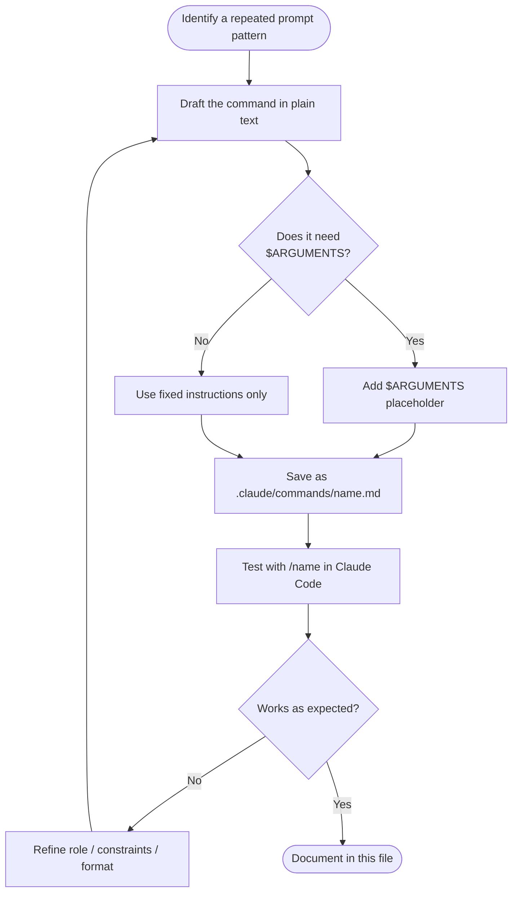

# Custom Slash Commands

Custom slash commands in Claude Code turn complex, multi-step prompt patterns into single-word invocations. Instead of re-writing or copy-pasting a long prompt every time, you store it in `.claude/commands/` and trigger it with `/command-name`.

> [!info] How It Works
> Any `.md` file in `.claude/commands/` becomes available as a `/command-name` slash command in Claude Code. The filename (without `.md`) is the command name. The file contents become the system prompt for that interaction.

---

## File Structure

```
AI Brain/
└── .claude/
    └── commands/
        ├── trace.md
        ├── challenge.md
        ├── reframe.md
        ├── synthesize.md
        ├── brainstorm.md
        └── update-memory.md
```

Each file is a plain Markdown document. Claude reads it as the instruction set for that command.

---

## Anatomy of a Good Command File

A well-designed command file has four parts:

```markdown
# Command Name

## Role
One sentence describing what role Claude should take on for this command.
Example: "You are a rigorous analytical thinker..."

## Instructions
Numbered steps or a structured prompt telling Claude exactly what to do.

## Output Format
Specify exactly how the response should be structured.
Example: "Respond in sections: ..."

## Constraints
What Claude should NOT do.
Example: "Do not summarize. Do not be polite about weaknesses."
```

---

## Design Principles

### 1. Be Specific About Role

Vague: *"Help me think about this."*
Better: *"You are a Socratic interlocutor. Your goal is to surface hidden assumptions in the user's argument, not to provide answers."*

### 2. Specify the Output Format

Every command should define what the response looks like. This makes outputs consistent and directly usable in your vault.

```markdown
## Output Format
Respond with exactly three sections:
1. **Core Mechanism** — 3–5 bullet points
2. **Hidden Assumptions** — numbered list
3. **One Question to Sit With** — a single sentence
```

### 3. Include Constraints

The most powerful part of a custom command is what it *doesn't* do. Constraints prevent drift toward generic responses.

```markdown
## Constraints
- Do not summarize the input back to me
- Do not hedge with "it depends" — commit to a position
- Do not offer solutions unless explicitly asked
- Keep total response under 400 words
```

### 4. Use `$ARGUMENTS` for Dynamic Input

The `$ARGUMENTS` placeholder lets you pass text directly when invoking the command:

```
/trace The relationship between entropy and information
```

In your command file, reference it like:

```markdown
Apply this analysis to: $ARGUMENTS
```

---

## Command Patterns

### Pattern 1: Analytical Lens
Apply a specific cognitive framework to whatever the user provides.

```markdown
# Trace

## Role
You are a first-principles analyst. Your job is to decompose any idea, claim, 
or argument into its foundational components and logical chain.

## Instructions
Given: $ARGUMENTS

1. Identify the core claim or mechanism
2. Map the logical dependencies (what must be true for this to be true?)
3. Trace the causal chain step by step
4. Identify where the chain is strongest and where it is weakest
5. State one implication that follows if the chain holds

## Output Format
**Foundation:** [the root assumption]
**Chain:** [numbered steps]
**Weakest Link:** [one sentence]
**Implication:** [one sentence]

## Constraints
Do not explain what you're doing. Just do it.
Keep each item to 1–2 sentences.
```

---

### Pattern 2: Creative Generator
Generate options, ideas, or alternatives rather than analysis.

```markdown
# Brainstorm

## Role
You are a creative generative thinker in divergent mode.

## Instructions
Topic: $ARGUMENTS

Generate 20 ideas. Prioritize diversity over quality — include obvious ideas,
contrarian ideas, analogical ideas, and absurd ideas. Do not filter.

## Output Format
Numbered list. One sentence per idea. No commentary between items.

## Constraints
No clustering, no headers, no caveats. Just the list.
```

---

### Pattern 3: Structured Transformation
Transform a note or input into a specific format.

```markdown
# Create Evergreen

## Role
You are a knowledge architect. Your job is to transform a rough note 
into a polished evergreen note suitable for long-term storage.

## Instructions
Input note: $ARGUMENTS

1. Extract the single core claim (one sentence, assertion form)
2. Write a 3–5 sentence elaboration in the author's own reasoning
3. Identify 3 supporting points or examples
4. Identify 2 tensions or open questions
5. Suggest 3–5 wikilink titles for related concepts

## Output Format
Output a complete markdown note with YAML frontmatter ready to save.
Include type: evergreen, status: evergreen, and relevant tags.
```

---

### Pattern 4: Review and Critique
Apply quality standards to evaluate the user's work.

```markdown
# Challenge

## Role  
You are a rigorous intellectual adversary. Your goal is to find every 
weakness in the argument presented — not to be destructive, but to 
make the idea stronger by exposing what needs reinforcing.

## Instructions
Argument to challenge: $ARGUMENTS

1. Identify the 3 strongest hidden assumptions
2. Provide the best counterargument to the core claim
3. Find one factual or logical gap
4. Name one alternative interpretation of the same evidence
5. Ask the one question that, if answered poorly, collapses the argument

## Constraints
Do not validate before critiquing.
Do not soften criticisms with praise.
Be direct.
```

---

## Installed Commands Reference

| Command | File | Category | Description |
|---------|------|----------|-------------|
| `/trace` | `trace.md` | Thinking | Follow logic step by step |
| `/challenge` | `challenge.md` | Thinking | Surface weak points and counterarguments |
| `/reframe` | `reframe.md` | Thinking | Rotate through multiple perspectives |
| `/synthesize` | `synthesize.md` | Thinking | Merge multiple notes into one insight |
| `/brainstorm` | `brainstorm.md` | Ideation | Generate ideas in divergent mode |
| `/update-memory` | `update-memory.md` | Meta | Update persistent memory files |

---

## How to Create a New Command



---

## Best Practices

> [!tip] Start with Constraints
> Write the constraints section *first*. Knowing what the command should NOT do clarifies what it should do.

> [!tip] Name Commands as Verbs
> Good: `/trace`, `/challenge`, `/synthesize`
> Avoid: `/thinkingtool`, `/deep-analysis-v2`

> [!warning] Keep Commands Focused
> One command, one cognitive job. A command that does "analysis, generation, AND formatting" does none of them well. If you need all three, chain three commands.

> [!example] Testing a New Command
> Before committing a command file, test it with 3 different inputs:
> 1. A simple, clear input (baseline)
> 2. An ambiguous input (does it handle uncertainty well?)
> 3. An edge case or off-topic input (does it stay in scope?)

---

## Related Notes

- [[MOCs/Prompt Library MOC]]
- [[MOCs/Automation MOC]]
- [[07 - Prompt Library/Thinking Tools/Thinking Tools.md]]
- [[07 - Prompt Library/Note Processing/Note Processing Prompts.md]]
- [[07 - Prompt Library/Idea Generation/Idea Generation.md]]
- [[07 - Prompt Library/Reflection/Reflection & Synthesis.md]]
- [[08 - Automation/]]
