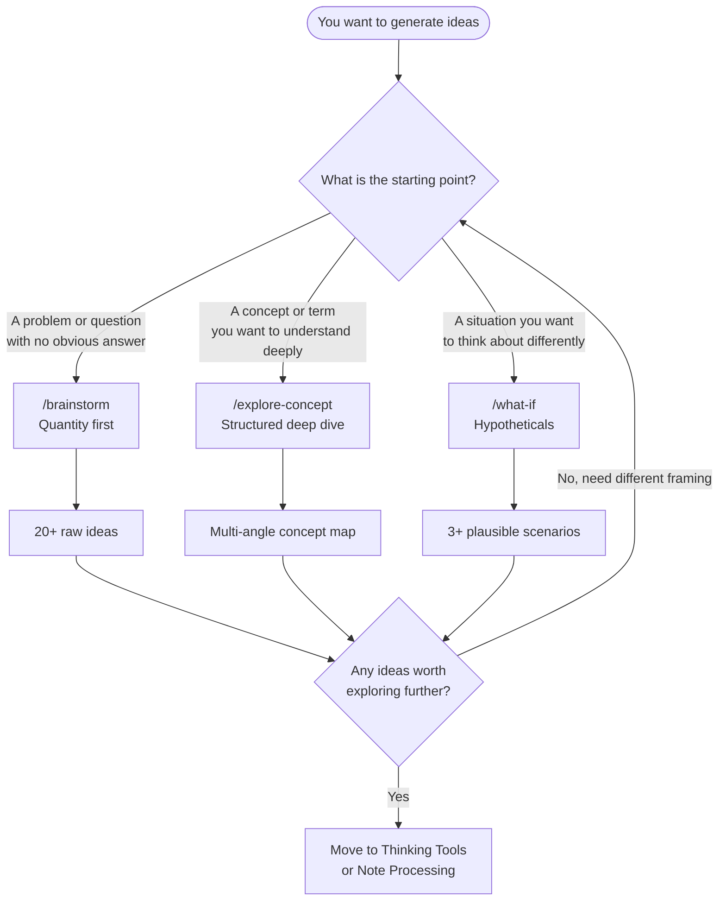

# Idea Generation

Idea generation prompts shift Claude into a *divergent* mode — creating options, directions, hypotheticals, and possibilities rather than analyzing what already exists. Use these before you narrow your focus, not after.

> [!warning] Diverge Before You Converge
> Don't run ideation prompts on a problem you've already decided how to solve. The value is in generating space you didn't know existed. If you feel resistance to the ideas produced, that's often the signal they're most worth exploring.

---

## The Three Ideation Prompts

### 1. Brainstorm

`/brainstorm` generates a wide field of ideas around a topic, question, or goal. It prioritizes quantity and variety over quality. No idea is filtered during generation.

**Best for:** Project kickoffs, naming, content ideas, feature lists, research directions, when you feel stuck at the "blank page" stage.

**Mode:** Rapid divergence — suspend judgment while running this.

[[07 - Prompt Library/Idea Generation/Brainstorm.md|View Brainstorm prompt]]

---

### 2. Explore Concept

`/explore-concept` performs a structured deep dive into a single idea from multiple angles: historical, technical, philosophical, and practical. It turns a word or phrase into a rich map of meaning.

**Best for:** Starting research on an unfamiliar topic, preparing literature notes, turning curiosity into structured knowledge.

**Mode:** Depth over breadth — gives you the full topology of one concept.

[[07 - Prompt Library/Idea Generation/Explore Concept.md|View Explore Concept prompt]]

---

### 3. What If

`/what-if` explores hypothetical scenarios and counterfactuals: "What if this assumption were false?" "What if the opposite were true?" "What if this trend continued for 10 years?"

**Best for:** Scenario planning, creative writing setups, challenging entrenched thinking, strategic risk analysis, creative problem-solving.

**Mode:** Speculative — designed to produce ideas that feel impossible until they don't.

[[07 - Prompt Library/Idea Generation/What If.md|View What If prompt]]

---

## Comparison Table

| Prompt | Mode | Output | When to Stop |
|--------|------|--------|-------------|
| **Brainstorm** | Divergent / quantity | Long list of options | When you have 20+ ideas |
| **Explore Concept** | Structured depth | Concept map / multi-angle breakdown | When you feel oriented |
| **What If** | Speculative / hypothetical | Scenarios + implications | When you find a surprising insight |

---

## Decision Flowchart

---

## Creative Techniques Built Into These Prompts

Each prompt encodes established creative and strategic thinking techniques:

| Technique | Prompt |
|-----------|--------|
| SCAMPER (Substitute, Combine, Adapt…) | Brainstorm |
| First Principles Analysis | Explore Concept |
| Pre-mortem / Scenario Planning | What If |
| Six Thinking Hats | Explore Concept + Reframe |
| Inversion | What If |
| Concept Mapping | Explore Concept |
| Lateral Thinking | Brainstorm + What If |

---

## Combining Ideation with Thinking Tools

Ideation prompts generate raw material. Thinking tools refine it.

**Typical creative research flow:**

1. `/explore-concept` → understand the landscape
2. `/brainstorm` → generate directions to pursue
3. `/what-if` → stress-test the most interesting direction
4. `/synthesize` → distill into a focused thesis
5. `/create-evergreen` → commit it to your knowledge base

> [!example] Example: Researching "Emergence"
>
> 1. `/explore-concept` on "emergence" → learn historical origins, scientific definitions, philosophical implications
> 2. `/brainstorm` "applications of emergence thinking to product design" → 25 raw ideas
> 3. `/what-if` "what if software teams were designed as emergent systems?" → 3 scenarios
> 4. `/synthesize` all three outputs → one sharp perspective
> 5. `/create-evergreen` → *"Emergence as a Design Philosophy for Complex Systems"*

---

## When NOT to Use Ideation Prompts

> [!warning] Avoid ideation prompts when:
> - You already know what you need to do (use `/trace` instead)
> - You need factual accuracy (use research or retrieval)
> - You're in execution mode — too many options create paralysis
> - You've already converged on a solution and just need validation

---

## Related Notes

- [[MOCs/Prompt Library MOC]]
- [[07 - Prompt Library/Prompt Library.md]]
- [[07 - Prompt Library/Thinking Tools/Thinking Tools.md]]
- [[07 - Prompt Library/Note Processing/Note Processing Prompts.md]]
- [[07 - Prompt Library/Reflection/Reflection & Synthesis.md]]
- [[07 - Prompt Library/Custom Commands/Custom Slash Commands.md]]
