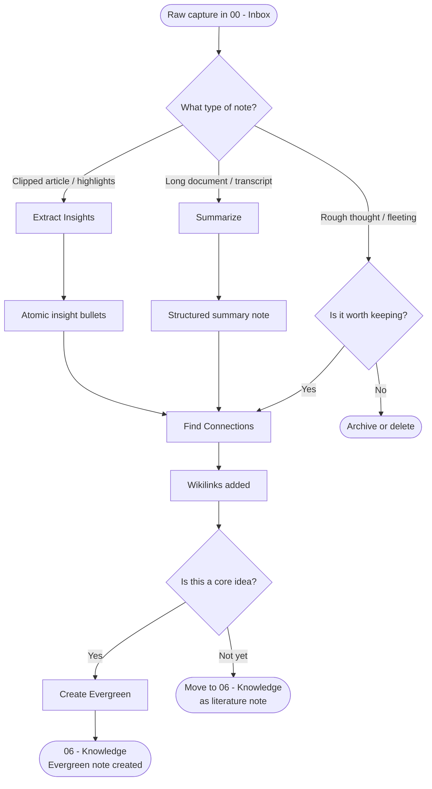

# Note Processing Prompts

Note processing is the practice of transforming raw captures — highlights, rough thoughts, clipped articles — into knowledge you can actually use. These prompts handle the mechanical and creative work of that transformation, turning `#status/seedling` notes into something connected and durable.

> [!info] The Processing Mindset
> Processing is not editing. You're not polishing prose — you're extracting signal, finding structure, and building links. Every processed note should be *more useful to your future self* than the raw version.

---

## The Four Processing Prompts

### 1. Extract Insights

`/extract-insights` (or use the [[07 - Prompt Library/Note Processing/Extract Insights.md|Extract Insights]] prompt directly) pulls the most important ideas from a note or source. It surfaces claims, evidence, and implications you might skim past.

**Best for:** Highlights from books or articles, long meeting notes, dense research papers, raw interview transcripts.

**Output:** A bulleted list of distilled insights with source attribution, ready to become atomic notes.

---

### 2. Create Evergreen

`/create-evergreen` converts a fleeting or literature note into an evergreen note — a note that captures a single, timeless idea in your own words, linked to related concepts.

**Best for:** Notes with `#status/growing` that you've returned to more than once, insights you want to keep for years, ideas worth defending.

**Output:** A fully formatted evergreen note with frontmatter, clear thesis, supporting evidence, and wikilinks.

[[07 - Prompt Library/Note Processing/Create Evergreen.md|View Create Evergreen prompt]]

---

### 3. Find Connections

`/find-connections` analyzes a note and suggests other notes in your vault it might link to — including non-obvious bridges that you wouldn't manually discover.

**Best for:** Orphaned notes, newly processed literature notes, any note that feels isolated from the rest of your thinking.

**Output:** A list of suggested wikilinks with reasoning for each connection.

[[07 - Prompt Library/Note Processing/Find Connections.md|View Find Connections prompt]]

---

### 4. Summarize

`/summarize` produces a concise, structured summary of a long note or document, preserving the key structure without losing essential nuance.

**Best for:** Long articles, book chapters, meeting transcripts, project documents you need to reference quickly.

**Output:** A structured summary (background, key points, conclusions, open questions) under 300 words.

[[07 - Prompt Library/Note Processing/Summarize.md|View Summarize prompt]]

---

## Comparison Table

| Prompt | Input | Output | Note Status Change |
|--------|-------|--------|-------------------|
| **Extract Insights** | Raw capture / source | Atomic insight bullets | Fleeting → ready to promote |
| **Create Evergreen** | Fleeting or literature note | Formatted evergreen note | Growing → Evergreen |
| **Find Connections** | Any note | Suggested wikilinks | Isolated → connected |
| **Summarize** | Long document | Structured summary | Long → scannable |

---

## Processing Workflow

---

## When to Use Each Prompt

| You are doing... | Use this prompt |
|-----------------|----------------|
| Processing inbox after reading session | Extract Insights |
| Weekly review — promoting a note | Create Evergreen |
| Graph view shows orphaned notes | Find Connections |
| Captured a long article but need it scannable | Summarize |
| Inbox processing sprint | Extract Insights → Find Connections |
| Writing preparation | Create Evergreen → Find Connections |

---

## The Processing Loop

Effective note processing is a loop, not a one-time event. A healthy cadence:

- **Daily** — Inbox zero: Extract Insights or Summarize on fresh captures
- **Weekly** — Review growing notes: Find Connections, promote one to Evergreen
- **Monthly** — Knowledge audit: identify what needs Create Evergreen treatment

> [!tip] Batch Processing Tip
> Don't process notes one by one. Collect 5–10 from the same theme, then run `/find-connections` across the batch. You'll discover cross-links that single-note processing misses.

---

> [!example] Example Session
> You've just finished *Thinking, Fast and Slow* and have 30 highlights saved.
>
> 1. Paste all highlights → `/extract-insights` → 8 clean insight bullets
> 2. For each bullet → `/find-connections` → each gets 2–3 wikilinks
> 3. The bullet on "availability heuristic" resonates most → `/create-evergreen`
> 4. Result: one evergreen note, 7 literature notes, all linked to existing vault knowledge

---

## Related Notes

- [[MOCs/Prompt Library MOC]]
- [[07 - Prompt Library/Prompt Library.md]]
- [[07 - Prompt Library/Thinking Tools/Thinking Tools.md]]
- [[07 - Prompt Library/Reflection/Reflection & Synthesis.md]]
- [[07 - Prompt Library/Custom Commands/Custom Slash Commands.md]]
- [[MOCs/Daily Systems MOC]]
