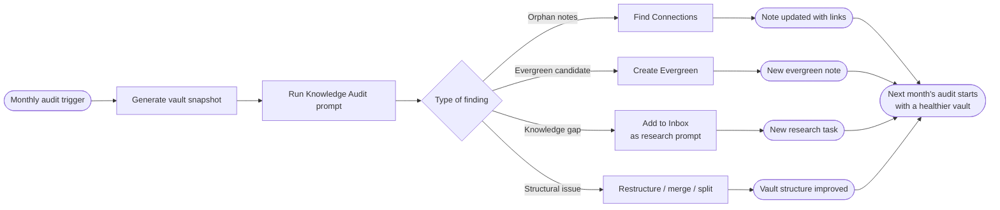

# Knowledge Audit

A prompt for auditing your knowledge garden — finding gaps, identifying orphaned notes, surfacing upgrade candidates, and ensuring your vault remains a connected, living system rather than a growing pile of files.

> [!info] Purpose
> A knowledge audit is to your vault what code review is to a codebase: it catches drift, identifies technical debt (disconnected notes), and ensures the system is growing intentionally rather than just growing. Do this monthly or whenever the vault starts to feel cluttered.

---

## When to Use This Prompt

- Monthly review (the primary cadence)
- After a period of heavy capture with little processing
- When navigation feels hard — you know something is in there but can't find it
- Before starting a major writing or synthesis project
- After returning from a learning-intensive period (course, conference, reading sprint)
- When the graph view shows too many isolated nodes

---

## Full Prompt Template

```text
I want to audit my knowledge system. Here is my input:

VAULT SNAPSHOT:
[Provide one or more of the following:
 - A list of your current notes by folder (can be abbreviated)
 - A list of notes with no links (orphans from your vault search)
 - A list of notes that haven't been updated in 30+ days
 - Tags or status counts (e.g., 40 seedlings, 12 growing, 3 evergreen)
 - Any notes you feel uncertain about keeping or promoting]

RECENT ACTIVITY (LAST 30 DAYS):
[Briefly describe: what topics have you been exploring? What projects are active? 
What are you trying to understand or accomplish right now?]

Please audit this knowledge system and provide:

1. STRONG CLUSTERS
   - Where is knowledge well-developed and well-connected?
   - Which topics have multiple notes, good cross-links, and clear hierarchy?
   - What can you confidently draw on for writing or decision-making right now?

2. ISOLATED NOTES (ORPHANS)
   - Which notes are floating without connections to others?
   - For each isolated note: suggest 2–3 potential links and which existing notes 
     they should connect to.
   - Which orphans are worth promoting vs. archiving?

3. KNOWLEDGE GAPS
   - Based on the existing notes and recent activity, what is conspicuously absent?
   - Where do you have surface-level notes on topics that deserve deeper treatment?
   - What bridge concepts are missing — ideas that would connect two existing clusters?

4. EVERGREEN UPGRADE CANDIDATES
   - Which notes are `#status/growing` and show signs of readiness for evergreen 
     promotion? (Multiple returns, referenced by other notes, stable thesis)
   - For each candidate: what would it take to promote it?
   - Are there any `#status/seedling` notes that have been seedlings too long?

5. STRUCTURAL IMPROVEMENTS
   - Are there notes that should be split (too many ideas in one place)?
   - Are there notes that should be merged (too much redundancy)?
   - Are there MOCs that need updating to reflect new notes?
   - Is the folder structure serving how you actually navigate the vault?

6. HIGH-LEVERAGE NEXT STEP
   - Given everything above, what is the single highest-leverage action to improve 
     the knowledge network?
   - Provide a prioritized list of 5 specific actions (note titles + action type) 
     to take in the next 30 days.
   - What would make the biggest difference to how useful this vault is?
```

---

## Preparing Your Vault Snapshot

You can generate useful input for this prompt several ways in Obsidian:

| Method | How |
|--------|-----|
| **Orphan list** | Use the built-in "Unlinked files" view or a Dataview query |
| **Status count** | Dataview query: `TABLE file.name WHERE contains(tags, "status/seedling")` |
| **Stale notes** | Dataview query: `TABLE file.mtime WHERE file.mtime < date(today) - dur(30 days)` |
| **Folder listing** | Copy from Files panel or use vault health tools |
| **Manual summary** | Write 2–3 sentences per folder describing what's there |

> [!tip] Use /vault-health First
> The [[.claude/commands/]] directory may have a `/vault-health` command that auto-generates a snapshot. Run it first and paste the output as your Vault Snapshot.

---

## Example Output (Section 3: Knowledge Gaps)

> *Gap 1: You have 8 notes on "systems thinking" but nothing bridging to your "product design" cluster. A note on "systems thinking in product design" would connect ~15 existing notes.*
>
> *Gap 2: Your "attention economy" notes lack any treatment of the policy or regulatory dimension — this matters for your current writing project.*
>
> *Gap 3: You reference "cognitive load" in 4 different notes but have never written the concept directly — it's a phantom link. Create an Explore Concept note on it.*

---

## Output Processing

After running this prompt:

1. Create a monthly note in `10 - Meta/Audits/` titled `Knowledge Audit YYYY-MM`
2. Paste the full output into that note
3. Convert section 6 (High-Leverage Actions) into tasks with `status:: todo` and `due::` dates
4. For each orphan → run `/find-connections` to validate the suggested links
5. For each evergreen candidate → run `/create-evergreen`
6. For each gap → add to `00 - Inbox/` as a research prompt for the coming month

---

## The Audit Cycle



---

## Audit Health Metrics

Track these over time to see if your vault is improving:

| Metric | How to Measure | Healthy Sign |
|--------|---------------|-------------|
| Orphan ratio | Unlinked notes / total notes | Decreasing over time |
| Evergreen count | Notes tagged `#status/evergreen` | Slowly increasing |
| Seedling age | Avg days since creation for seedlings | Under 60 days |
| MOC coverage | Notes linked from at least one MOC | Above 70% |
| Inbox backlog | Files in `00 - Inbox/` | Under 20 at any time |

---

> [!warning] Avoid Audit Theater
> The audit is only valuable if findings become actions. Don't run this prompt, feel satisfied about the analysis, and then not touch the vault. Set a 25-minute timer after the audit and immediately process the top 3 items from section 6.

---

## Related Prompts

- [[07 - Prompt Library/Reflection/Reflection & Synthesis.md]] — Overview of all reflection prompts
- [[07 - Prompt Library/Reflection/Weekly Synthesis.md]] — Weekly input that feeds monthly audits
- [[07 - Prompt Library/Note Processing/Note Processing Prompts.md]] — Actions to take on audit findings
- [[07 - Prompt Library/Note Processing/Find Connections.md]] — Fix orphans found in audits
- [[07 - Prompt Library/Note Processing/Create Evergreen.md]] — Promote candidates found in audits
- [[10 - Meta/]] — Where audit outputs are stored
