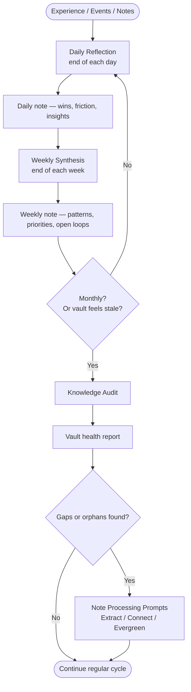

# Reflection & Synthesis

Reflection prompts close the loop between experience and understanding. Where [[07 - Prompt Library/Note Processing/Note Processing Prompts.md|Note Processing]] transforms raw captures into knowledge, reflection prompts transform lived time — days, weeks, periods of learning — into patterns, decisions, and forward motion.

> [!quote] The Principle
> "We do not learn from experience. We learn from *reflecting* on experience." — John Dewey
>
> Reflection prompts give that reflection structure so it doesn't collapse into rumination or vague review.

---

## The Three Reflection Prompts

### 1. Daily Reflection

`/daily-review` closes the day by surfacing what happened, what it meant, and what to carry forward. It keeps the gap between action and insight small.

**Cadence:** End of day, or first thing the next morning reviewing yesterday.
**Time required:** 10–15 minutes.
**Output:** A daily note with wins, friction, insights, and one key intention for tomorrow.

[[07 - Prompt Library/Reflection/Daily Reflection.md|View Daily Reflection prompt]]

---

### 2. Weekly Synthesis

`/weekly-synthesis` operates at a higher altitude. It looks across a full week to find patterns, assess momentum on projects, and generate forward-looking priorities grounded in evidence — not mood.

**Cadence:** Sunday evening or Monday morning.
**Time required:** 20–30 minutes.
**Output:** A weekly synthesis note with themes, wins, stalls, open loops, and next-week priorities.

[[07 - Prompt Library/Reflection/Weekly Synthesis.md|View Weekly Synthesis prompt]]

---

### 3. Knowledge Audit

`/knowledge-audit` is a periodic review of your knowledge garden itself — not what happened this week, but the quality and connectivity of your accumulated notes. It finds gaps, orphans, and upgrade candidates.

**Cadence:** Monthly, or any time the vault feels chaotic or stale.
**Time required:** 30–60 minutes.
**Output:** A prioritized list of vault improvement actions: notes to connect, gaps to fill, evergreens to create.

[[07 - Prompt Library/Reflection/Knowledge Audit.md|View Knowledge Audit prompt]]

---

## Comparison Table

| Prompt | Time Horizon | Primary Question | Output |
|--------|-------------|-----------------|--------|
| **Daily Reflection** | 1 day | What happened and what does it mean? | Daily note entry |
| **Weekly Synthesis** | 7 days | What patterns emerged? What moves next? | Weekly synthesis note |
| **Knowledge Audit** | All time | Is my knowledge base healthy and connected? | Vault improvement plan |

---

## The Reflection Cycle

---

## Reflection Depth Ladder

Not every reflection needs to go deep. Choose the right altitude:

| Altitude | Prompt | Question |
|----------|--------|----------|
| Surface | Daily Reflection | What happened today? |
| Pattern | Weekly Synthesis | What's the shape of this week? |
| System | Knowledge Audit | Is my thinking system working? |
| Meta | [[10 - Meta/]] + Synthesize | What is this whole system optimizing for? |

---

## When to Use Each Prompt

| Situation | Recommended Prompt |
|-----------|-------------------|
| End of workday | Daily Reflection |
| End of week / Sunday evening | Weekly Synthesis |
| Monthly review | Knowledge Audit |
| Vault feels cluttered or disconnected | Knowledge Audit |
| Starting a new project — review what you know | Knowledge Audit (focused) |
| You feel like you're not retaining what you read | Daily Reflection + Weekly Synthesis |
| You're writing a long-form piece | Weekly Synthesis (on your research notes) |
| You've been away from the vault for weeks | Knowledge Audit |

---

> [!tip] Anchor the Weekly Synthesis
> The most important habit is the weekly synthesis. It compounds. A daily reflection that isn't synthesized weekly becomes noise. A weekly synthesis is what turns captured notes into actual knowledge that changes behavior.

---

> [!example] Monthly Reflection Stack
> A healthy monthly review stacks all three prompts:
>
> 1. **Week 4 Sunday** → `/weekly-synthesis` on the final week
> 2. **Month-end Monday** → `/knowledge-audit` on the whole vault
> 3. **After audit** → Process any flagged notes with `/create-evergreen` or `/find-connections`
> 4. **Close of session** → Update [[MOCs/Daily Systems MOC]] with any system changes you want to keep

---

## Integration with Daily Systems

Reflection prompts are the connective tissue between your daily actions and your knowledge system:

- Daily notes in `05 - Daily Systems/` feed the Weekly Synthesis
- Weekly synthesis notes become input for the Knowledge Audit
- Knowledge Audit outputs become tasks in `01 - Projects/` or notes in `06 - Knowledge/`

See [[MOCs/Daily Systems MOC]] for the full daily/weekly/monthly system design.

---

## Related Notes

- [[MOCs/Prompt Library MOC]]
- [[MOCs/Daily Systems MOC]]
- [[07 - Prompt Library/Prompt Library.md]]
- [[07 - Prompt Library/Note Processing/Note Processing Prompts.md]]
- [[07 - Prompt Library/Thinking Tools/Thinking Tools.md]]
- [[07 - Prompt Library/Custom Commands/Custom Slash Commands.md]]
