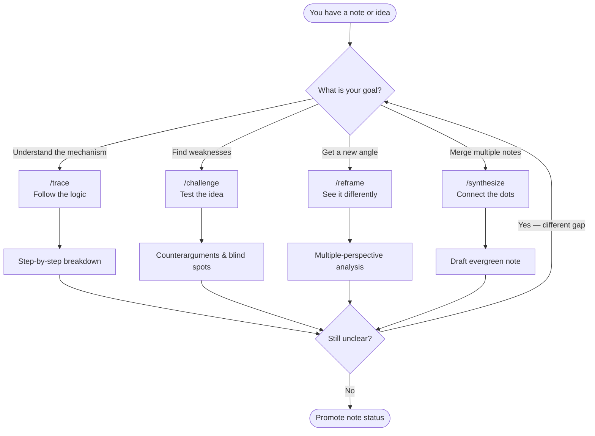

# Thinking Tools

Thinking tools are structured prompts designed to deepen your reasoning about a note, idea, or problem. Rather than asking Claude to "explain" or "summarize," thinking tools apply a specific cognitive lens — tracing logic, challenging assumptions, reframing perspective, or synthesizing across sources.

> [!tip] When to Use Thinking Tools
> Use these prompts when you feel stuck, when a note feels shallow, or when you want to pressure-test an idea before committing to it. They work best on notes that are at least `#status/growing` and rarely return value on purely factual captures.

---

## The Four Thinking Tools

### 1. Trace — Follow the Logic

`/trace` walks an idea step by step, mapping its causal chain, dependencies, and implications. Use it to understand *how* something works or *why* something is true at a fundamental level.

**Best for:** Complex arguments, technical concepts, historical causation, decision trees, any note where the reasoning is opaque.

**Example trigger phrase:** *"I understand what this says, but I don't understand why it's true."*

[[.claude/commands/trace.md|View /trace command]]

---

### 2. Challenge — Test the Idea

`/challenge` plays devil's advocate, surfacing weak points, hidden assumptions, and counterarguments. It deliberately looks for what could go wrong or what the note is glossing over.

**Best for:** Plans, frameworks, beliefs, arguments you're about to act on, anything that feels too comfortable.

**Example trigger phrase:** *"This seems right, but I want to make sure I'm not fooling myself."*

[[.claude/commands/challenge.md|View /challenge command]]

---

### 3. Reframe — See It Differently

`/reframe` rotates the idea through multiple perspectives — psychological, systemic, historical, economic, contrarian. Use it when you feel stuck in one viewpoint or when a problem keeps repeating.

**Best for:** Creative blocks, interpersonal problems, strategic decisions, philosophical questions, recurring frustrations.

**Example trigger phrase:** *"I keep approaching this the same way and getting the same result."*

[[.claude/commands/reframe.md|View /reframe command]]

---

### 4. Synthesize — Connect the Dots

`/synthesize` merges multiple notes or ideas into a unified, distilled insight. Use it when you have a cluster of related notes that haven't crystallized into a single understanding.

**Best for:** Literature review clusters, related fleeting notes, project retrospectives, pre-writing integration.

**Example trigger phrase:** *"I have five notes on this topic but I still can't articulate the big insight."*

[[.claude/commands/synthesize.md|View /synthesize command]]

---

## Comparison Table

| Tool | Core Question | Best Input | Output Type | Time Cost |
|------|--------------|------------|-------------|-----------|
| **Trace** | How does this work / why is this true? | Single note or concept | Step-by-step logic map | Medium |
| **Challenge** | What's wrong or weak here? | Argument, plan, or belief | Counterarguments + gaps | Low |
| **Reframe** | How else could this be seen? | Any note or problem | Multi-lens analysis | Medium |
| **Synthesize** | What do these mean together? | 2–6 related notes | Unified insight draft | High |

---

## Decision Flowchart

---

## Combining Tools: A Deep-Thinking Workflow

These tools are designed to chain. A typical session for turning a shallow note into an evergreen one:

1. `/trace` — understand the full structure of the idea
2. `/challenge` — find the cracks and unstated assumptions
3. `/reframe` — see what the cracks reveal from other angles
4. `/synthesize` — produce a stronger, integrated note

> [!example] Example Workflow
> You have a fleeting note: *"Attention is a finite resource."*
>
> 1. `/trace` — What is attention cognitively? How do neuroscientists model capacity? What depletes it?
> 2. `/challenge` — Is attention truly finite? What about flow states? What does "resource" mean metaphorically vs. literally?
> 3. `/reframe` — Economically (attention economy), neurologically, phenomenologically, ethically (who controls your attention?).
> 4. `/synthesize` — Merge with [[03 - Resources/Focus]] and [[03 - Resources/Deep Work]] into a new evergreen note: *"Attention as a Cultivated Capacity, Not a Depleting Fuel."*

---

## Situational Quick Reference

| Situation | Recommended Tool |
|-----------|-----------------|
| "I don't fully understand this" | `/trace` |
| "This feels too neat / convenient" | `/challenge` |
| "I keep going in circles" | `/reframe` |
| "I have 5 notes on the same topic" | `/synthesize` |
| "I want to write something original" | `/reframe` → `/synthesize` |
| "I'm about to make a big decision" | `/trace` → `/challenge` |
| "I want to prepare for a debate" | `/challenge` → `/reframe` |
| "My literature review feels flat" | `/synthesize` → `/trace` |

---

> [!note] Integration with Note Status
> Thinking tools pair naturally with the status ladder:
> - `#status/seedling` → use `/trace` to develop structure
> - `#status/growing` → use `/challenge` or `/reframe` to deepen
> - Pre-`#status/evergreen` → use `/synthesize` to finalize

---

## Related Notes

- [[MOCs/Prompt Library MOC]]
- [[07 - Prompt Library/Prompt Library.md]]
- [[07 - Prompt Library/Note Processing/Note Processing Prompts.md]]
- [[07 - Prompt Library/Idea Generation/Idea Generation.md]]
- [[07 - Prompt Library/Reflection/Reflection & Synthesis.md]]
- [[07 - Prompt Library/Custom Commands/Custom Slash Commands.md]]
