# Auto-Tagging & Linking

This guide explains how to use Claude to suggest tags and wikilinks for notes in the vault — reducing manual metadata work while keeping the taxonomy clean and consistent.

> [!warning] Human Review Required
> Auto-tagging and auto-linking are *suggestion* systems. Claude proposes; you decide. Never blindly accept suggestions without reading them — especially for linking, where a plausible-sounding link might point to a note that isn't actually related.

---

## Tag Taxonomy Overview

The vault uses a hierarchical tag system with five top-level namespaces. Every note should have at least one tag from `#type/` and one from `#status/`.

### Type Tags — *What kind of note is this?*

| Tag | Use For |
|---|---|
| `#type/fleeting` | Quick captures, rough ideas |
| `#type/literature` | Notes from a specific source |
| `#type/evergreen` | Developed, permanent ideas |
| `#type/project` | Active project notes |
| `#type/moc` | Maps of Content |
| `#type/daily` | Daily notes |
| `#type/weekly` | Weekly review notes |
| `#type/monthly` | Monthly review notes |
| `#type/resource` | Reference and how-to material |

### Status Tags — *How developed is this note?*

| Tag | Meaning |
|---|---|
| `#status/seedling` | Just captured, needs development |
| `#status/growing` | Actively being developed |
| `#status/evergreen` | Stable, well-developed |
| `#status/archived` | No longer active |

### Area Tags — *What domain does it belong to?*

| Tag | Domain |
|---|---|
| `#area/dev` | Software development |
| `#area/automation` | Vault automation |
| `#area/learning` | Study and learning |
| `#area/health` | Health and habits |
| `#area/finance` | Financial topics |
| `#area/writing` | Writing and communication |
| `#area/research` | Research projects |

### Topic Tags — *What specific subject?*

Fine-grained subject tags. Examples:
- `#topic/claude`, `#topic/obsidian`, `#topic/python`
- `#topic/productivity`, `#topic/habits`, `#topic/sleep`
- `#topic/zettelkasten`, `#topic/pkm`, `#topic/dataview`

### Prompt Tags — *Prompt Library classification*

| Tag | Use For |
|---|---|
| `#prompt/thinking` | Thinking tool prompts |
| `#prompt/reflection` | Reflection prompts |
| `#prompt/research` | Research prompts |
| `#prompt/processing` | Note processing prompts |
| `#prompt/generation` | Idea generation prompts |

---

## Tag Taxonomy Tree

```mermaid
graph TD
    Root[Vault Tags] --> Type[#type/]
    Root --> Status[#status/]
    Root --> Area[#area/]
    Root --> Topic[#topic/]
    Root --> Prompt[#prompt/]

    Type --> T1[fleeting]
    Type --> T2[literature]
    Type --> T3[evergreen]
    Type --> T4[project]
    Type --> T5[moc]
    Type --> T6[daily / weekly / monthly]
    Type --> T7[resource]

    Status --> S1[seedling]
    Status --> S2[growing]
    Status --> S3[evergreen]
    Status --> S4[archived]

    Area --> A1[dev]
    Area --> A2[automation]
    Area --> A3[learning]
    Area --> A4[health / finance / writing]

    Topic --> TP1[claude · obsidian · python]
    Topic --> TP2[productivity · habits]
    Topic --> TP3[zettelkasten · pkm]

    Prompt --> P1[thinking · reflection]
    Prompt --> P2[research · processing]
    Prompt --> P3[generation]
```



---

## How Claude Suggests Tags

### Content Analysis Process

When you ask Claude to tag a note, it performs this analysis:

1. **Identify the note type** — Is this a fleeting capture? A processed article? A developed idea? → `#type/`
2. **Assess development level** — How complete and polished is the writing? → `#status/`
3. **Identify the domain** — Which area of your life or work does this belong to? → `#area/`
4. **Extract subject matter** — What specific topics are discussed? → `#topic/`
5. **Check for prompt characteristics** — If it's in the Prompt Library, classify it → `#prompt/`

### Tag Suggestion Rules Claude Follows

- Suggest a **maximum of 6–8 tags** per note (prevents tag sprawl)
- Always include one `#type/` tag and one `#status/` tag
- Prefer **existing tags** over creating new ones
- Only suggest a new tag if the note clearly introduces a new, recurring concept
- Flag potential new tags separately for your approval

---

## Auto-Linking Workflow

### How It Works

Claude reads the note content and the list of existing notes in the vault, then suggests wikilinks where:
1. A concept in the note matches the title of an existing note
2. The existing note would genuinely add context if followed
3. The link isn't already present

### Linking Rules

- Suggest **2–5 wikilinks** per pass (more than that is noise)
- Prioritize linking to **evergreen notes** and **MOCs** over fleeting notes
- Do not suggest links to daily notes (too transient)
- Flag the suggested link with a brief reason: *why* is this note relevant?

### Auto-Linking Prompt Template

```
Read the following note and suggest wikilinks to existing vault notes.

Note content:
[PASTE NOTE HERE]

Existing notes to consider linking:
[PASTE NOTE LIST OR MOST RELEVANT TITLES]

For each suggested link:
- State the exact text to link
- State the target note
- Give a one-sentence reason why the link adds value

Limit to 5 suggestions maximum. Prefer quality over quantity.
```

---

## Claude Command for Auto-Tagging

Save this as `.claude/commands/auto-tag.md` to use as a slash command:

```markdown
# Auto-Tag & Link

Read the active note and perform these steps:

## Step 1: Suggest Tags

Analyze the note content and suggest tags following these rules:
- Include exactly one #type/ tag
- Include exactly one #status/ tag
- Include 1-2 #area/ tags if applicable
- Include 1-3 #topic/ tags based on specific subjects
- Maximum 7 tags total
- Only use tags from the established taxonomy in CLAUDE.md
- If a new tag is genuinely needed, flag it separately

## Step 2: Suggest Wikilinks

Identify 2-5 places where a wikilink to an existing note would add value.
For each suggestion, provide:
- The phrase to link
- The target note title
- A one-sentence justification

## Step 3: Suggest MOC Placement

Identify which MOC this note should be added to, if any.

## Output Format

Present suggestions as a structured list that I can review and approve.
Do NOT make any changes to the note — output suggestions only.
```

---

## Maintaining Tag Consistency

### Weekly Tag Audit

Run this Dataview query to spot tag drift:

```dataview
TABLE tags
FROM ""
WHERE !contains(tags, "type/")
SORT file.mtime DESC
LIMIT 20
```

This surfaces notes missing a `#type/` tag — the most common tagging gap.

### Detecting Novel Tags

```dataview
TABLE tags
FROM ""
FLATTEN tags as tag
WHERE !startswith(tag, "type/")
  AND !startswith(tag, "status/")
  AND !startswith(tag, "area/")
  AND !startswith(tag, "topic/")
  AND !startswith(tag, "prompt/")
GROUP BY tag
```

Any tag that appears in this query doesn't belong to the official taxonomy and should be reviewed.

### Renaming a Tag

To rename a tag consistently across the vault:

```bash
# Preview changes first
grep -rl "#old-tag" "/path/to/vault" --include="*.md"

# Apply rename (after review)
find "/path/to/vault" -name "*.md" -exec sed -i '' 's/#old-tag/#new-tag/g' {} +
```

> [!warning] Always backup before bulk find-replace operations.

---

> [!tip] Best Practice
> Run auto-tagging when a note is first created (on capture from Inbox) and again when it's promoted to `#status/growing`. Don't re-tag evergreen notes unless something material has changed.

---

*Part of [[MOCs/Automation MOC]] · See also [[08 - Automation/Automation]]*
