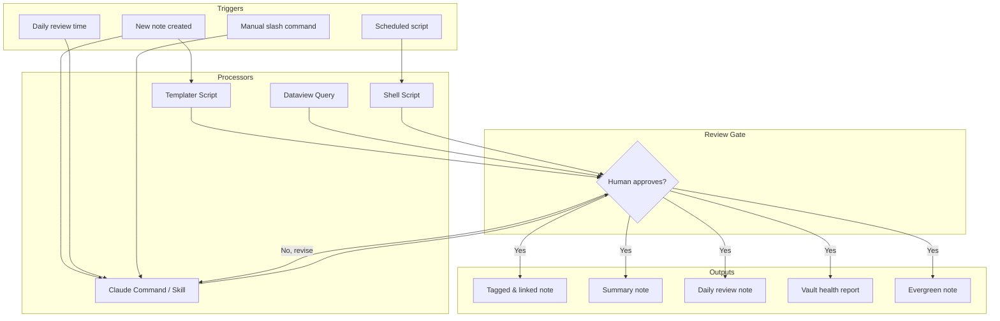

# Automation

This is the master guide for all automation systems inside the AI Brain vault. Automation here means using Claude, scripts, and Obsidian plugins to eliminate repetitive cognitive overhead — not to replace the thinking itself.

> [!quote] Philosophy
> Automation should amplify your thinking, not substitute for it. Every script and command in this vault is designed to handle the *mechanical* parts of knowledge management so you can focus on the *meaningful* parts.

---

## What Can Be Automated

The vault distinguishes between two kinds of work:

| Work Type | Example | Automate? |
|---|---|---|
| Mechanical | Applying consistent tags | Yes |
| Mechanical | Detecting orphan notes | Yes |
| Mechanical | Generating note summaries | Yes (first draft) |
| Cognitive | Deciding what a note *means* | No |
| Cognitive | Connecting distant ideas | Assist only |
| Cognitive | Deciding project priority | No |

### Automation Candidates

- **Tagging** — Claude reads a note and suggests tags from the established taxonomy
- **Linking** — Claude scans for mentions of existing notes and proposes wikilinks
- **Summarizing** — Claude produces a structured summary of articles, meetings, or research
- **Daily review** — Claude compiles today's captures, tasks, and reflections into a digest
- **Weekly synthesis** — Claude surfaces patterns across the week's notes
- **Vault maintenance** — Detecting orphans, broken links, stale notes, and tag drift
- **Note promotion** — Moving fleeting → literature → evergreen based on completeness signals

---

## Automation Tools

### 1. Claude Commands (Primary)

Custom slash commands stored in `.claude/commands/`. Each is a markdown file containing a structured prompt. Claude reads the context and executes the task interactively.

```
.claude/commands/
├── brainstorm.md
├── challenge.md
├── reframe.md
├── synthesize.md
├── trace.md
└── update-memory.md
```

See [[08 - Automation/Custom Skills/Custom Claude Skills]] for how skills differ from commands and how to build both.

### 2. Templater (Note Creation)

Obsidian's Templater plugin handles:
- Auto-inserting frontmatter on new notes
- Date/time variables (`<% tp.date.now("YYYY-MM-DD") %>`)
- Folder-specific templates triggered on file creation
- On-open and on-create hooks for automated note setup

### 3. Dataview (Dynamic Queries)

Dataview renders live query results inside notes. Used for:
- Task dashboards aggregated across the vault
- MOC auto-population of recent notes by tag or folder
- Stale note detection (no modification in 30+ days)
- Progress tracking for projects

```dataview
TABLE created, status
FROM "00 - Inbox"
WHERE status = "todo"
SORT created ASC
```

### 4. Shell Scripts

For batch operations that go beyond what Obsidian plugins can do:
- Mass tag renaming across hundreds of files
- Vault statistics (word count, note count, growth rate)
- Broken link detection across the filesystem
- Backup, sync, and archive scripts

See [[08 - Automation/Vault Maintenance/Vault Maintenance Scripts]] for ready-to-run scripts.

### 5. Claude Skills (Advanced)

Skills extend Claude's capabilities for specialized domains. The vault has the following installed:

| Skill | Purpose |
|---|---|
| `obsidian-markdown` | Correct Obsidian syntax generation |
| `obsidian-bases` | Bases file creation and editing |
| `json-canvas` | Canvas file generation |
| `obsidian-cli` | Vault read/write via CLI |
| `defuddle` | Web content extraction to clean markdown |

---

## Automation Philosophy

### Augment, Don't Replace

The goal is a *thinking partner*, not a *thinking replacement*. Claude helps with:
- First drafts (you refine)
- Tag suggestions (you approve)
- Link suggestions (you decide relevance)
- Summaries (you add insight and meaning)

### Preserve Human Judgment at Decision Points

Every automation pipeline has a **review gate** — a moment where you confirm, edit, or reject the output before it becomes permanent in the vault. Nothing in the automation layer writes to vault files without your explicit approval.

```
Input → Claude Processing → Draft Output → [HUMAN REVIEW] → Vault
```

### Prefer Reversibility

Scripts should never destructively modify files without a backup or confirmation step. Tag renames, bulk operations, and moves should be logged. If in doubt, write to a staging note first.

### Stay Inside the Ecosystem

All automation must produce standard Obsidian-compatible files: plain markdown, YAML frontmatter, wikilinks. No proprietary formats that break if a plugin disappears.

---

## Automation Architecture



---

## Sub-Guides

| Guide | Description |
|---|---|
| [[08 - Automation/Custom Skills/Custom Claude Skills]] | Building and using custom Claude skills |
| [[08 - Automation/Auto-Tagging/Auto-Tagging & Linking]] | Tag suggestion and auto-linking workflows |
| [[08 - Automation/Summary Generation/Summary Generation]] | Generating summaries for different content types |
| [[08 - Automation/Daily Review/Daily Review Automation]] | Automating the daily review process |
| [[08 - Automation/Vault Maintenance/Vault Maintenance Scripts]] | Keeping the vault clean and healthy |

---

## Quick Reference: Commands

| Command | What It Does |
|---|---|
| `/brainstorm` | Generate ideas around a topic |
| `/synthesize` | Combine multiple notes into a synthesis |
| `/trace` | Step-by-step analysis of an idea |
| `/challenge` | Constructive critique of an idea |
| `/reframe` | Reframe a problem from new angles |
| `/daily-review` | Generate daily reflection |
| `/vault-health` | Run vault health check |
| `/update-memory` | Update persistent memory files |

---

> [!tip] Getting Started
> If you're new to automation in this vault, start with [[08 - Automation/Auto-Tagging/Auto-Tagging & Linking]] — it has the highest daily return on investment and is the easiest to adopt incrementally.

> [!info] See Also
> The full list of active automation workflows lives in [[MOCs/Automation MOC]]. For Claude integration details, see [[03 - Resources/Claude Integration/MCP Tools & Skills]].

---

*Part of [[MOCs/Automation MOC]]*
