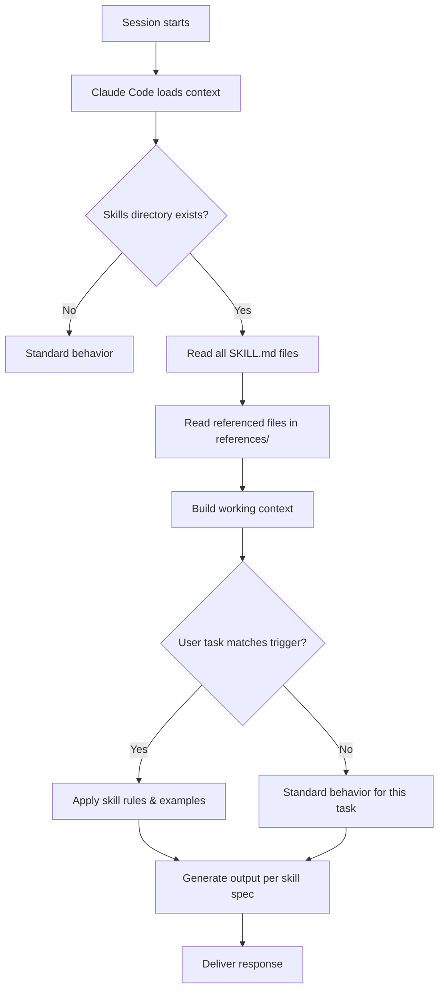

# Custom Claude Skills

Skills are reusable knowledge modules that teach Claude how to handle a specific domain or workflow with more consistency than ad hoc prompting. Unlike one-off commands, skills are loaded into every session and shape how Claude approaches an entire category of task.

> [!info] Skills vs Commands
> **Commands** (`.claude/commands/*.md`) are slash commands you invoke manually for a single task.
> **Skills** (`.claude/skills/*/SKILL.md`) are always-on context files that modify Claude's baseline behavior for a domain.

---

## What Are Skills?

A skill is a markdown file placed inside `.claude/skills/<skill-name>/SKILL.md`. When Claude Code loads a session inside this vault, it reads all installed skills and incorporates their instructions into its working context.

Skills typically contain:
- **Trigger conditions** — when this skill applies
- **Conventions** — domain-specific rules Claude must follow
- **Examples** — concrete before/after demonstrations
- **References** — links to deeper specification files

```
.claude/skills/
├── obsidian-markdown/
│   ├── SKILL.md
│   └── references/
│       ├── CALLOUTS.md
│       ├── EMBEDS.md
│       └── PROPERTIES.md
├── obsidian-bases/
│   └── SKILL.md
├── json-canvas/
│   └── SKILL.md
├── obsidian-cli/
│   └── SKILL.md
└── defuddle/
    └── SKILL.md
```

---

## Currently Installed Skills

### `obsidian-markdown`

Teaches Claude the full Obsidian Flavored Markdown specification:
- Wikilinks (`[[Note]]`, `[[Note|Alias]]`, `[[Note#Heading]]`)
- Embeds (`![[Note]]`, `![[image.png|300]]`)
- Callouts (`> [!note]`, `> [!warning]-`)
- Properties (YAML frontmatter with typed fields)
- Tags, comments (`%% hidden %%`), highlights (`==text==`)

**When it activates:** Any time Claude creates or edits a `.md` file in the vault.

### `obsidian-bases`

Teaches Claude the `.base` file format for Obsidian Bases:
- View definitions (table, board, gallery)
- Filter expressions
- Sort and group configurations

**When it activates:** Creating or editing `.base` files.

### `json-canvas`

Teaches Claude the JSON Canvas specification for Obsidian Canvas files:
- Node types (text, file, link, group)
- Edge definitions with labels and directions
- Layout and color conventions

**When it activates:** Creating or editing `.canvas` files.

### `obsidian-cli`

Provides commands for reading and writing vault files via the Obsidian CLI tool:
- Reading notes by path
- Creating and updating notes
- Searching vault content

**When it activates:** Any vault read/write operation via terminal.

### `defuddle`

Teaches Claude to use the Defuddle CLI to extract clean markdown from web pages:
- Stripping navigation, ads, and boilerplate
- Preserving article structure and metadata
- Outputting Obsidian-ready markdown

**When it activates:** Processing URLs or web content for the vault.

---

## How to Create Your Own Skill

### Step 1: Choose a Focused Domain

Good skill candidates:
- A content type you process repeatedly (e.g., Thai research papers)
- A workflow with non-obvious rules (e.g., your personal tagging system)
- A tool with a specific API or syntax (e.g., a custom script)

Bad skill candidates:
- "Be a better assistant" (too vague)
- A task you do once a month (overhead not worth it)
- Something already covered by an existing skill

### Step 2: Create the Directory Structure

```bash
mkdir -p .claude/skills/my-skill/references
touch .claude/skills/my-skill/SKILL.md
```

### Step 3: Write the SKILL.md File

Use this structure:

```markdown
# Skill Name

One-sentence description of what this skill covers.

## When to Apply This Skill

List trigger conditions — file types, task types, or explicit user requests.

## Rules

1. Rule one (specific, not vague)
2. Rule two
3. Rule three

## Examples

### Example: [Scenario Name]

**Input:**
[what the user provides]

**Output:**
[what Claude should produce]

## Anti-Patterns

- Do NOT do X
- Avoid Y because Z

## References

- [references/DETAIL.md](references/DETAIL.md)
```

### Step 4: Add References (Optional)

For complex skills, put detailed specifications in `references/` files and link to them from SKILL.md. This keeps the skill file scannable while making the full spec available when needed.

---

## Skill Design Principles

### 1. Focused > Broad

A skill covering one thing well beats a skill covering five things loosely. If a skill is getting too long, split it.

### 2. Example-Rich

Abstract rules are hard to apply consistently. Every rule should have at least one concrete example. Two is better.

### 3. Explicit Anti-Patterns

Tell Claude what *not* to do. Anti-patterns prevent the most common misapplications.

### 4. Reference-Linked

For detailed specifications (tag taxonomies, template structures, script APIs), put the details in `references/` and link to them. The SKILL.md should be a quick-load orientation, not a reference manual.

### 5. Testable

You should be able to verify a skill is working by asking Claude to perform a representative task and checking the output against the expected behavior defined in the skill.

---

## Testing and Iterating on Skills

### Testing Approach

1. **Baseline test** — Open a fresh session and ask Claude to perform the skill's primary task without mentioning the skill. Check if it follows the rules automatically.
2. **Edge case test** — Find the 2-3 cases most likely to go wrong and test them explicitly.
3. **Anti-pattern test** — Verify Claude avoids the documented anti-patterns.

### Iteration Cycle

```
Write skill → Test in session → Note failures → Refine rules → Add examples → Retest
```

> [!tip] Iteration Tip
> When a rule fails in practice, add a concrete example of the failure and the correct behavior. Examples are more reliable than abstract rules.

### Common Skill Problems

| Problem | Likely Cause | Fix |
|---|---|---|
| Claude ignores the skill | Skill not in correct path | Verify `.claude/skills/name/SKILL.md` structure |
| Rules applied inconsistently | Rules too vague | Add concrete examples |
| Skill conflicts with another | Overlapping trigger conditions | Narrow trigger conditions in both skills |
| Skill makes Claude verbose | Over-specified output format | Simplify output section |

---

## Skill Loading Flow



---

> [!example] Skill Ideas for This Vault
> - **`thai-research`** — Rules for processing Thai-language academic content
> - **`evergreen-promotion`** — Criteria and steps for promoting notes to evergreen status
> - **`project-review`** — Weekly project review format and prompts
> - **`literature-note`** — Standard structure for literature notes from books and papers

---

*Part of [[MOCs/Automation MOC]] · See also [[08 - Automation/Automation]]*
