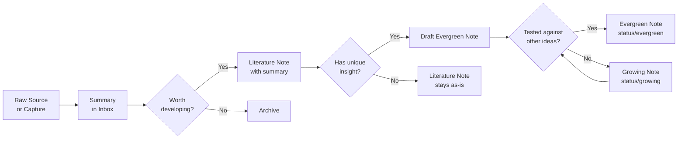

# Summary Generation

Summary generation is one of the highest-leverage automation tasks in the vault. A well-structured summary transforms a dense source (an article, meeting, research cluster) into a retrievable, linkable unit that feeds future synthesis.

> [!abstract] Core Principle
> A summary is not a compression of words — it is an extraction of *meaning*. The goal is not to shorten text but to capture what matters and discard what doesn't.

---

## Types of Summaries

### 1. Article Summary

Used for: Web articles, blog posts, essays, documentation.

**Structure:**
- **Source** — Title, author, URL, date
- **One-sentence summary** — The single most important claim
- **Key points** — 3–5 bullet points (main arguments or findings)
- **Implications** — What does this mean for your work or thinking?
- **Related notes** — Wikilinks to existing vault notes

**Ideal output length:** 100–200 words

---

### 2. Meeting Notes Summary

Used for: Call summaries, meeting notes, interview transcripts.

**Structure:**
- **Context** — Who, what, when
- **Key decisions** — What was decided
- **Action items** — Who does what by when (use `status:: todo`)
- **Open questions** — Unresolved items
- **Follow-up notes** — What to process later

**Ideal output length:** 150–300 words

---

### 3. Research Digest

Used for: A cluster of notes on a topic, a reading list, a literature review.

**Structure:**
- **Topic overview** — What question are these notes addressing?
- **Main positions or findings** — What do the sources collectively say?
- **Agreements** — Where do sources converge?
- **Tensions** — Where do sources disagree?
- **Synthesis insight** — Your own emerging understanding
- **Gaps** — What's still unknown or unexplored?

**Ideal output length:** 300–500 words

---

### 4. Weekly Roundup

Used for: End-of-week synthesis of all notes created that week.

**Structure:**
- **Notes created this week** — Dataview list
- **Key themes** — Patterns across the week's captures
- **Insights worth developing** — Notes that should be promoted
- **Tasks completed / still open** — Weekly task summary
- **One sentence summary of the week** — For the monthly review

**Ideal output length:** 200–400 words

---

## Using `/summarize` for Different Content Types

### Prompt Template: Article Summary

```
Summarize the following article for my knowledge vault.

Source: [TITLE] by [AUTHOR] — [URL]

Article content:
[PASTE ARTICLE]

Output format:
## Summary: [Title]

**Source:** [author, url, date]
**One-sentence summary:** [single sentence]

### Key Points
- [point 1]
- [point 2]
- [point 3]

### Implications
[2-3 sentences on what this means]

### Related
- [[suggested note 1]]
- [[suggested note 2]]

Use Obsidian wikilink syntax for all internal links.
```

---

### Prompt Template: Meeting Summary

```
Summarize these meeting notes for my vault.

Meeting: [NAME]
Date: [DATE]
Attendees: [LIST]

Raw notes:
[PASTE NOTES]

Output:
## Meeting: [Name] — [Date]

**Context:** [one sentence]

### Decisions
- [decision 1]

### Action Items
- [ ] [person]: [task] — due [date]

### Open Questions
- [question]

### Follow-up
[any notes for later processing]
```

---

### Prompt Template: Research Digest

```
I have the following notes on [TOPIC]. Synthesize them into a research digest.

Notes:
[PASTE OR LIST NOTES]

Output:
## Research Digest: [Topic]

**Question:** [the research question these notes address]

### What the Sources Say
[summary of main findings, 3-5 points]

### Agreements
[where sources converge]

### Tensions
[where sources disagree]

### My Synthesis
[emerging understanding — leave blank for me to fill in]

### Gaps
[what's still unknown]
```

---

## Batch Summarization

For summarizing multiple notes at once (e.g., clearing the Inbox):

### Step 1: Generate the Note List

```dataview
TABLE file.path
FROM "00 - Inbox"
WHERE type = "fleeting"
SORT created ASC
```

### Step 2: Process Each Note

For each note in the list, run the appropriate summary template. Claude can process multiple notes in a single session by working through them sequentially.

> [!tip] Batch Efficiency
> Group notes by type before summarizing. Process all articles together, then all meeting notes, then all research captures. This keeps Claude in the right mode and produces more consistent output.

### Step 3: Save Summaries

Each summary goes into the appropriate folder:
- Article summaries → `06 - Knowledge/Literature Notes/`
- Meeting summaries → `01 - Projects/[Project]/Meetings/`
- Research digests → `06 - Knowledge/Research/`

---

## Summary to Evergreen Note Pipeline

A summary is a midpoint, not a destination. The pipeline from raw capture to evergreen knowledge:



### Promotion Criteria

A summary becomes a **literature note** when it:
- Has been read and reviewed (not just generated)
- Has a `source::` field linking back to the original
- Has at least one `[[wikilink]]` to another vault note

A literature note becomes an **evergreen note** when it:
- Expresses a single, clear, title-as-claim idea
- Has been connected to 3+ other notes
- Has been revisited and refined at least once

---

## Summary Quality Checklist

Before saving a generated summary, verify:

- [ ] The one-sentence summary is accurate and not vague
- [ ] Key points reflect the source, not hallucinations
- [ ] Wikilinks point to real, existing notes (check spelling)
- [ ] The "implications" section contains your thinking, not just Claude's
- [ ] Frontmatter `type`, `status`, and `source` are filled in

> [!bug] Watch For
> Claude sometimes generates wikilinks to notes that don't exist. Always verify every `[[link]]` in a generated summary before saving.

---

*Part of [[MOCs/Automation MOC]] · See also [[08 - Automation/Automation]]*
