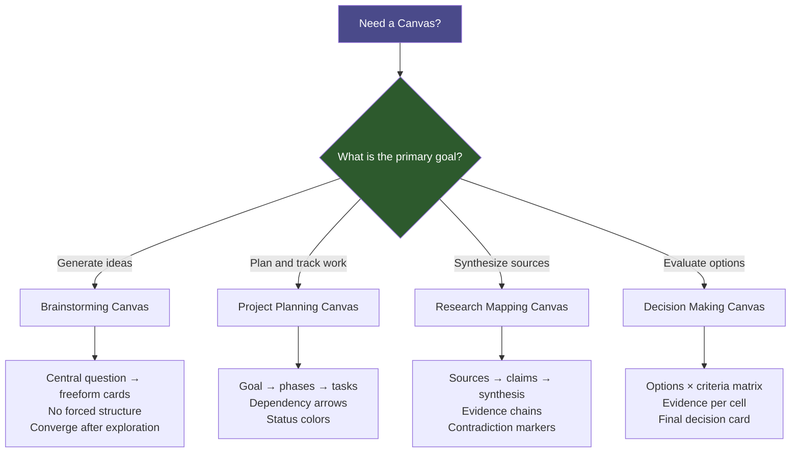

# Canvas Workspaces Guide

> [!abstract] Overview
> Obsidian Canvas is an infinite spatial board that lets you arrange notes, images, cards, and links in two-dimensional space. This guide covers the main workspace types, layout principles, and how to use Claude to generate canvases programmatically.

## Why Canvas?

Linear notes are excellent for developing a single idea. But many thinking tasks are fundamentally spatial:

- You need to see **all the pieces at once** before you can see the pattern
- You want to **group by affinity** without committing to a hierarchy
- You need to **compare options** side by side
- You want to **map a process** where the sequence and branching matter

Canvas provides that spatial freedom without losing the connections to your note content.

> [!tip] Core Rule
> Canvas is for thinking and orienting. When you reach a durable insight while working in a canvas, convert it into a proper note and link back from the canvas. The canvas captures the reasoning process; the note captures the conclusion.

---

## Types of Canvas Workspaces

### 1. Brainstorming Canvas

**Purpose:** Generate ideas without premature structure. Quantity and freedom over organization.

**Typical layout:**
- Central question or theme card in the middle
- Freeform cards radiating outward
- Color-coded by idea type (speculation, constraint, opportunity, question)
- No forced hierarchy — let clusters form naturally

**When to create one:** When starting any project, when stuck on a problem, when you want to explore possibilities before committing to a direction.

**Naming convention:** `Brainstorm - [Topic] - [Date].canvas`

### 2. Project Planning Canvas

**Purpose:** Map out the components, dependencies, and timeline of an active project.

**Typical layout:**
- Project goal card at top
- Work breakdown: phases as groups, tasks as cards within each group
- Dependency arrows between tasks
- Embedded notes for specifications, research, decisions
- Status colors: gray (todo), yellow (in-progress), green (done)

**When to create one:** At project kickoff, when a project grows complex enough that a linear note feels inadequate.

**Naming convention:** `Project - [Project Name].canvas`

### 3. Research Mapping Canvas

**Purpose:** Synthesize sources and notes in a domain before writing or deciding.

**Typical layout:**
- Sources (literature notes) on the left
- Key claims extracted as cards in the center
- Your synthesis and conclusions on the right
- Arrows showing evidence → claim → conclusion relationships
- Contradictions highlighted in red

**When to create one:** When preparing a synthesis note, when researching a topic with multiple conflicting sources, when preparing to write something substantive.

**Naming convention:** `Research - [Topic].canvas`

### 4. Decision Making Canvas

**Purpose:** Structure a decision with options, criteria, evidence, and trade-offs visible simultaneously.

**Typical layout:**
- Decision question at top
- Options as column headers
- Criteria as row labels
- Evidence cards in the cells (or color-coded scores)
- Risk and uncertainty cards at the bottom
- Final decision card with reasoning

**When to create one:** For any significant decision where you want to think it through rather than decide on instinct.

**Naming convention:** `Decision - [Decision Topic] - [Date].canvas`

---

## Canvas Workspace Types (Diagram)



---

## Creating Effective Canvas Layouts

### Layout Principles

**Left to right = time or causality.** If your canvas has a flow (process, argument, decision), put earlier steps on the left and later steps on the right. Readers scan left to right instinctively.

**Top to bottom = hierarchy or priority.** High-level concepts at top, details below. Most important things near the top.

**Proximity = relatedness.** Cards that belong together should be close. Use the Canvas group feature to make clusters explicit.

**Color = category.** Pick a consistent color scheme and stick to it. Changing colors mid-canvas to express a different meaning breaks the reader's model.

**Size = importance.** Make key notes and cards larger. Use small cards for supporting detail.

### Practical Tips

- **Use groups** to organize clusters of related cards. Name each group explicitly — the label is the cluster's concept.
- **Use arrows** sparingly. Too many arrows create visual noise. Arrows should only represent meaningful relationships (causation, dependency, evidence).
- **Embed notes, don't duplicate.** Drag a note from the file explorer into the canvas rather than creating a new card with the same content. This keeps the canvas live-linked to the note.
- **Add navigation cards.** For large canvases, add a "You are here" or "Start here" card near the entry point.
- **Keep canvases focused.** One canvas per project or research question. If a canvas is getting unwieldy, it may be trying to do two things — split it.

---

## Using Claude with the json-canvas Skill

The `json-canvas` skill allows Claude to generate fully-formed Obsidian Canvas files from a description or from existing vault content. This is one of the most powerful automation workflows in this vault.

### When to Use Claude for Canvas Generation

- You have a list of notes or topics and want to see them arranged spatially
- You want to generate a standard canvas type (brainstorm, project, research) from a template
- You have described a problem and want Claude to lay out the relevant considerations

### How to Invoke

In Claude Code, use the json-canvas skill explicitly:

```
/json-canvas Create a project planning canvas for [project name] with phases: 
Research, Design, Build, Test, Launch. Include cards for the following tasks: [list]
```

Or for a research canvas:

```
/json-canvas Map the following notes as a research synthesis canvas, 
grouping by theme: [[Note 1]], [[Note 2]], [[Note 3]]
```

### Output

Claude will generate a `.canvas` file (JSON format) that you can place directly in the `09 - Visualization/Canvas Workspaces/` folder and open in Obsidian. The file will include nodes, edges, and groups with proper positioning.

> [!tip] After Generation
> Claude-generated canvases are starting points, not final products. After opening in Obsidian:
> 1. Rearrange nodes to your preference
> 2. Replace text cards with embedded note links where possible
> 3. Add or remove edges to reflect actual relationships
> 4. Convert insights back into notes

---

## Canvas Templates for Common Use Cases

### Brainstorm Template Structure

```
[Central Question Card — large, center]
    ↓ (no arrows needed — spatial proximity conveys grouping)
[Idea cards — medium, spread radially]
[Constraint cards — small, red, bottom]
[Next action cards — medium, green, right side]
```

### Project Planning Template Structure

```
[Goal Card — large, top center]
[Phase 1 Group]  [Phase 2 Group]  [Phase 3 Group]
  [Task cards]     [Task cards]     [Task cards]
[Blockers/Risks — red cards, bottom]
[Resources/Links — right column]
```

### Research Mapping Template Structure

```
[Sources — left column]  →  [Claims — center]  →  [Synthesis — right]
                              [Contradictions — red, center-bottom]
```

---

## Embedding Notes, Images, and Links

### Embed a Vault Note

Drag the note from the file explorer sidebar onto the canvas. It appears as an embedded note card showing the note's content live.

### Embed an Image

Drag an image from `Attachments/` onto the canvas. Resize by dragging the card corners.

### Add a Web Link Card

Right-click the canvas → Add card → Paste a URL. Obsidian will display a link preview card.

### Add a Raw Card

Right-click → Add card → Type directly. Use for scratch thinking, labels, or annotations that do not need to be vault notes.

> [!warning] External Links vs. Embedded Notes
> Web link cards do not update automatically — they capture the page title at time of creation. Prefer embedded notes for content you want to stay current with vault edits.

---

## Related Notes

- [[09 - Visualization/Visualization]] — Master visualization overview
- [[09 - Visualization/Knowledge Maps/Knowledge Maps Guide]] — Canvas used for knowledge mapping
- [[MOCs/Visualization MOC]] — Visualization hub
- [[03 - Resources/Core Plugins/Advanced URI & Canvas]] — Canvas plugin documentation
