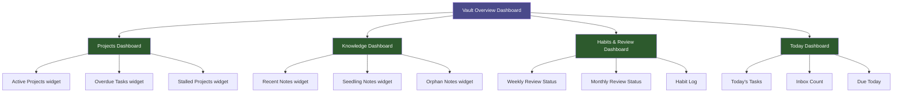

# Progress Dashboards

> [!abstract] Overview
> Progress dashboards use Dataview queries to surface the right information at the right time — active projects, pending tasks, knowledge growth, and habit status — without manual tracking. This guide covers design principles, query patterns, and templates for vault-wide and project-specific dashboards.

## Dashboard Design Principles

### 1. Signal Over Noise

A dashboard should show only what requires your attention. A project that is on track does not need to be prominent. An overdue task or a stalled project should be impossible to miss.

> [!tip] The "Glanceability" Test
> A good dashboard delivers its key message in under 5 seconds of reading. If you need to read carefully to understand what needs attention, the dashboard needs redesign.

### 2. Time-Boxed Relevance

Different dashboards serve different review rhythms:
- **Daily dashboard** — What do I need to do today?
- **Weekly dashboard** — How is the week going? What is falling behind?
- **Monthly dashboard** — Is the vault growing? Are projects progressing?
- **Vault overview** — What is the overall health of the system?

Do not try to answer all four questions from one dashboard. Build separate sections or separate notes for each review rhythm.

### 3. Action-Oriented

Every widget on a dashboard should prompt a possible action. If a widget shows information that you would never act on, remove it.

### 4. Live Queries Only

All dashboard content should be driven by Dataview queries, not by manually maintained lists. Manual maintenance is a guarantee of staleness. If Dataview cannot generate a widget automatically, reconsider whether you need that widget.

---

## Dashboard Architecture



---

## Dataview Query Examples

### Active Projects Widget

Shows all active projects with their status and due dates, sorted by priority.

````markdown
```dataview
TABLE priority, status, due, project
FROM "01 - Projects"
WHERE status != "done" AND status != "archived"
SORT priority ASC, due ASC
```
````

### Tasks Due Today or Overdue

````markdown
```dataview
TASK
FROM "01 - Projects" OR "05 - Daily Systems"
WHERE !completed AND due <= date(today)
SORT due ASC
```
````

### Recent Notes (Last 7 Days)

````markdown
```dataview
LIST
FROM ""
WHERE file.ctime >= date(today) - dur(7 days)
SORT file.ctime DESC
LIMIT 15
```
````

### Seedling Notes Needing Development

Shows notes with `#status/seedling` tag that are more than 7 days old — ripe for development.

````markdown
```dataview
TABLE file.ctime as "Created", tags
FROM #status/seedling
WHERE file.ctime < date(today) - dur(7 days)
SORT file.ctime ASC
```
````

### Inbox Backlog

````markdown
```dataview
LIST
FROM "00 - Inbox"
SORT file.ctime ASC
```
````

### Knowledge Growth by Month

````markdown
```dataview
TABLE length(rows) as "Notes Created"
FROM "06 - Knowledge"
GROUP BY dateformat(file.ctime, "yyyy-MM") as Month
SORT Month DESC
LIMIT 6
```
````

### Orphan Notes (No Outgoing Links)

````markdown
```dataview
LIST
FROM ""
WHERE length(file.outlinks) = 0
AND file.folder != "Attachments"
AND file.folder != "Templates"
SORT file.ctime ASC
LIMIT 20
```
````

### Projects Without a Due Date

````markdown
```dataview
TABLE status, priority
FROM "01 - Projects"
WHERE !due AND status = "in-progress"
SORT priority ASC
```
````

### Weekly Review Completion Tracker

````markdown
```dataview
TABLE file.ctime as "Date", weekly-review-done as "Review Done?"
FROM "05 - Daily Systems"
WHERE file.name CONTAINS "Weekly"
SORT file.ctime DESC
LIMIT 8
```
````

### Notes by Status Distribution

````markdown
```dataview
TABLE length(rows) as "Count"
FROM "06 - Knowledge"
GROUP BY tags
WHERE contains(tags, "status")
```
````

---

## Building a Vault Overview Dashboard

The vault overview dashboard lives at `[[🏠 Home]]` and provides a one-stop view of vault health. Recommended sections:

### Section 1: Today at a Glance

```markdown
## Today — {{date}}

> [!todo] Tasks Due Today
> [Dataview: tasks due today]

> [!warning] Inbox Backlog
> [Dataview: inbox count and list]
```

### Section 2: Active Projects

```markdown
## Active Projects

[Dataview: projects table with status, priority, due]
```

### Section 3: Knowledge Health

```markdown
## Knowledge Health

**Seedling notes ready to develop:**
[Dataview: seedling notes older than 7 days]

**Recent additions (last 7 days):**
[Dataview: recent notes list]
```

### Section 4: Vault Metrics

```markdown
## Vault Metrics

| Metric | Query |
|---|---|
| Total notes | [Dataview inline count] |
| Orphan notes | [Dataview count] |
| Seedling notes | [Dataview count] |
| Projects active | [Dataview count] |
```

---

## Project-Specific Dashboards

Each active project note should include a mini-dashboard section. Template:

````markdown
## Project Dashboard

**Status:** `= this.status`  
**Priority:** `= this.priority`  
**Due:** `= this.due`

### Open Tasks

```dataview
TASK
FROM [[current note]]
WHERE !completed
SORT due ASC
```

### Related Notes

```dataview
LIST
FROM ""
WHERE contains(file.outlinks, this.file.link)
SORT file.ctime DESC
LIMIT 10
```
````

---

## Weekly Progress Dashboard

For weekly reviews, a dedicated dashboard note in `05 - Daily Systems/` with the following structure:

### Tasks Completed This Week

````markdown
```dataview
TASK
FROM "01 - Projects"
WHERE completed AND completedDate >= date(today) - dur(7 days)
SORT completedDate DESC
```
````

### Notes Created This Week

````markdown
```dataview
LIST
FROM ""
WHERE file.ctime >= date(today) - dur(7 days)
SORT file.ctime DESC
```
````

### Projects Advanced This Week

````markdown
```dataview
TABLE status, modified
FROM "01 - Projects"
WHERE file.mtime >= date(today) - dur(7 days)
SORT file.mtime DESC
```
````

---

## Monthly Progress Dashboard

For monthly reviews, add a longer-horizon view:

### Knowledge Growth Trend

````markdown
```dataview
TABLE length(rows) as "Notes", dateformat(date, "MMMM yyyy") as "Month"
FROM "06 - Knowledge"
GROUP BY dateformat(file.ctime, "yyyy-MM") as date
SORT date DESC
LIMIT 12
```
````

### Projects Completed This Month

````markdown
```dataview
TABLE completed
FROM "01 - Projects"
WHERE status = "done" 
  AND file.mtime >= date(today) - dur(30 days)
SORT completed DESC
```
````

### Evergreen Notes Growth

````markdown
```dataview
LIST
FROM #status/evergreen
WHERE file.ctime >= date(today) - dur(30 days)
SORT file.ctime DESC
```
````

---

## Dashboard Maintenance Tips

> [!warning] Common Dataview Pitfalls
> - **Empty results:** Check that frontmatter property names exactly match query field names (case-sensitive)
> - **Wrong dates:** Ensure date properties use ISO format `"2026-04-16"` not natural language
> - **Missing tasks:** Tasks must use `- [ ]` syntax; Dataview does not pick up other task formats
> - **Slow queries:** Narrow the `FROM` clause to a specific folder rather than using `FROM ""` (whole vault) for large vaults

### Recommended Review Schedule

| Dashboard | When to Review | Location |
|---|---|---|
| Today at a Glance | Every morning | `[[🏠 Home]]` |
| Active Projects | Start of each work session | `[[MOCs/Projects MOC]]` |
| Seedling Notes | Weekly review | `[[MOCs/Knowledge MOC]]` |
| Vault Health | Monthly review | `[[10 - Meta/Vault Health]]` |
| Knowledge Growth | Monthly review | `[[10 - Meta/Vault Health]]` |

---

## Related Notes

- [[09 - Visualization/Visualization]] — Master visualization overview
- [[09 - Visualization/Dashboards/Vault Dashboard]] — The live vault overview dashboard
- [[MOCs/Visualization MOC]] — Visualization hub
- [[MOCs/Daily Systems MOC]] — Daily and weekly systems context
- [[03 - Resources/Core Plugins/Dataview & Queries]] — Full Dataview documentation
