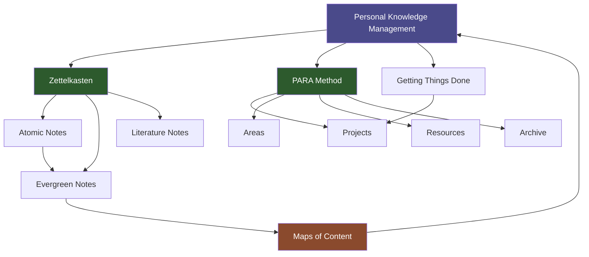

# Knowledge Maps Guide

> [!abstract] Overview
> A knowledge map is a visual representation of how ideas, concepts, and notes connect within a domain. Unlike a simple list (MOC) or an auto-generated graph, a knowledge map is deliberately constructed to reveal the logic of a field. This guide covers types, construction methods, and how to use Claude to generate maps from vault content.

## What Is a Knowledge Map?

A knowledge map answers the question: **"How do the ideas in this domain fit together?"**

It differs from related tools in key ways:

| Tool | Generated by | Shows | Best for |
|---|---|---|---|
| **Graph View** | Obsidian (automatic) | Link structure | Vault health, exploration |
| **MOC** | You (manual list) | Topic index | Navigation, collection |
| **Knowledge Map** | You (intentional) | Conceptual relationships | Understanding, synthesis |
| **Canvas Workspace** | You (spatial) | Spatial arrangement | Thinking, planning |

A knowledge map is the most intellectually demanding of these tools — it requires you to understand a domain well enough to explain how its parts relate. That effort is what makes it valuable.

> [!tip] When You Are Ready for a Map
> Build a knowledge map when you have 8–15 notes on a domain and feel like you understand the territory but cannot explain how it all fits together. The act of mapping will clarify your understanding.

---

## Types of Knowledge Maps

### 1. Concept Map

**What it shows:** Hierarchical and lateral relationships between concepts, with labeled edges explaining the type of relationship.

**Key feature:** Edges have labels (e.g., "causes", "is a type of", "enables", "contradicts").

**Best for:** Understanding the structure of a technical domain, preparing to teach something, synthesizing a research area.

**Example:** A concept map for "note-taking methodologies" might show Zettelkasten → enables → emergent structure, Zettelkasten → contrasts with → GTD, both → are instances of → personal knowledge management.

### 2. Mind Map

**What it shows:** A central concept with radiating branches and sub-branches. Purely hierarchical — no cross-links.

**Key feature:** Fast to build; shows decomposition of a topic.

**Best for:** Brainstorming sub-topics, outlining a note or project, quick capture of a domain's structure.

**Limitation:** Cannot represent relationships between branches — use a concept map when lateral relationships matter.

### 3. Argument Map

**What it shows:** The logical structure of an argument: claims, supporting evidence, objections, and rebuttals.

**Key feature:** Explicit distinction between claims (propositions) and support/objection relationships.

**Best for:** Analyzing or constructing complex arguments, preparing for a decision, evaluating competing positions.

**Example:** Central claim: "Evergreen notes are worth the extra effort." Support: "Atomic notes compose more flexibly." Objection: "Takes longer to write." Rebuttal: "Recombination time savings offset initial cost."

### 4. Topic Map

**What it shows:** The landscape of a subject area — what topics exist, how they group, and which are central vs. peripheral.

**Key feature:** Topographic rather than argumentative — maps territory, not logic.

**Best for:** Getting oriented in a new domain, planning what to learn next, identifying gaps in your knowledge.

---

## Building Knowledge Maps in Canvas

### Step 1: Gather the Source Notes

Pull relevant notes from `06 - Knowledge/`, `03 - Resources/`, and active project notes. Aim for 8–20 notes — enough to have material, not so many that the canvas becomes overwhelming.

Open a new Canvas in `09 - Visualization/Knowledge Maps/`.

### Step 2: Place Notes Without Structure

Drag all source notes onto the canvas. Do not arrange them yet — just get them all visible. Resize to medium so you can read the titles.

### Step 3: Find the Central Concept

Identify the note or concept that everything else relates to. Place it in the center. This is your anchor.

### Step 4: Group by Affinity

Move notes into groups based on how they relate to each other. Do not force a hierarchy yet — let the groupings emerge from the content. Add Canvas groups to formalize the clusters.

### Step 5: Add Relationships

Use Canvas arrows to connect notes. Label each arrow with the relationship type:
- "causes" / "enables" / "blocks"
- "is a type of" / "is an example of"
- "supports" / "contradicts"
- "precedes" / "depends on"

### Step 6: Identify Gaps

Look at the clusters. Are there concepts you kept wanting to reference but do not have notes for? Add blank cards as placeholders — these are your knowledge gaps. Move them to `00 - Inbox/` as seeds.

### Step 7: Extract Synthesis

After the map is complete, write a synthesis note that describes the map in prose. The map helped you see the structure; the synthesis note captures the insight for future use.

---

## Using MOCs as Text-Based Knowledge Maps

A well-crafted MOC is a text-based knowledge map — it does what a canvas knowledge map does but in list form. The advantage: text is searchable, embeddable, and versioned. The disadvantage: spatial relationships are harder to express.

For dense domains, maintain both:
- A **Canvas knowledge map** for working sessions (seeing everything at once)
- An **MOC note** for navigation and reference (linking and searching)

The MOC should reference the Canvas map file, and the Canvas map should embed the MOC note.

> [!example] MOC Structure as Map
> A MOC organized with headers acts as a hierarchical map:
> ```
> ## Foundations
> - [[Note A]] — the base concept
> - [[Note B]] — prerequisite
> 
> ## Core Methods
> - [[Note C]] — primary technique
> - [[Note D]] — variation of C
> 
> ## Applications
> - [[Note E]] — applied to X
> - [[Note F]] — applied to Y
> ```
> This is a topic map in list form.

---

## Using Claude to Generate Knowledge Maps

Claude can analyze a set of vault notes and produce either a Canvas knowledge map (via the `json-canvas` skill) or a text-based map outline.

### Generating a Canvas Knowledge Map

```
/json-canvas Analyze these notes and generate a knowledge map canvas 
showing how the concepts relate. Use arrows with relationship labels.
Notes: [[Note 1]], [[Note 2]], [[Note 3]], [[Note 4]], [[Note 5]]
```

Claude will produce a `.canvas` file with nodes for each note and labeled edges between them.

### Generating a Text-Based Map

Ask Claude to produce a structured outline or MOC:

```
Based on the content of [[Note 1]], [[Note 2]], [[Note 3]], 
create a structured knowledge map outline showing how these ideas relate.
Group by theme and label relationships.
```

### What Claude Does Well

- Identifying conceptual categories across a set of notes
- Suggesting relationship types between concepts
- Identifying notes that serve as bridges between clusters
- Pointing out gaps in a domain's coverage

### What Requires Human Judgment

- Deciding which relationships are most important to emphasize
- Evaluating whether a suggested connection is actually valid
- Choosing the level of granularity for the map

---

## Example Knowledge Map Structure



This map shows: Zettelkasten and PARA are both sub-approaches of PKM; atomic notes mature into evergreen notes which are organized by MOCs which feed back into PKM; GTD and PARA share the Projects concept.

---

## Knowledge Map Maintenance

Knowledge maps become stale as notes evolve. Build a review step into your monthly review:

1. Open each active knowledge map canvas
2. Check that embedded notes still have the expected content
3. Add any new notes that belong in the map
4. Update or add relationship labels as your understanding has evolved
5. Add a `modified` property to the canvas file's companion note

---

## Related Notes

- [[09 - Visualization/Visualization]] — Master visualization overview
- [[09 - Visualization/Canvas Workspaces/Canvas Workspaces Guide]] — Canvas technique
- [[09 - Visualization/Graph View Optimization]] — Complementary tool for exploration
- [[MOCs/Visualization MOC]] — Visualization hub
- [[MOCs/Knowledge MOC]] — Knowledge management hub
