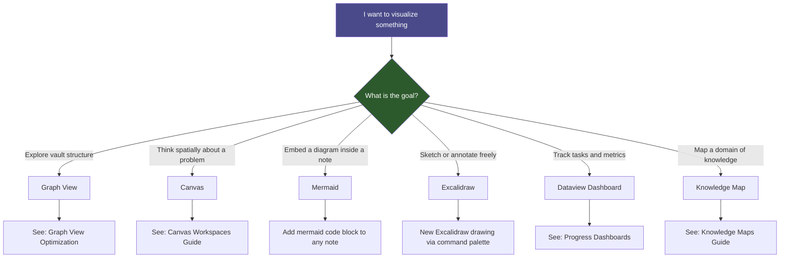

# Visualization

> [!abstract] Overview
> Visualization is the practice of making invisible structures in your knowledge visible. This guide covers why it matters and which tools to reach for in each situation.

## Why Visualization Matters for Knowledge Management

Knowledge lives in relationships. A note in isolation has limited value; a note embedded in a web of related ideas becomes a thinking tool. Visualization makes those relationships legible at a glance, exposing:

- **Clusters** — domains where you have deep, interconnected knowledge
- **Bridges** — single notes that connect otherwise separate domains (high intellectual leverage)
- **Orphans** — notes that have not yet found a home; candidates for integration or deletion
- **Gaps** — topics you think about but have not yet written down
- **Progress** — how projects and habits are actually moving over time

Without visualization, a vault of 500+ notes becomes an archive you search rather than a system you think with. Visualization turns storage into a thinking environment.

> [!tip] Core Principle
> The goal of visualization is not aesthetics — it is to prompt action. Every time you look at a graph, canvas, map, or dashboard, you should leave with at least one concrete next step.

---

## Tools Available in This Vault

### 1. Graph View

Obsidian's built-in graph renders the entire vault as a force-directed network. Best for:
- Discovering unexpected connections
- Identifying orphan notes
- Validating that MOCs are properly linked
- Seeing the overall shape of your knowledge over time

**Files:** [[09 - Visualization/Graph View Optimization]]

### 2. Canvas

Obsidian Canvas is an infinite spatial board where you can place notes, images, cards, and links. Best for:
- Brainstorming sessions that need spatial freedom
- Project planning with many moving parts
- Research synthesis where you need to see everything at once
- Visual argument mapping

**Files:** [[09 - Visualization/Canvas Workspaces/Canvas Workspaces Guide]]

### 3. Mermaid Diagrams

Mermaid is a text-based diagramming language rendered inside code blocks. Best for:
- Decision trees and flowcharts embedded in notes
- System architecture diagrams
- Sequence diagrams for processes
- State machines for workflows

Mermaid diagrams live inside notes and travel with them — they are durable in a way external diagrams are not.

### 4. Excalidraw

The Excalidraw plugin renders freehand-style vector drawings inside Obsidian. Best for:
- Sketches that benefit from a hand-drawn look
- Annotating screenshots or imported images
- Quick concept diagrams that do not need Mermaid precision

**Files:** `Excalidraw/` folder

### 5. Dataview Tables and Lists

The Dataview plugin queries frontmatter and inline fields to generate dynamic tables, lists, and calendars. Best for:
- Project status dashboards
- Task tracking across many notes
- Knowledge growth metrics
- Habit and review logs

**Files:** [[09 - Visualization/Dashboards/Progress Dashboards]]

### 6. Knowledge Maps (Canvas-Based)

A structured use of Canvas to represent how concepts in a domain relate to each other. Distinct from graph view (intentional, curated) and from Canvas brainstorming (structured, not exploratory).

**Files:** [[09 - Visualization/Knowledge Maps/Knowledge Maps Guide]]

---

## Decision Tree: Which Tool to Use?

---

## Tool Comparison Matrix

| Tool | Persistent? | Dynamic? | Embedded in Notes? | Best Scale |
|---|---|---|---|---|
| Graph View | Yes | Yes (auto-updates) | No | Whole vault |
| Canvas | Yes | No (static) | No | Project / domain |
| Mermaid | Yes | No (static) | Yes | Single concept |
| Excalidraw | Yes | No (static) | Via embed | Single diagram |
| Dataview | Yes | Yes (live queries) | Yes | Any scale |
| Knowledge Map | Yes | No (curated) | No | Domain |

---

## Visualization Workflows

### Weekly Review Visualization Routine
1. Open [[09 - Visualization/Dashboards/Progress Dashboards]] — check project and task status
2. Open local graph on your most active note — look for orphaned neighbors
3. Scan global graph for new clusters that have formed
4. Update any stale canvas workspaces for active projects

### New Project Setup
1. Create a Canvas workspace for the project (see [[09 - Visualization/Canvas Workspaces/Canvas Workspaces Guide]])
2. Add a Dataview dashboard section to the project note
3. Link the project canvas from the project note and from [[MOCs/Visualization MOC]]

### Knowledge Domain Mapping
1. Identify a domain with 10+ notes
2. Run global graph filtered to that domain's tags
3. Use Claude with the `json-canvas` skill to generate a knowledge map canvas
4. Review with [[09 - Visualization/Knowledge Maps/Knowledge Maps Guide]]

---

## Related Notes

- [[MOCs/Visualization MOC]] — Hub for all visualization content
- [[09 - Visualization/Graph View Optimization]] — Deep dive on graph configuration
- [[09 - Visualization/Canvas Workspaces/Canvas Workspaces Guide]] — Canvas workspace patterns
- [[09 - Visualization/Knowledge Maps/Knowledge Maps Guide]] — Knowledge mapping methodology
- [[09 - Visualization/Dashboards/Progress Dashboards]] — Dataview-powered dashboards
- [[03 - Resources/Core Plugins/Advanced URI & Canvas]] — Canvas plugin docs
- [[03 - Resources/Core Plugins/Graph View Enhancers]] — Graph plugin docs
- [[03 - Resources/Core Plugins/Dataview & Queries]] — Dataview plugin docs
