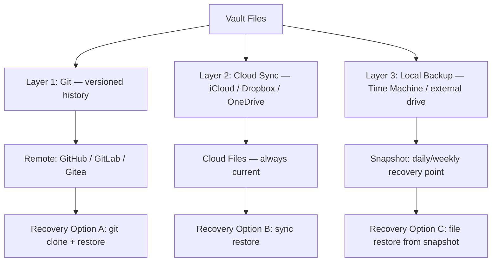

# Backup & Git Sync

Version control and reliable backups are the safety net that lets you experiment freely with vault structure, automation, and new workflows. This guide covers the git configuration for this vault, backup strategy, and conflict resolution.

> [!warning] Don't Rely on a Single Backup Layer
> Git is excellent for versioning text notes but not a complete backup solution. The strategy below uses three complementary layers.

---

## Git Setup for Obsidian

This vault is a git repository. The setup is:

```
Vault root: /Users/lunio/Desktop/DevPortal/AI Brain/
Git remote:  (configured via Obsidian Git plugin)
Branch:      main
```

### Initial Setup (Reference)

If setting up on a new machine:

```bash
cd "/Users/lunio/Desktop/DevPortal/AI Brain"
git init
git remote add origin <YOUR_REMOTE_URL>
git pull origin main
```

Install the **Obsidian Git** community plugin and configure it (see below).

---

## .gitignore Best Practices

The `.gitignore` at vault root should exclude:

```gitignore
# Obsidian workspace state (machine-specific)
.obsidian/workspace.json
.obsidian/workspace-mobile.json

# Obsidian cache (regenerated automatically)
.obsidian/cache

# Large binary attachments (optional — adjust to your needs)
Attachments/Videos/
Attachments/Audio/
*.mp4
*.mov
*.zip
*.dmg

# OS artifacts
.DS_Store
Thumbs.db

# Sensitive notes (if any)
# 00 - Inbox/Private/
```

> [!tip] What to Keep in Git
> Keep: all `.md` files, `.json` plugin configs, `.excalidraw.md` files, templates, and `CLAUDE.md`. These are the files that matter for vault reconstruction.

---

## Obsidian Git Plugin Usage

The **Obsidian Git** plugin automates commits and sync from within Obsidian.

### Recommended Settings

| Setting | Value | Reason |
|---------|-------|--------|
| Auto commit on file change | Off | Avoids noisy micro-commits |
| Auto commit interval | Every 30 min | Background safety net |
| Auto pull on startup | On | Pulls remote changes before you start working |
| Auto push after commit | On | Keeps remote in sync |
| Commit message | `vault: auto-backup {{date}}` | Readable history |
| Pull on startup | On | Prevents divergence |
| Disable notifications | Off | Keep visible during setup; disable once stable |

### Manual Commit Workflow

For meaningful changes (new notes, restructuring, prompt updates), commit manually with a descriptive message:

1. Open Command Palette → "Obsidian Git: Open Source Control View"
2. Review staged changes
3. Write a commit message describing what changed: `add literature note on Zettelkasten`, `refactor Projects MOC`, `update CLAUDE.md context rules`
4. Commit and push

---

## Three-Layer Backup Strategy



### Layer 1: Git (Primary)

- **What it provides**: Full version history, ability to roll back any file to any commit, branch-based experimentation
- **What it doesn't provide**: Continuous protection (only protects committed changes)
- **Cadence**: Auto every 30 min + manual on meaningful changes

### Layer 2: Cloud Sync (Continuous)

- **What it provides**: Near-real-time protection for unsaved/uncommitted changes
- **Options**: iCloud Drive, Dropbox, or Obsidian Sync
- **Caution**: Cloud sync and Obsidian Git can conflict if syncing the `.git/` folder — exclude it from cloud sync or use Obsidian Sync (which is vault-aware)

> [!warning] iCloud + Git Conflict
> If the vault folder is inside `~/Library/Mobile Documents/` (iCloud), `.git/` objects can be corrupted by iCloud's object sync. Move the vault to `~/Documents/` outside iCloud, or exclude the `.git/` directory from iCloud sync.

### Layer 3: Local Backup (Snapshot)

- **What it provides**: Full vault snapshots, immune to cloud/network issues
- **Options**: macOS Time Machine, Restic, rsync to external drive
- **Cadence**: Daily via Time Machine is sufficient for most users

---

## Conflict Resolution Workflow

Conflicts occur when the same file is edited on two different machines before syncing.

### Prevention

- Always pull before starting a session: Command Palette → "Obsidian Git: Pull"
- Avoid editing the vault on two devices simultaneously

### When a Conflict Occurs

1. Git will mark the conflicted file with conflict markers:
   ```
   <<<<<<< HEAD
   Your local version
   =======
   Remote version
   >>>>>>> origin/main
   ```
2. Open the conflicted file in a text editor (VS Code or Obsidian itself)
3. Resolve by choosing the correct version or merging both
4. Remove all `<<<<<<<`, `=======`, `>>>>>>>` markers
5. Stage the resolved file: `git add <filename>`
6. Commit: `git commit -m "resolve merge conflict in <filename>"`

> [!tip] Conflict-Prone Files
> `CLAUDE.md`, MOC files, and the Home dashboard are the most frequently edited and thus most conflict-prone. Commit these immediately after changes.

### For `.json` Config Conflicts

Plugin config files (`.obsidian/*.json`) can conflict on multi-device setups. Strategy:
- Choose one device as the "authoritative" config device
- On conflict, accept the version from that device
- Only update plugin configs from the authoritative device

---

## Recovery Scenarios

| Scenario | Recovery Method |
|----------|----------------|
| Accidentally deleted a note | `git log --diff-filter=D -- "path/to/note.md"` then `git checkout <hash> -- "path/to/note.md"` |
| Corrupted note | Open git history in GitHub/GitLab, copy previous version |
| Vault-wide rollback needed | `git reset --hard <commit-hash>` (destructive — ensure Layer 2/3 backup first) |
| Plugin config broken | Delete `.obsidian/plugins/<plugin>/data.json`, reinstall plugin |
| Full vault loss | Clone from remote: `git clone <remote> <path>` |

---

## Related

- [[10 - Meta/Vault Health/Vault Health Checks]] — Weekly commit discipline
- [[10 - Meta/Vault Health/Performance Tuning]] — `.gitignore` for large attachments
- [[03 - Resources/Community/Best Practices]] — General vault best practices
- [[MOCs/Obsidian Claude Ecosystem MOC]]
