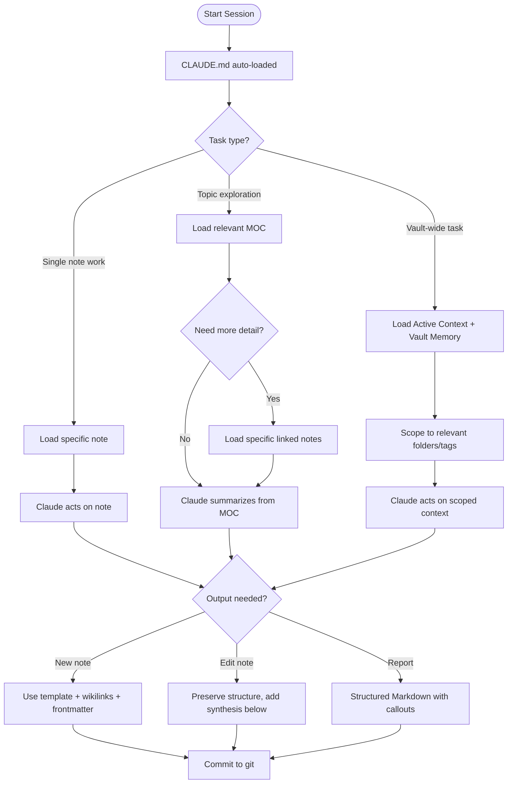

# Claude Context Optimization

The quality of Claude's output in this vault is directly proportional to the quality of the context it receives. This guide covers how to structure the vault so Claude can load the right information efficiently — without wasting tokens on noise or redundant content.

> [!info] Core Principle
> Claude's context window is finite. Every token spent on stale, redundant, or irrelevant content is a token taken away from reasoning about your actual task.

---

## CLAUDE.md Optimization

`CLAUDE.md` is the primary context document that Claude loads automatically in every session. Its quality has an outsized effect on every interaction.

### Keep It Concise

The goal is a clear, actionable reference — not exhaustive documentation. `CLAUDE.md` should cover:
- Vault structure overview (folder map)
- Conventions (wikilinks, tags, frontmatter)
- Claude integration rules (which templates to use, how to structure output)
- Key MOC references

It should **not** contain:
- Full content of individual notes (link to them instead)
- Detailed plugin documentation (link to resource notes)
- History or rationale (use separate notes for that)

> [!tip] Length Target
> Aim for `CLAUDE.md` under 200 lines. If it's growing beyond that, use progressive disclosure: move details into linked reference notes and keep only the rules in `CLAUDE.md`.

### Prioritize Rules Over Descriptions

Rules ("Always use `[[wikilinks]]` for internal links") are more useful than descriptions ("This vault uses wikilinks"). Claude applies rules; descriptions just consume tokens.

### Review CLAUDE.md Monthly

During the monthly vault health check, review `CLAUDE.md` for:
- Rules that are no longer relevant
- Missing conventions that have emerged from practice
- Sections that could be condensed or linked out

---

## Note Structure That Helps Claude

Notes that are well-structured reduce the need for Claude to guess at intent and context.

### Frontmatter as a Signal

Complete YAML frontmatter gives Claude structured, machine-readable context without needing to parse prose:

```yaml
---
type: project
created: "2026-04-16"
status: in-progress
priority: high
related:
  - "[[03 - Resources/Topic]]"
  - "[[MOCs/Projects MOC]]"
tags:
  - area/dev
  - status/growing
---
```

Claude can extract `type`, `status`, and `related` from frontmatter far more reliably than from prose.

### Clear Headings

Use consistent heading levels that signal information hierarchy. Claude uses headings to determine what sections are relevant to a query without needing to read the full note.

### Summary Sections

For long notes, add a short summary at the top:

> **Summary**: This note covers X, Y, and Z. Key decision: [decision]. Current status: [status].

This lets Claude get the essence of a note without reading the full content, saving context budget.

---

## MOC-Based Context Loading

Maps of Content (MOCs) are the most efficient way to give Claude a structured view of a topic area.

### MOCs as Context Entry Points

Instead of loading many individual notes, load the relevant MOC and ask Claude to drill into specific notes as needed:

```
Load [[MOCs/Projects MOC]] and give me a status summary of all active projects.
```

This is more efficient than: "Here are 12 project notes, summarize them."

### MOC Quality Requirements

For MOCs to work as context entry points, they must be:
- **Current**: All linked notes actually exist and are up-to-date
- **Organized**: Links grouped by category or status
- **Descriptive**: Each link has a brief annotation explaining what the note covers

### Recommended MOC Structure

```markdown
## Active

- [[Project A]] — Building X, target: Q2 2026
- [[Project B]] — Research phase, blocked on Y

## On Hold

- [[Project C]] — Paused pending budget approval

## Recently Archived

- [[Project D]] — Completed March 2026
```

---

## Reducing Token Waste

### Avoid Loading Attachments

Never point Claude at `.excalidraw.md` files or large attachments unless the drawing content is specifically needed. These are verbose and consume large amounts of context.

### Scope Requests to Relevant Folders

Instead of "look at my whole vault," scope requests:
- "Look at all notes in `01 - Projects/Active Project/`"
- "Review the notes tagged `#area/dev` modified this week"

### Use Command Files for Repetitive Prompts

Store complex prompt structures in `.claude/commands/` rather than typing them each session. This keeps sessions cleaner and ensures consistent framing.

### Archive Liberally

Notes in `04 - Archive/` are less likely to be loaded as context. Keeping inactive content archived reduces the chance of stale information influencing Claude's responses.

---

## Skill and Command Design for Efficiency

### Keep Commands Focused

Each command file in `.claude/commands/` should do one thing well. A command that tries to do research, synthesis, AND formatting in one pass produces worse output than three focused commands.

### Include Output Format Specs

Commands should specify the expected output format to reduce back-and-forth:

```markdown
Output a Markdown note with:
- YAML frontmatter (type, created, tags, related)
- H1 title
- Summary callout
- Body in sections with H2 headings
- Related section with wikilinks
```

### Prefer Skills Over Raw Prompts for Complex Tasks

For recurring multi-step tasks (synthesis, health check, evergreen conversion), use skills rather than raw prompts. Skills have structured examples and rules that produce more consistent outputs.

---

## Context Optimization Flow



---

## Active Context File

The [[10 - Meta/Active Context.md]] file is a manually maintained snapshot of what's currently in focus — active projects, current priorities, recent decisions. Load it when starting a new Claude session on complex tasks to orient Claude quickly without loading many individual project notes.

Keep it short (under 50 lines) and update it weekly during the health check.

---

## Vault Memory File

The [[10 - Meta/Vault Memory.md]] file contains persistent facts Claude should know across sessions — naming conventions, key decisions, recurring patterns. Think of it as long-term memory for the Claude-vault relationship.

---

## Related

- [[10 - Meta/Active Context.md]] — Current session context snapshot
- [[10 - Meta/Vault Memory.md]] — Persistent vault facts for Claude
- [[10 - Meta/Vault Health/Vault Health Checks]] — Regular CLAUDE.md review
- [[03 - Resources/Claude Integration/Context Loading Strategies]] — Advanced context patterns
- [[MOCs/Obsidian Claude Ecosystem MOC]]
- [[🏠 Home]]
