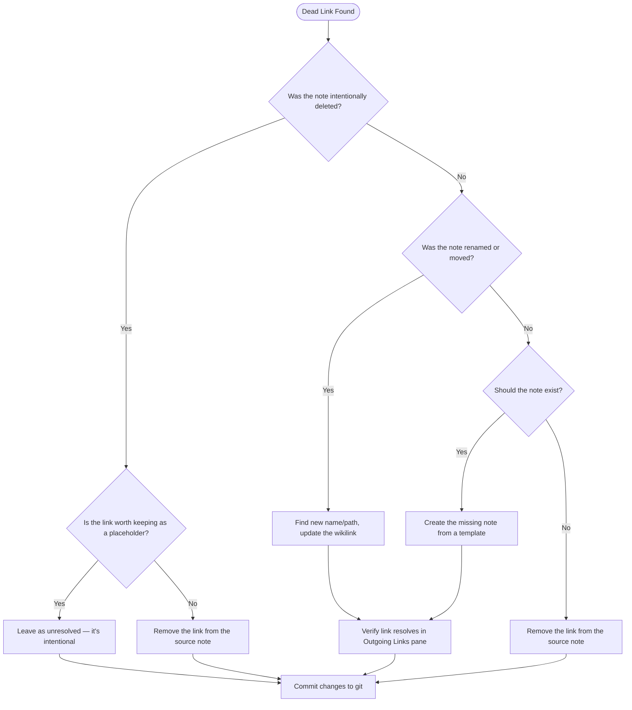

# Dead Link Cleanup

Dead links — wikilinks that point to notes that don't exist — create graph noise, confuse Dataview queries, and undermine trust in the vault. This guide covers why they occur, how to find them, and how to resolve them systematically.

> [!info] Obsidian's Stance
> Obsidian treats unresolved links as *intentional placeholders* by default. They appear in the graph as grey nodes. This is a feature, not a bug — but it requires discipline to keep intentional from accidental.

---

## What Causes Dead Links

### 1. Renamed Files Without Using Obsidian's Rename

Obsidian automatically updates all links when you rename a file through the app (F2 or right-click → Rename). The most common cause of dead links is renaming files externally — in Finder, Terminal, or a text editor — which bypasses Obsidian's link update mechanism.

> [!warning] Always Rename Inside Obsidian
> Never rename `.md` files in Finder or a file manager. Use Obsidian's built-in rename to keep all backlinks intact.

### 2. Deleted Notes With Existing Backlinks

When you delete a note, Obsidian does not clean up links pointing to it from other notes. Every note that linked to the deleted file now has a dead link.

### 3. Typos in Wikilinks

Manually typed wikilinks (`[[Note Nmae]]`) can silently create unresolved links if the note name is misspelled. Autocomplete prevents this — always use it.

### 4. Moved Files Without Link Updates

Moving a file to a different folder while Obsidian has "Automatically update internal links" disabled (Settings → Files & Links) will break all existing links to that file.

### 5. Template Placeholders Left Unfilled

Some templates include wikilink placeholders like `[[Related Project]]` that are meant to be filled in. If left as-is, they create dead links.

---

## Finding Dead Links

### Method 1: Obsidian's Built-in Unlinked References Panel

Open the **Backlinks** pane for any note and check the "Unlinked mentions" section. For a vault-wide view:

- Go to **Settings → Core Plugins** and ensure "Backlinks" is enabled
- Open the graph view and look for grey (unresolved) nodes
- Use **Search** with the query: `path:""` to list all notes, then filter

### Method 2: Obsidian's "Outgoing Links" Pane

Open a note and view the **Outgoing Links** pane. Any unresolved links appear in a separate "Unlinked" section with a dashed icon.

### Method 3: Dataview Query for Unresolved Links

```dataview
TABLE file.outlinks AS "All Outlinks"
FROM ""
WHERE length(file.outlinks) > 0
FLATTEN file.outlinks AS link
WHERE !link.file
SORT file.name ASC
LIMIT 40
```

> [!note]
> This query flattens outgoing links and filters for those where the target file does not exist. It may be slow on large vaults — add a `FROM "01 - Projects"` scope to limit it.

### Method 4: Global Search

Use Obsidian's global search with operators to hunt for common patterns:

```
[[Note that was deleted
```

Or search for specific known-deleted note names.

---

## Cleanup Workflow

For each dead link found, follow this decision tree:



### Step-by-Step

1. **Identify** — Use the Dataview query or graph view to list all dead links
2. **Decide** — For each dead link: create, redirect, or remove (see flowchart above)
3. **Fix** — Edit the source note:
   - To redirect: change `[[Old Name]]` → `[[New Name]]`
   - To create: run the template for the appropriate note type and fill in content
   - To remove: delete the wikilink text, replace with plain text if needed
4. **Verify** — Open the Outgoing Links pane on the edited note and confirm no unresolved links remain
5. **Commit** — Commit the batch of fixes to git with a descriptive message

---

## Prevention Strategies

### Rename Only Inside Obsidian

The single most effective prevention. Use F2 or right-click → Rename. Obsidian will update all backlinks automatically.

### Enable Automatic Link Updates

In Settings → Files & Links → "Automatically update internal links" — keep this ON. It updates links when you move files via Obsidian's file explorer.

### Use Autocomplete for Wikilinks

Always type `[[` and let the autocomplete suggest note names. Never type a full wikilink by hand unless you are certain of the exact filename.

### Review Template Placeholders

After creating a note from a template, immediately fill in all `[[placeholder]]` links or delete the ones that don't apply. Set a convention: placeholder links use a distinct format like `[[FILL IN]]` so they're easy to grep for.

### Pre-Deletion Check

Before deleting a note, open its **Backlinks** pane and review all notes pointing to it. Either update those notes first, or accept that they will have dead links.

---

## Batch Cleanup With Claude

For large cleanups, provide Claude with the list of dead links and ask it to suggest resolutions:

```
Here is a list of dead links from my vault. For each one, suggest whether I should create the note, remove the link, or redirect it to an existing note: [paste list]
```

Claude can also help draft stub notes for any dead links that should become real notes.

---

## Related

- [[10 - Meta/Vault Health/Vault Health Checks]] — Full weekly health process
- [[10 - Meta/Vault Health/Performance Tuning]] — Performance impact of large unresolved link sets
- [[10 - Meta/Backup/Backup & Git Sync]] — Committing cleanup changes
- [[MOCs/Obsidian Claude Ecosystem MOC]]
