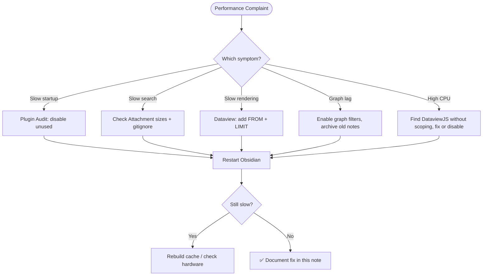

# Performance Tuning

Obsidian is fast by default, but performance degrades as vaults grow. This guide covers the most common causes of slowness and the targeted interventions that fix them — without disrupting your workflow.

> [!tip] Optimization Philosophy
> Only optimize where you feel friction. Startup time, search speed, render lag, and graph clutter are the four most common pain points. Fix the one that bothers you most first.

---

## Common Performance Issues

| Symptom | Most Likely Cause |
|---------|------------------|
| Slow vault startup | Too many plugins loading on launch |
| Sluggish search | Large attachment files indexed by search |
| Slow note rendering | Complex Dataview queries on frequently opened notes |
| Graph view lags | Vault over ~2000 notes without filtering |
| High CPU/memory | DataviewJS with expensive loops or no LIMIT |
| Sync conflicts | Large binary files in git sync path |

---

## Plugin Audit

Plugins are the single biggest performance lever. Every enabled plugin runs code on vault startup and may hook into file events, editor changes, or rendering.

### Audit Process

1. Open **Settings → Community Plugins**
2. List all enabled plugins
3. For each plugin, ask: *Have I used this in the last 30 days?*
4. Disable (not uninstall) any plugin you haven't used recently
5. Restart Obsidian and note the startup time improvement

> [!warning] Disable, Don't Uninstall
> Disabling preserves your settings if you want to re-enable later. Uninstalling removes the plugin data entirely.

### Plugin Load Impact Reference

| Plugin Category | Typical Load Impact |
|-----------------|---------------------|
| Core-adjacent (Calendar, Periodic Notes) | Very low |
| Dataview | Medium — indexes the whole vault |
| Templater | Low — only runs on trigger |
| Excalidraw | Medium-high — large runtime |
| Obsidian Git | Low at rest, medium during sync |
| DataviewJS-heavy dashboards | High if auto-refreshing |
| Kanban with many boards | Medium |
| Graph Analysis | High on large vaults |

### Recommended Plugin Hygiene

- Keep total enabled plugins under 20 for best performance
- Disable any plugin you installed "just to try" and didn't adopt
- Check for plugin updates monthly — performance improvements are common in changelogs
- Prefer native Obsidian features over plugins when possible (e.g., native search over another search plugin)

---

## Dataview Optimization

Dataview is powerful but can be a performance bottleneck if queries are unscoped, un-limited, or excessively complex.

### Scope Your Queries

Always add a `FROM` clause to limit the search space:

```javascript
// Slow — scans entire vault
TABLE status FROM ""

// Fast — scans only one folder
TABLE status FROM "01 - Projects"
```

### Use LIMIT

Prevent runaway queries on large vaults:

```javascript
TABLE file.mtime, status FROM "01 - Projects"
SORT file.mtime DESC
LIMIT 20
```

### Avoid Expensive DataviewJS Patterns

```javascript
// Slow — iterates all pages
dv.pages().forEach(p => { ... })

// Better — scoped
dv.pages('"01 - Projects"').forEach(p => { ... })
```

Avoid calling `dv.pages()` without a path argument in DataviewJS blocks that render on frequently visited notes (like your Home dashboard).

### Cache Results Where Possible

For static reference data (e.g., a list of all template names), consider using a plain Markdown table instead of a Dataview query that recomputes on every render.

### Dataview Refresh Rate

In Dataview settings, set "Refresh interval" to a higher value (e.g., 2000ms instead of 500ms) if live updates aren't critical. This reduces CPU usage on notes with many queries.

---

## File Organization

### Keep Folders Manageable

Obsidian's file explorer and internal indexer slow down when folders contain hundreds of files. Best practice:

- Keep individual folders under 200 files
- Use subfolders for large collections (e.g., split `03 - Resources/` by subtopic)
- Archive old notes to `04 - Archive/` to reduce the active working set

### Attachment Management

Binary files (images, PDFs, videos) inflate vault size and slow down sync and search:

- Store large media in `Attachments/` with subdirectories by type
- Add large binary formats to `.gitignore` if using git sync
- Use external links for large PDFs when you don't need offline access

```gitignore
# .gitignore — large attachment exclusions
Attachments/Videos/
Attachments/Audio/
*.mp4
*.mov
*.psd
```

### Limit Excalidraw File Size

Excalidraw files grow over time as drawings become more complex. Very large `.excalidraw.md` files slow down the link indexer. Split large drawings into multiple focused diagrams.

---

## Cache and Index Management

### Rebuilding the Cache

If search results are stale or Dataview shows incorrect data, rebuild the cache:

- **Dataview**: Open Command Palette → "Dataview: Force Refresh All Views"
- **Search**: Obsidian re-indexes automatically, but closing and reopening the vault forces a full reindex
- **Full cache reset**: Close Obsidian, delete `.obsidian/cache`, reopen

> [!note]
> The `.obsidian/` folder contains plugin configs and cache. Be careful when manually editing files here. Always have a git backup before doing so.

### Graph Cache

The graph view caches node positions. If the graph feels slow or stale:
- Open Graph Settings → "Reset Display" to regenerate positions
- Use filters to hide Tags, Attachments, and unresolved links in large vaults

---

## Hardware Considerations

Performance ceilings are ultimately hardware-bound. Practical thresholds for typical hardware:

| Vault Size | Expected Performance |
|------------|---------------------|
| < 500 notes | Fast on any modern machine |
| 500–2000 notes | Fast with reasonable plugin hygiene |
| 2000–5000 notes | Graph view needs filtering; Dataview needs scoping |
| 5000+ notes | Consider archiving aggressively; use `FROM` in all queries |

For large vaults, prioritize:
1. SSD storage (dramatically faster than spinning disk for file indexing)
2. Adequate RAM (8GB minimum; 16GB if running many plugins + Claude Code simultaneously)
3. Keeping the vault on local storage, not a network drive

---

## Performance Check Workflow



---

## Related

- [[10 - Meta/Vault Health/Vault Health Checks]] — Regular health process including plugin review
- [[10 - Meta/Vault Health/Dead Link Cleanup]] — Unresolved links contribute to indexer overhead
- [[10 - Meta/Backup/Backup & Git Sync]] — `.gitignore` for large files
- [[03 - Resources/Community/Plugin Recommendations]] — Curated plugin list with performance notes
- [[MOCs/Obsidian Claude Ecosystem MOC]]
