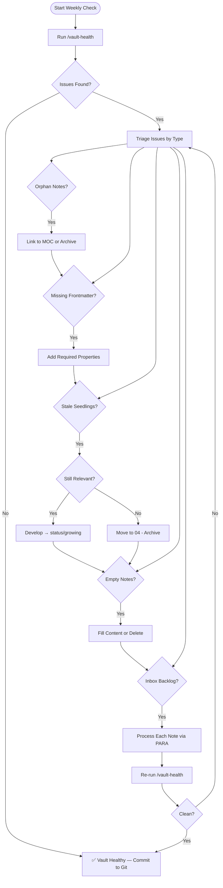

# Vault Health Checks

A healthy vault is a usable vault. Regular health checks prevent the slow accumulation of orphan notes, broken links, stale content, and structural debt that make a knowledge base untrustworthy over time.

> [!tip] Quick Start
> Run the `/vault-health` command for an automated summary. Use this guide for the full manual workflow and deeper diagnostics.

---

## Why Health Checks Matter

Without regular maintenance, vaults drift toward:
- **Orphan notes** that are never discovered or linked
- **Stale projects** that are implicitly abandoned but not archived
- **Frontmatter gaps** that break Dataview dashboards
- **Inbox buildup** that creates cognitive overhead every time you open the vault
- **Duplicate content** from capturing the same idea multiple times

The goal is not a perfect vault — it is a ==trustworthy== one. You should be able to trust that what you see in the graph and dashboards reflects reality.

---

## Weekly Health Check Checklist

> [!todo] Weekly Checklist
> - [ ] Run `/vault-health` command and review output
> - [ ] Process `00 - Inbox/` — move all notes to permanent PARA homes
> - [ ] Check for orphan notes (no incoming links) via Dataview
> - [ ] Verify all new notes this week have complete frontmatter
> - [ ] Review `#status/seedling` notes older than 2 weeks — promote or prune
> - [ ] Scan for empty or near-empty notes
> - [ ] Confirm that new content is linked from the relevant MOC
> - [ ] Commit all changes to git

---

## Dataview Diagnostic Queries

### Orphan Notes (No Incoming Links)

Notes with no other note pointing to them are isolated islands. They may be drafts, forgotten captures, or content that needs integration into the graph.

```dataview
TABLE file.inlinks AS "Incoming Links", file.tags AS "Tags", file.mtime AS "Modified"
FROM ""
WHERE length(file.inlinks) = 0
AND file.name != "🏠 Home"
AND !contains(file.path, "Templates/")
SORT file.mtime DESC
LIMIT 30
```

### Missing Frontmatter Fields

Notes missing required properties break Dataview queries and reduce searchability across the vault.

```dataview
TABLE file.path AS "Path", file.mtime AS "Modified"
FROM ""
WHERE !type OR !created OR !tags
AND !contains(file.path, "Templates/")
SORT file.mtime DESC
LIMIT 30
```

### Stale Seedlings (Not Modified in 60+ Days)

```dataview
TABLE file.mtime AS "Last Modified", status AS "Status", file.tags AS "Tags"
FROM ""
WHERE contains(file.tags, "status/seedling")
AND date(today) - file.mtime > dur(60 days)
SORT file.mtime ASC
LIMIT 20
```

### Empty or Near-Empty Notes

```dataview
TABLE file.size AS "Size (bytes)", file.path AS "Path"
FROM ""
WHERE file.size < 250
AND !contains(file.path, "Templates/")
AND !contains(file.path, "Attachments/")
SORT file.size ASC
LIMIT 20
```

### Notes Without Outgoing Links

Notes that link to nothing are poor connectors in the knowledge graph. Every note should link to at least one other note or MOC.

```dataview
TABLE length(file.outlinks) AS "Outgoing Links", file.mtime AS "Modified"
FROM ""
WHERE length(file.outlinks) = 0
AND !contains(file.tags, "type/daily")
AND !contains(file.path, "Templates/")
SORT file.mtime DESC
LIMIT 20
```

### Recently Created Notes (Inbox Review)

```dataview
TABLE file.folder AS "Folder", file.tags AS "Tags", type AS "Type"
FROM ""
WHERE date(today) - file.ctime < dur(7 days)
SORT file.ctime DESC
LIMIT 25
```

---

## Using the `/vault-health` Command

The `vault-health` skill runs an automated sweep and produces a structured health report. Invoke it from the Claude Code CLI:

```
/vault-health
```

> [!info] What the Command Checks
> - Orphan note count and list
> - Frontmatter completeness rate
> - Stale seedling note count
> - Broken wikilink count (via Obsidian's unresolved link index)
> - Inbox backlog size
> - Notes overdue for status promotion
> - MOC coverage gaps

Review the output, then use the Dataview queries above to drill into any flagged categories.

---

## Health Metrics & Scorecard

Track these metrics over time to spot trends before they become problems.

| Metric | Green | Yellow | Red |
|--------|-------|--------|-----|
| Inbox size | 0–5 notes | 6–15 notes | 16+ notes |
| Orphan notes | < 5% of vault | 5–15% | > 15% |
| Missing frontmatter | 0 notes | 1–5 notes | 6+ notes |
| Stale seedlings (60d+) | 0–3 | 4–10 | 11+ |
| Empty notes | 0 | 1–3 | 4+ |
| Unlinked MOC entries | 0 | 1–3 | 4+ |
| Git commits this week | 3+ | 1–2 | 0 |

> [!example] Scoring Your Vault
> Count how many metrics land in Green. **6–7 = excellent**, **4–5 = healthy**, **2–3 = needs attention**, **0–1 = urgent cleanup needed**.

---

## Health Check Workflow



---

## Monthly Deep-Dive Checks

Beyond the weekly checklist, perform these deeper reviews monthly:

- **MOC completeness**: Open each MOC and verify all linked notes exist and are current. Add new content that belongs there.
- **Template drift**: Compare recently created notes against their templates. Update templates if real usage has diverged.
- **Tag taxonomy review**: Open the tag panel and look for near-duplicate tags (`#project` vs `#projects`, `#area/dev` vs `#dev`).
- **Archive audit**: Review `04 - Archive/` — anything there that should be deleted entirely? Anything that became relevant again?
- **Plugin audit**: See [[10 - Meta/Vault Health/Performance Tuning]] for the plugin review process.
- **Context file review**: Check [[10 - Meta/Active Context.md]] and [[10 - Meta/Vault Memory.md]] for staleness.

---

## Promoting Note Status

Note status follows a defined progression. Use the monthly check to review and promote where appropriate.

| Stage | Tag | Description |
|-------|-----|-------------|
| New capture | `#status/seedling` | Raw idea, draft, or inbox item |
| Developing | `#status/growing` | Being actively expanded and linked |
| Mature | `#status/evergreen` | Stable, well-linked, regularly referenced |
| Inactive | (archived) | Moved to `04 - Archive/` |

> [!warning] Don't Force Promotion
> A note should earn `#status/evergreen` by being well-linked, clear, and genuinely referenced. Don't promote just to clear the checklist.

---

## Related

- [[10 - Meta/Vault Health/Dead Link Cleanup]] — Finding and fixing broken wikilinks
- [[10 - Meta/Vault Health/Performance Tuning]] — Speed and stability optimization
- [[10 - Meta/Backup/Backup & Git Sync]] — Version control and backup
- [[10 - Meta/Claude Context Optimization]] — Keeping Claude's context clean and efficient
- [[MOCs/Obsidian Claude Ecosystem MOC]]
- [[🏠 Home]]
