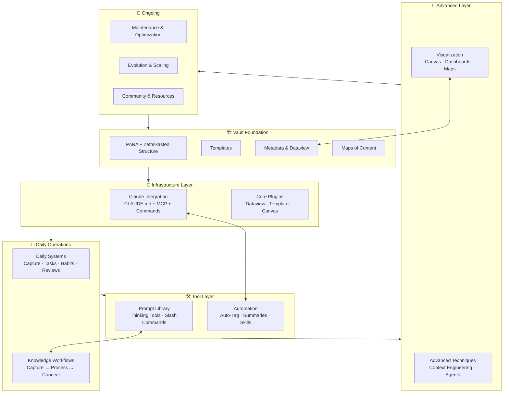
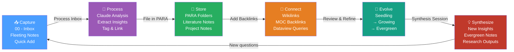
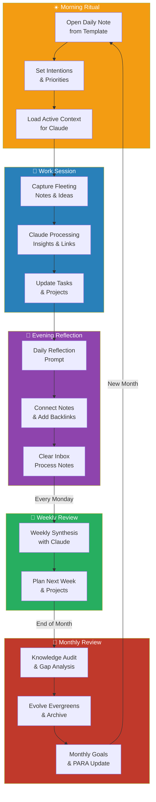
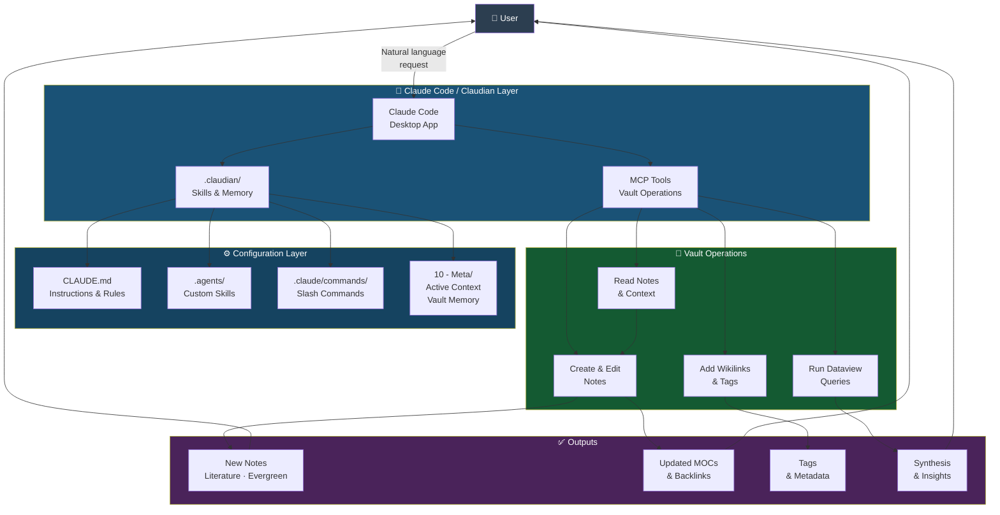

# 🧭 Obsidian Claude Ecosystem MOC

This is the **master operating map** for the entire Obsidian Claude Ecosystem — a unified, living index of every system, workflow, prompt, plugin, and automation that makes up this AI-augmented personal knowledge management vault. Use this note as your highest-level entry point: every section below maps to a functional layer of the vault, with direct wikilinks to the underlying files. Whether you are setting up for the first time, debugging a workflow, or exploring new capabilities, start here.

> [!tip] Navigation Guide
> Each section below corresponds to a layer of the ecosystem. Click any wikilink to jump directly to that resource. Sections are ordered from foundational to advanced.

---

## 1. 🏗️ Vault Foundation

The structural backbone of the vault: the methodology, folder system, templates, and metadata conventions everything else is built on.

### Governing Document
- [[CLAUDE.md]] — PARA + Zettelkasten structure, Claude integration rules, conventions

### Maps of Content (MOCs)
- [[MOCs/Projects MOC]] — Active projects overview
- [[MOCs/Areas MOC]] — Ongoing areas of responsibility
- [[MOCs/Knowledge MOC]] — Knowledge graph entry point
- [[MOCs/Daily Systems MOC]] — Daily, weekly, monthly systems
- [[MOCs/Prompt Library MOC]] — All prompts and commands
- [[MOCs/Automation MOC]] — Automation workflows
- [[MOCs/Visualization MOC]] — Visual knowledge tools

### Templates
- [[Templates/Daily Note]] — Daily note structure with intentions and reflections
- [[Templates/Literature Note]] — Literature note for reading and sources
- [[Templates/Evergreen Note]] — Atomic, permanent concept notes
- [[Templates/Fleeting Note]] — Quick capture before processing
- [[Templates/Project Note]] — Project scoping and tracking
- [[Templates/Area Note]] — Ongoing area of responsibility
- [[Templates/Weekly Review]] — Weekly review and synthesis
- [[Templates/Monthly Review]] — Monthly audit and planning
- [[Templates/MOC Template]] — Template for creating new MOCs

### Reference Guides
- [[03 - Resources/Vault Foundation/Vault Foundation]] — Overview of the foundation layer
- [[03 - Resources/Vault Foundation/Folder Structure (PARA-Zettelkasten)]] — Folder structure rationale and conventions
- [[03 - Resources/Vault Foundation/Metadata & Dataview Guide]] — Frontmatter properties, Dataview patterns
- [[03 - Resources/Vault Foundation/Templates System]] — How to use and extend templates
- [[03 - Resources/Vault Foundation/MOCs & Hub Notes]] — How to create and maintain MOCs
- [[03 - Resources/Vault Foundation/Attachment Management]] — Media and file organization

---

## 2. 🤖 Claude Integration

How Claude AI is connected to the vault — configuration, desktop setup, tools, context management, and session memory.

### Core Configuration
- [[CLAUDE.md]] — Primary instruction set for Claude operating in this vault
- [[03 - Resources/Claude Integration/Claude Integration]] — Integration overview and architecture
- [[03 - Resources/Claude Integration/CLAUDE.md Configuration]] — Deep dive into CLAUDE.md setup
- [[03 - Resources/Claude Integration/Commands Folder]] — How `.claude/commands/` works

### Setup & Tools
- [[03 - Resources/Claude Integration/Claude Code Desktop Setup]] — Installing and configuring Claude Code
- [[03 - Resources/Claude Integration/MCP Tools & Skills]] — Model Context Protocol tools and custom skills

### Context & Memory
- [[03 - Resources/Claude Integration/Context Loading Strategies]] — How to load vault context effectively
- [[03 - Resources/Claude Integration/Session Memory System]] — Persistent memory across sessions

### Custom Commands (`.claude/commands/`)

| Command | Purpose |
|---|---|
| `brainstorm` | Expand ideas around a topic |
| `challenge` | Constructively critique an idea |
| `reframe` | See a note from multiple perspectives |
| `synthesize` | Merge notes into new insights |
| `trace` | Step-by-step analysis of an idea |
| `update-memory` | Sync session learnings to memory files |

---

## 3. 🔌 Core Plugins

The Obsidian plugin stack that powers daily operations, automation, and visualization.

- [[03 - Resources/Core Plugins/Core Plugins]] — Plugin stack overview and selection rationale
- [[03 - Resources/Core Plugins/Terminal & Claude Code]] — Integrated terminal and Claude Code access
- [[03 - Resources/Core Plugins/Dataview & Queries]] — Dynamic query-based views and dashboards
- [[03 - Resources/Core Plugins/Templater & QuickAdd]] — Template automation and quick capture
- [[03 - Resources/Core Plugins/Periodic Notes]] — Daily, weekly, monthly note generation
- [[03 - Resources/Core Plugins/Advanced URI & Canvas]] — URI actions and Canvas workspaces
- [[03 - Resources/Core Plugins/Graph View Enhancers]] — Graph visualization and filtering

---

## 4. 📚 Prompt Library

Every reusable prompt, thinking tool, and custom command in the vault, organized by use case.

### Hub
- [[07 - Prompt Library/Prompt Library]] — Complete prompt library overview

### Idea Generation
- [[07 - Prompt Library/Idea Generation/Idea Generation]] — Master idea generation prompts
- [[07 - Prompt Library/Idea Generation/Brainstorm]] — Brainstorming around a topic
- [[07 - Prompt Library/Idea Generation/Explore Concept]] — Deep exploration of a concept
- [[07 - Prompt Library/Idea Generation/What If]] — Speculative and counterfactual thinking

### Note Processing
- [[07 - Prompt Library/Note Processing/Note Processing Prompts]] — Note summarization and extraction prompts

### Reflection & Synthesis
- [[07 - Prompt Library/Reflection/Reflection & Synthesis]] — Reflection prompts for deep thinking
- [[07 - Prompt Library/Reflection/Weekly Synthesis]] — Weekly synthesis workflow
- [[07 - Prompt Library/Reflection/Knowledge Audit]] — Audit vault knowledge gaps
- [[07 - Prompt Library/Reflection/Daily Reflection]] — Daily reflection and review

### Thinking Tools
- [[07 - Prompt Library/Thinking Tools/Thinking Tools]] — Master thinking tools index
- [[07 - Prompt Library/Thinking Tools/Synthesize]] — Multi-note synthesis
- [[07 - Prompt Library/Thinking Tools/Challenge]] — Adversarial critique tool
- [[07 - Prompt Library/Thinking Tools/Reframe]] — Perspective-shifting tool
- [[07 - Prompt Library/Thinking Tools/Trace]] — Step-by-step reasoning chain

### Custom Slash Commands
- [[07 - Prompt Library/Custom Commands/Custom Slash Commands]] — All `.claude/commands/` prompt files

---

## 5. 🔄 Knowledge Workflows

The end-to-end processes for capturing, processing, connecting, and evolving knowledge in the vault.

- [[03 - Resources/Knowledge Workflows/Knowledge Workflows]] — Workflow overview
- [[03 - Resources/Knowledge Workflows/Capture - Process - Connect]] — The core three-stage workflow
- [[03 - Resources/Knowledge Workflows/Capture Process Connect]] — Extended capture workflow guide
- [[03 - Resources/Knowledge Workflows/Literature Notes Guide]] — How to create effective literature notes
- [[03 - Resources/Knowledge Workflows/Literature Notes]] — Literature note patterns and examples
- [[03 - Resources/Knowledge Workflows/Evergreen Notes]] — Building atomic, permanent notes
- [[03 - Resources/Knowledge Workflows/Project Management]] — PARA project lifecycle management
- [[03 - Resources/Knowledge Workflows/Research & Synthesis]] — Research and multi-source synthesis

---

## 6. ⚙️ Automation

Claude-powered automation: auto-tagging, daily reviews, summaries, vault maintenance, and custom skills.

### Hub
- [[08 - Automation/Automation]] — Automation layer overview

### Workflows & Scripts
- [[08 - Automation/Auto-Tagging/Auto-Tagging & Linking]] — Automated tag and backlink insertion
- [[08 - Automation/Daily Review/Daily Review Automation]] — Automated daily review generation
- [[08 - Automation/Summary Generation/Summary Generation]] — Note summarization workflows
- [[08 - Automation/Vault Maintenance/Vault Maintenance Scripts]] — Scripts for vault health
- [[08 - Automation/Custom Skills/Custom Claude Skills]] — Building and using custom Claude skills

---

## 7. 📅 Daily Systems

The routines, habits, and periodic review systems that keep the vault active and growing.

### Hub
- [[05 - Daily Systems/Daily Systems]] — Daily systems overview
- [[05 - Daily Systems/Weekly & Monthly Reviews]] — Review cadence and templates

### Daily Operations
- [[05 - Daily Systems/Daily Notes/Daily Notes]] — Daily note workflow and conventions
- [[05 - Daily Systems/Task Management/Task & Priority Management]] — Task capture and prioritization
- [[05 - Daily Systems/Habit Tracking/Habit Tracking]] — Habit logging with Dataview
- [[05 - Daily Systems/Journaling/Journaling with Claude]] — AI-assisted journaling practice

---

## 8. 🚀 Advanced Techniques

Power-user patterns for treating the vault as an AI context engine, building agents, and multi-step reasoning.

- [[03 - Resources/Advanced Techniques/Advanced Techniques]] — Advanced techniques overview
- [[03 - Resources/Advanced Techniques/Vault-as-Context Engineering]] — Using the vault as structured AI context
- [[03 - Resources/Advanced Techniques/Agentic Note-Taking]] — Autonomous note creation and linking
- [[03 - Resources/Advanced Techniques/Multi-Step Reasoning]] — Chained AI reasoning across notes
- [[03 - Resources/Advanced Techniques/Cross-Note Analysis]] — Pattern detection across the knowledge graph
- [[03 - Resources/Advanced Techniques/Custom AI Agents]] — Building purpose-built agents from vault content

---

## 9. 🗺️ Visualization

Canvas workspaces, dashboards, and knowledge maps for spatial and visual thinking.

### Hub
- [[09 - Visualization/Visualization]] — Visualization layer overview
- [[09 - Visualization/Graph View Optimization]] — Optimizing the Obsidian graph view

### Visual Tools
- [[09 - Visualization/Canvas Workspaces/Canvas Workspaces Guide]] — How to use Canvas for spatial thinking
- [[09 - Visualization/Dashboards/Vault Dashboard]] — Main Dataview dashboard
- [[09 - Visualization/Dashboards/Progress Dashboards]] — Project and habit progress dashboards
- [[09 - Visualization/Knowledge Maps/Knowledge Maps Guide]] — Building and maintaining knowledge maps

---

## 10. 🔧 Maintenance & Optimization

Vault health, backup, performance tuning, and ongoing optimization workflows.

### Hub
- [[10 - Meta/Maintenance & Optimization]] — Maintenance overview
- [[10 - Meta/Active Context]] — Current active context for Claude sessions
- [[10 - Meta/Vault Memory]] — Persistent memory across Claude sessions
- [[10 - Meta/Claude Context Optimization]] — Tips for optimal Claude context loading

### Maintenance Tasks
- [[10 - Meta/Vault Health/Vault Health Checks]] — Routine health check procedures
- [[10 - Meta/Vault Health/Dead Link Cleanup]] — Identifying and fixing dead wikilinks
- [[10 - Meta/Vault Health/Performance Tuning]] — Obsidian performance optimization
- [[10 - Meta/Backup/Backup & Git Sync]] — Git-based backup and sync strategy
- [[10 - Meta/Best Practices/Best Practices]] — Vault management best practices
- [[10 - Meta/Learning Resources/Learning Resources]] — Guides and tutorials for vault skills

---

## 11. 🌐 Community & Resources

External resources, plugin recommendations, skill libraries, and shared templates.

- [[03 - Resources/Community/Community & Resources]] — Community overview
- [[03 - Resources/Community/Plugin Recommendations]] — Curated plugin recommendations
- [[03 - Resources/Community/Popular Claude Skills (2026)]] — Community-built Claude skills
- [[03 - Resources/Community/Shared Vault Templates]] — Templates shared by the community
- [[03 - Resources/Community/Learning Resources]] — Courses, videos, and reading

---

## 12. 📈 Evolution & Scaling

Long-term strategies for growing the vault, multi-vault management, team use, and next-level AI integration.

- [[03 - Resources/Evolution/Evolution & Scaling]] — Evolution strategy overview
- [[03 - Resources/Evolution/Long-term Knowledge Evolution]] — How knowledge matures over time
- [[03 - Resources/Evolution/Multi-Vault Management]] — Running multiple connected vaults
- [[03 - Resources/Evolution/Team Collaboration]] — Adapting the system for team use
- [[03 - Resources/Evolution/New Skill Development]] — Building new Claude skills from scratch
- [[03 - Resources/Evolution/Next-Level AI Integration]] — Future directions for AI in the vault

---

## 📊 System Architecture Diagrams

### Diagram 1: System Architecture

---

### Diagram 2: Knowledge Flow

---

### Diagram 3: Daily & Periodic Workflow

---

### Diagram 4: Claude Integration Architecture

---

## 🚀 Getting Started

If you are new to this vault or returning after a break, follow these steps to orient yourself:

1. **Read the governing document** — Open [[CLAUDE.md]] to understand the vault's structure, conventions, and Claude integration rules. This is the single source of truth for how everything works.

2. **Tour the folder structure** — Walk through each top-level folder (`00 - Inbox` through `10 - Meta`) and read the overview file in each. Start with [[03 - Resources/Vault Foundation/Folder Structure (PARA-Zettelkasten)]].

3. **Set up Claude integration** — Follow [[03 - Resources/Claude Integration/Claude Code Desktop Setup]] to connect Claude Code to the vault. Then read [[03 - Resources/Claude Integration/Context Loading Strategies]] to learn how to load context efficiently.

4. **Create your first daily note** — Open the [[Templates/Daily Note]] template and create today's daily note in `05 - Daily Systems/Daily Notes/`. This activates the daily workflow loop.

5. **Explore the Prompt Library** — Visit [[07 - Prompt Library/Prompt Library]] and try one thinking tool prompt. The `/brainstorm`, `/synthesize`, and `/trace` commands are good starting points.

6. **Run the Daily Workflow** — Capture a fleeting note in `00 - Inbox/`, then ask Claude to process it using [[03 - Resources/Knowledge Workflows/Capture - Process - Connect]].

7. **Check vault health** — Run [[10 - Meta/Vault Health/Vault Health Checks]] to confirm everything is set up correctly and identify any immediate issues.

8. **Bookmark this MOC** — Star or pin this file in Obsidian. It is your highest-level navigation hub for the entire ecosystem.

---

## 🔗 Related

- [[🏠 Home]] — Main vault dashboard
- [[MOCs/Projects MOC]] — Active projects
- [[MOCs/Knowledge MOC]] — Knowledge graph
- [[MOCs/Daily Systems MOC]] — Daily systems
- [[MOCs/Prompt Library MOC]] — Prompts and commands
- [[MOCs/Automation MOC]] — Automation workflows
- [[MOCs/Visualization MOC]] — Visual tools

---

*Last updated: 2026-04-16 · maintained by [[CLAUDE.md]] conventions*
